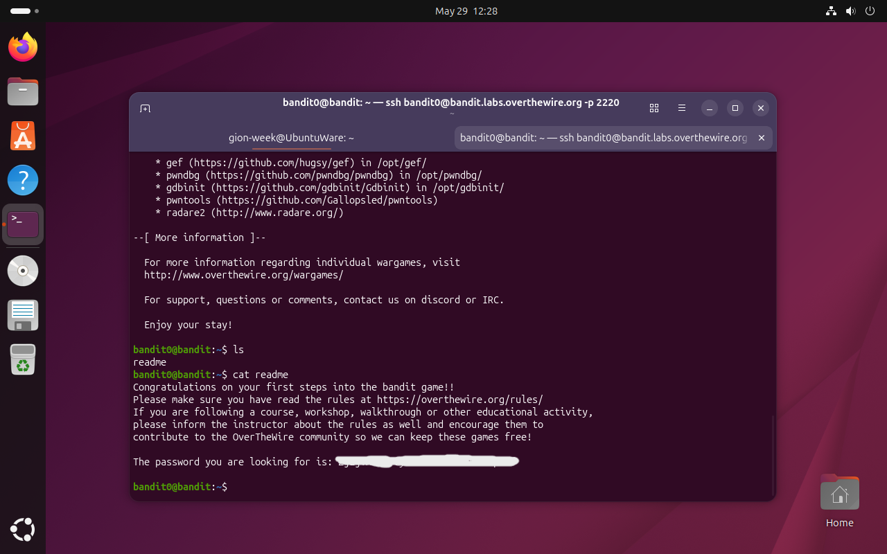

# Bandit Level 0 → 1

## Obiettivo

Il punto di ingresso del wargame: connettersi al server tramite SSH usando le credenziali fornite direttamente dalla pagina del livello, poi trovare la password per il livello successivo.

---

## Informazioni di connessione

| Campo | Valore |
|-------|--------|
| Host | `bandit.labs.overthewire.org` |
| Porta | `2220` |
| Utente | `bandit0` |
| Password | `bandit0` |

```bash
ssh bandit0@bandit.labs.overthewire.org -p 2220
```

---

## Comandi / concetti utili

- `ssh` — connessione remota sicura
- `ls` — lista file nella directory corrente
- `cat` — stampa il contenuto di un file

---

## Soluzione

### Step 1 – Connettersi al server via SSH

Il sito di OverTheWire fornisce direttamente le credenziali per il Level 0, rendendo questo primo step puramente introduttivo alla meccanica del gioco. Si esegue il comando SSH specificando utente, host e porta, tre parametri che torneranno invariati per tutti i livelli successivi cambiando solo il nome utente:

```bash
ssh bandit0@bandit.labs.overthewire.org -p 2220
```

Al prompt della password si inserisce `bandit0`. Una volta autenticati, si accede alla shell remota del server come utente `bandit0`.

### Step 2 – Individuare i file presenti

Il primo passo in qualsiasi livello è orientarsi nella home directory. Si lista il contenuto per capire con cosa si ha a che fare:

```bash
bandit0@bandit:~$ ls
readme
```

È presente un unico file chiamato `readme`. Il nome è già suggestivo: in ambienti Unix un file `readme` contiene tipicamente istruzioni o informazioni rilevanti.

### Step 3 – Leggere il file e ottenere la password

Non ci sono ostacoli particolari: si apre il file direttamente con `cat`:

```bash
bandit0@bandit:~$ cat readme
```

Il file contiene, oltre a un messaggio introduttivo di OverTheWire, la password per accedere al livello successivo (`bandit1`).



---

## Note e osservazioni

**SSH (Secure Shell)** è un protocollo di rete che permette di aprire una sessione di shell su una macchina remota attraverso un canale cifrato. Funziona su architettura client-server:

- il **client** (la propria macchina) invia una richiesta di connessione
- il **server** (la macchina remota) autentica il client e, se l'autenticazione ha successo, apre una sessione interattiva

La comunicazione è cifrata end-to-end tramite crittografia asimmetrica: durante l'handshake iniziale le due parti negoziano le chiavi di sessione, dopodiché tutti i dati trasmessi (comandi, output, password) sono illeggibili a eventuali intercettatori.

L'autenticazione può avvenire in due modi principali:
- **Password** — come in questo livello, si fornisce la password dell'utente remoto
- **Chiave pubblica/privata** — il client dimostra di possedere la chiave privata corrispondente a una chiave pubblica già registrata sul server (metodo più sicuro e consigliato in produzione)

La porta standard di SSH è la `22`; OverTheWire usa la `2220` per convenzione propria, da specificare con il flag `-p`.
