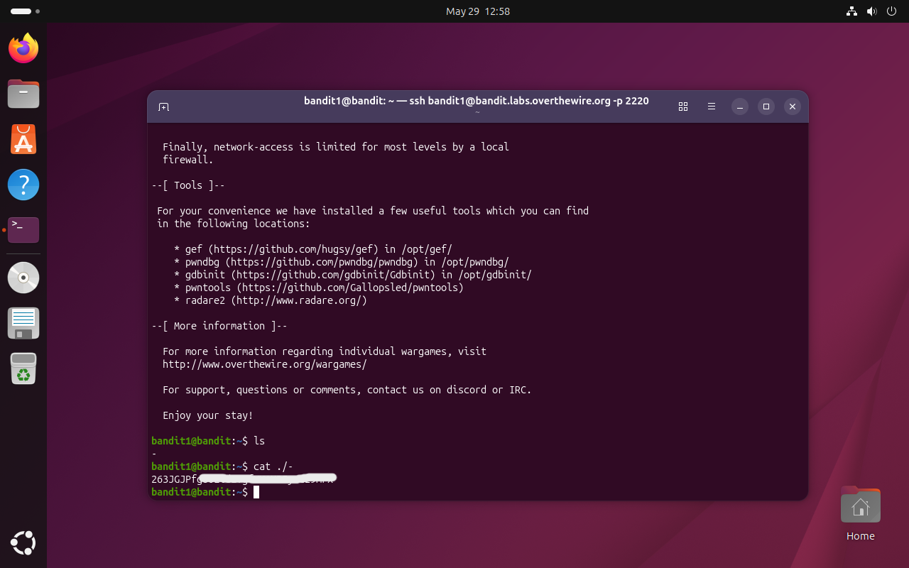

# Bandit Level 1 → 2

## Obiettivo

La password per il livello successivo è contenuta in un file chiamato `-` nella home directory.

---

## Informazioni di connessione

| Campo | Valore |
|-------|--------|
| Host | `bandit.labs.overthewire.org` |
| Porta | `2220` |
| Utente | `bandit1` |

```bash
ssh bandit1@bandit.labs.overthewire.org -p 2220
```

---

## Comandi / concetti utili

- `ls` — lista file nella directory corrente
- `cat` — stampa il contenuto di un file
- `./` — prefisso per riferirsi a un file nella directory corrente tramite percorso

---

## Soluzione

### Step 1 – Individuare i file presenti

```bash
bandit1@bandit:~$ ls
-
```

È presente un unico file il cui nome è `-`. Già a questo punto è ragionevole aspettarsi un problema: `-` è un carattere con significato speciale per molti comandi Unix, quindi un semplice `cat -` quasi certamente non funzionerà come ci si aspetta.

### Step 2 – Leggere il file e ottenere la password

Il tentativo diretto con `cat -` non restituisce alcun output e mette il terminale in attesa di input: la shell sta interpretando `-` come alias per lo standard input (tastiera) invece che come nome di file. Per aggirare questo comportamento è sufficiente fornire un percorso esplicito anziché il nome nudo, togliendo così ambiguità all'interprete:

```bash
bandit1@bandit:~$ cat ./-
```

Il prefisso `./` forza `cat` a trattare l'argomento come un percorso relativo a un file concreto, restituendo la password per accedere al livello successivo (`bandit2`).



---

## Note e osservazioni

**`-` come nome di file**

Nei sistemi Linux `-` è un nome di file valido, ma per convenzione consolidata la maggior parte dei comandi Unix lo interpreta come alias per lo **standard input** (`stdin`). Questo significa che eseguire `cat -` non legge nessun file: mette `cat` in ascolto dell'input da tastiera fino a quando non si invia EOF (`Ctrl+D`). La stessa convenzione vale per molti altri comandi (`grep`, `sort`, `diff`, ecc.).

**Percorso assoluto e relativo**

Un **percorso assoluto** parte dalla radice del filesystem (`/`) e identifica un file in modo univoco indipendentemente dalla directory corrente, ad esempio `/home/bandit1/-`.

Un **percorso relativo** è invece espresso rispetto alla directory corrente. Il prefisso `./` indica esplicitamente "la directory in cui mi trovo ora", quindi `cat ./-` significa "leggi il file di nome `-` che si trova qui". In entrambi i casi il comando riceve un percorso concreto invece del carattere `-` nudo, aggirando la convenzione stdin.

In questo livello è sufficiente il percorso relativo `./−`, ma avrebbe funzionato anche il percorso assoluto `/home/bandit1/-`.
