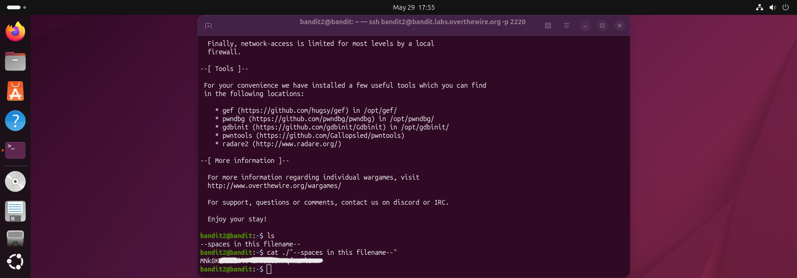

# Bandit Level 2 → 3

## Obiettivo

La password per il livello successivo è contenuta in un file chiamato `--spaces in this filename--` nella home directory.

---

## Informazioni di connessione

| Campo | Valore |
|-------|--------|
| Host | `bandit.labs.overthewire.org` |
| Porta | `2220` |
| Utente | `bandit2` |

```bash
ssh bandit2@bandit.labs.overthewire.org -p 2220
```

---

## Comandi / concetti utili

- `ls` — lista file nella directory corrente
- `cat` — stampa il contenuto di un file
- `./` — prefisso per riferirsi a un file nella directory corrente tramite percorso
- `" "` — virgolette doppie per racchiudere stringhe contenenti spazi

---

## Soluzione

### Step 1 – Individuare i file presenti

```bash
bandit2@bandit:~$ ls
--spaces in this filename--
```

È presente un unico file il cui nome contiene spazi e inizia con `--`. Entrambe le caratteristiche creano problemi distinti alla shell: gli spazi frammentano il nome in token separati, mentre `--` viene tipicamente interpretato come marcatore di fine flag. Serve quindi una strategia che neutralizzi entrambe le ambiguità contemporaneamente.

### Step 2 – Leggere il file e ottenere la password

Un semplice `cat --spaces in this filename--` non funziona: la shell spezzerebbe il nome in argomenti distinti (`--spaces`, `in`, `this`, `filename--`) causando un errore. La soluzione è combinare le virgolette doppie, che preservano gli spazi, con il prefisso `./`, che disambigua il `--` iniziale trattandolo come parte di un percorso:

```bash
bandit2@bandit:~$ cat ./"--spaces in this filename--"
```

Il file contiene la password per accedere al livello successivo (`bandit3`).



---

## Note e osservazioni

**Spazi nei nomi di file e parsing della shell**

Quando si esegue un comando, la shell divide l'input in token usando lo spazio come separatore. Un nome di file come `--spaces in this filename--` verrebbe quindi interpretato come quattro argomenti distinti (`--spaces`, `in`, `this`, `filename--`), causando un errore.

Le virgolette doppie (`"..."`) istruiscono la shell a trattare tutto ciò che contengono come un'unica stringa, preservando gli spazi letteralmente.

Il prefisso `./` è necessario per lo stesso motivo visto nel Level 1: il nome inizia con `--`, che la shell potrebbe interpretare come inizio di un flag del comando. Specificare il percorso forza `cat` a trattarlo come un nome di file.

I due accorgimenti possono essere usati separatamente o insieme a seconda del caso:
- Solo virgolette: sufficiente se il nome non inizia con `-`
- Solo `./`: sufficiente se il nome non contiene spazi
- Entrambi: necessario quando il nome contiene spazi **e** inizia con `-` o `--`, come in questo livello

In alternativa alle virgolette, si può usare il carattere di escape `\` prima di ogni spazio:

```bash
bandit2@bandit:~$ cat ./--spaces\ in\ this\ filename--
```
