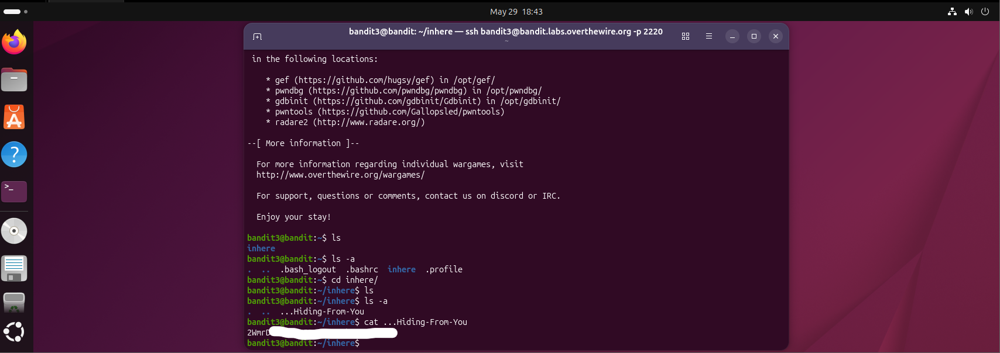

# Bandit Level 3 → 4

## Obiettivo

La password per il livello successivo è contenuta in un file nascosto all'interno della cartella `inhere`.

---

## Informazioni di connessione

| Campo | Valore |
|-------|--------|
| Host | `bandit.labs.overthewire.org` |
| Porta | `2220` |
| Utente | `bandit3` |

```bash
ssh bandit3@bandit.labs.overthewire.org -p 2220
```

---

## Comandi / concetti utili

- `ls` — lista file nella directory corrente
- `ls -a` — lista tutti i file, inclusi quelli nascosti
- `cd` — cambia directory
- `cat` — stampa il contenuto di un file

---

## Soluzione

### Step 1 – Individuare i file presenti

```bash
bandit3@bandit:~$ ls
inhere
```

È presente una sola cartella chiamata `inhere`. L'obiettivo dice esplicitamente che il file è nascosto, quindi è già chiaro che `ls` da solo non sarà sufficiente e servirà il flag `-a`.

### Step 2 – Cercare file nascosti nella home

Prima di entrare in `inhere`, vale la pena controllare se ci sono file nascosti anche nella home:

```bash
bandit3@bandit:~$ ls -a
.  ..  .bash_logout  .bashrc  inhere  .profile
```

I file che compaiono (`.bash_logout`, `.bashrc`, `.profile`) sono file di configurazione standard della shell, non rilevanti per la sfida. L'unico elemento di interesse rimane la cartella `inhere`.

### Step 3 – Navigare nella cartella e cercare il file

```bash
bandit3@bandit:~$ cd inhere/
bandit3@bandit:~/inhere$ ls
bandit3@bandit:~/inhere$ ls -a
.  ..  ...Hiding-From-You
```

`ls` senza flag non restituisce nulla, confermando che il file è nascosto. Con `-a` emerge `...Hiding-From-You`: un nome volutamente evocativo che inizia con tre punti, sufficiente a renderlo invisibile al listing standard.

### Step 4 – Leggere il file e ottenere la password

Non ci sono ulteriori ostacoli: il file non ha caratteri problematici nel nome oltre ai punti iniziali, quindi si può aprire direttamente:

```bash
bandit3@bandit:~/inhere$ cat ...Hiding-From-You
```

Il file contiene la password per accedere al livello successivo (`bandit4`).



---

## Note e osservazioni

**File nascosti in Linux**

Nei sistemi Linux un file o una cartella è considerato nascosto se il suo nome inizia con un punto (`.`). Non si tratta di una protezione né di un attributo speciale del filesystem: è puramente una convenzione che i programmi rispettano omettendo questi file dai risultati predefiniti di `ls`. Il flag `-a` (abbreviazione di `--all`) istruisce `ls` a mostrarli comunque.

Le voci `.` e `..` che compaiono sempre con `ls -a` non sono file reali: rappresentano rispettivamente la directory corrente e la directory padre, e sono presenti in ogni cartella del filesystem.

Il file di questo livello si chiama `...Hiding-From-You`: inizia con tre punti, quindi viene nascosto come qualsiasi altro dotfile, ma non ha nulla di speciale rispetto a un file che inizia con un solo punto.

**Navigazione tra cartelle con `cd`**

`cd` (change directory) permette di spostarsi nel filesystem. Alcuni utilizzi comuni:

- `cd nome-cartella` — entra in una sottocartella della directory corrente
- `cd ..` — sale di un livello alla directory padre
- `cd ~` oppure solo `cd` — torna alla home directory dell'utente
- `cd /percorso/assoluto` — salta direttamente a qualsiasi percorso nel filesystem

Il prompt del terminale riflette la directory corrente: `bandit3@bandit:~/inhere$` indica che ci si trova dentro `inhere`, nella home (`~`) dell'utente `bandit3`.
