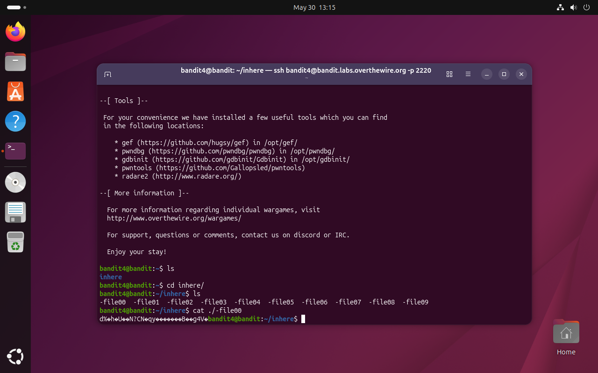
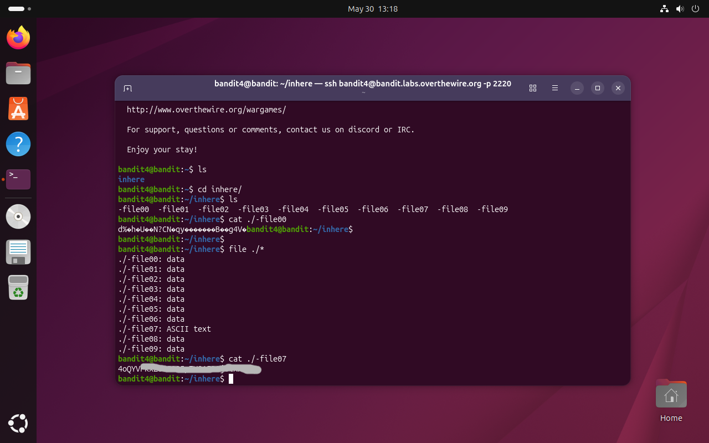

# Bandit Level 4 → 5

## Obiettivo

La password per il livello successivo è contenuta nell'unico file human-readable all'interno della cartella `inhere`, che contiene dieci file (`-file00` → `-file09`).

---

## Informazioni di connessione

| Campo | Valore |
|-------|--------|
| Host | `bandit.labs.overthewire.org` |
| Porta | `2220` |
| Utente | `bandit4` |

```bash
ssh bandit4@bandit.labs.overthewire.org -p 2220
```

---

## Comandi / concetti utili

- `ls` — lista file nella directory corrente
- `cd` — cambia directory
- `cat` — stampa il contenuto di un file
- `file` — determina il tipo di un file
- `./*` — wildcard per selezionare tutti i file nella directory corrente

---

## Soluzione

### Step 1 – Navigare nella cartella e valutare il problema

```bash
bandit4@bandit:~$ ls
inhere
bandit4@bandit:~$ cd inhere/
bandit4@bandit:~/inhere$ ls
-file00  -file01  -file02  -file03  -file04  -file05  -file06  -file07  -file08  -file09
```

Sono presenti dieci file, tutti con nomi che iniziano con `-`, quindi va usato il prefisso `./` come nei livelli precedenti. L'obiettivo specifica che solo uno è human-readable: aprirli tutti uno per uno sarebbe inefficiente e, nel caso dei file binari, potrebbe produrre output che corrompe il rendering del terminale.

### Step 2 – Tentativo di lettura: output illeggibile

Per capire concretamente il problema, si apre il primo file:

```bash
bandit4@bandit:~/inhere$ cat ./-file00
d%♦h♦U♦♦N?CN♦qy♦♦♦♦♦♦♦B♦♦g4V♦
```

L'output è dati binari grezzi, confermando che la maggior parte dei file non contiene testo. Questo rende chiaro che serve uno strumento per identificare il tipo di ciascun file senza doverli aprire uno per uno.



### Step 3 – Identificare il file human-readable con `file`

Il comando `file` ispeziona il contenuto dei file e ne restituisce il tipo, senza aprirli né stamparli. Combinato con il wildcard `*`, analizza tutti i file in una sola esecuzione:

```bash
bandit4@bandit:~/inhere$ file ./*
./-file00: data
./-file01: data
./-file02: data
./-file03: data
./-file04: data
./-file05: data
./-file06: data
./-file07: ASCII text
./-file08: data
./-file09: data
```

Solo `-file07` è classificato come `ASCII text`. Tutti gli altri sono `data`, ovvero dati binari non riconducibili a un formato leggibile. Il file da aprire è quindi identificato senza ambiguità.

### Step 4 – Leggere il file corretto e ottenere la password

```bash
bandit4@bandit:~/inhere$ cat ./-file07
```

Il file contiene la password per accedere al livello successivo (`bandit5`).



---

## Note e osservazioni

**File binari e file di testo**

`file` è un comando che determina il tipo di un file ispezionandone il contenuto, indipendentemente dall'estensione. Lo fa leggendo i primi byte del file e confrontandoli con una serie di pattern noti (i cosiddetti "magic numbers"). La classificazione `data` indica dati binari generici non riconducibili a un formato specifico; `ASCII text` indica che il file contiene esclusivamente caratteri del set ASCII stampabile, ovvero testo leggibile da un essere umano.

Aprire un file binario con `cat` non causa danni, ma l'output può essere confuso o corrompere temporaneamente il rendering del terminale, poiché i byte vengono stampati così come sono, inclusi eventuali caratteri di controllo.

**Il wildcard `*`**

Il carattere `*` è un wildcard che la shell espande automaticamente in tutti i file presenti nella directory corrente (o che corrispondono al pattern specificato). Scrivere `file ./*` equivale quindi a scrivere `file ./-file00 ./-file01 ... ./-file09`, ma senza doverli elencare manualmente. È uno strumento fondamentale per operare su gruppi di file in modo efficiente.
