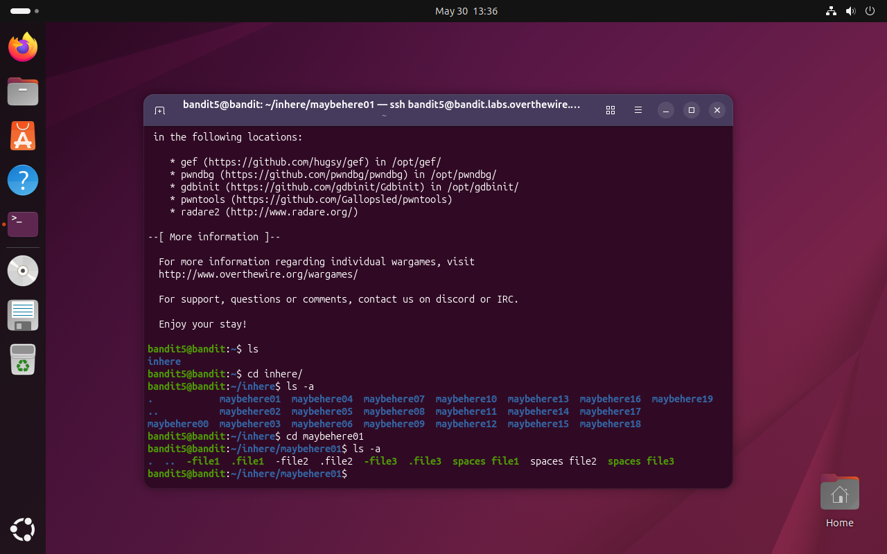
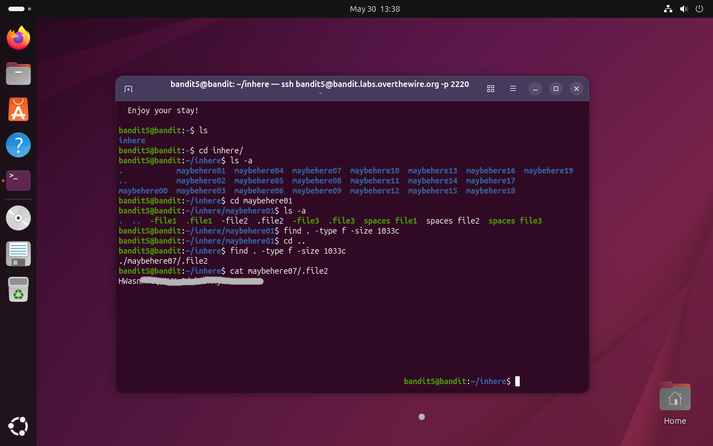

# Bandit Level 5 → 6

## Obiettivo

La password per il livello successivo è contenuta in un file nella cartella `inhere` con le seguenti proprietà:

- human-readable
- dimensione esatta di 1033 byte
- non eseguibile

---

## Informazioni di connessione

| Campo | Valore |
|-------|--------|
| Host | `bandit.labs.overthewire.org` |
| Porta | `2220` |
| Utente | `bandit5` |

```bash
ssh bandit5@bandit.labs.overthewire.org -p 2220
```

---

## Comandi / concetti utili

- `ls` / `ls -a` — lista file, inclusi i nascosti
- `cd` — cambia directory
- `find` — ricerca file nel filesystem secondo criteri specifici
- `cat` — stampa il contenuto di un file

---

## Soluzione

### Step 1 – Navigare in `inhere` e esplorare la struttura

```bash
bandit5@bandit:~$ ls
inhere
bandit5@bandit:~$ cd inhere/
bandit5@bandit:~/inhere$ ls -a
maybehere00  maybehere02  maybehere04  maybehere06  maybehere08  maybehere10  maybehere12  maybehere14  maybehere16  maybehere18
maybehere01  maybehere03  maybehere05  maybehere07  maybehere09  maybehere11  maybehere13  maybehere15  maybehere17  maybehere19
```

`inhere` contiene 20 sottocartelle. Entrando in una per esplorarne il contenuto si può notare subito un problema:

```bash
bandit5@bandit:~/inhere$ cd maybehere01
bandit5@bandit:~/inhere/maybehere01$ ls -a
.  ..  -file1  .file1  -file2  .file2  -file3  .file3  spaces file1  spaces file2  spaces file3
```

Ogni sottocartella contiene più file di vario tipo. Cercare manualmente tra 20 cartelle sarebbe impraticabile.



### Step 2 – Cercare il file con `find` per dimensione

Tornando in `inhere`, si usa `find` per filtrare i file con dimensione esatta di 1033 byte. Scegliamo la dimensione esatta come criterio perchè è quello che ha maggiori probabilità di restringere notevolmente il campo di ricerca in questo caso. Se ad esempio si fosse scelto uno degli altri due criteri, le probabilità di trovare file "human-readable" e/o "non eseguibili" sarebbero state molto alte e si sarebbe dovuto filtrare ulteriormente l'output:

```bash
bandit5@bandit:~/inhere/maybehere01$ cd ..
bandit5@bandit:~/inhere$ find . -type f -size 1033c
./maybehere07/.file2
```

Ed infatti l'unico file corrispondente è `.file2` nella cartella `maybehere07`.

### Step 3 – Leggere il file e ottenere la password

```bash
bandit5@bandit:~/inhere$ cat maybehere07/.file2
```

Non resta che aprire il file e leggere la password per accedere al livello successivo (`bandit6`).



---

## Note e osservazioni

**Il comando `find`**

`find` è uno degli strumenti più potenti della command line Linux: permette di cercare file e directory nel filesystem applicando filtri combinabili tra loro. La sintassi base è:

```bash
find <percorso> <criteri>
```

I flag usati in questo livello:

- `-type f` — limita la ricerca ai soli file regolari, escludendo directory, symlink e altri tipi
- `-size 1033c` — filtra per dimensione esatta; il suffisso `c` indica i byte (da *characters*). Altri suffissi comuni: `k` per kilobyte, `M` per megabyte

`find` può combinare molti altri criteri: `-name`, `-user`, `-group`, `-perm` (permessi), `-mtime` (data di modifica), e così via. Nei livelli successivi ne verranno usati altri.

In questo livello la dimensione di 1033 byte era l'unico criterio necessario e sufficiente a identificare univocamente il file tra tutti quelli presenti nelle 20 sottocartelle.
