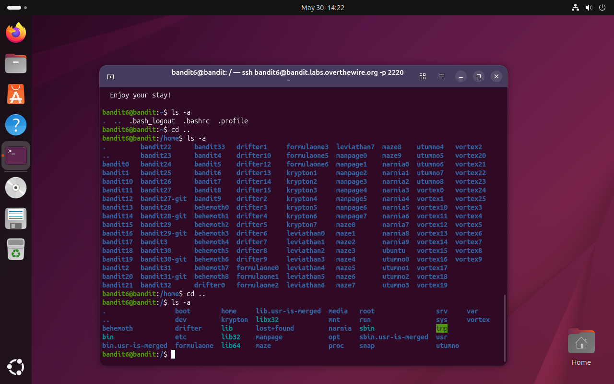
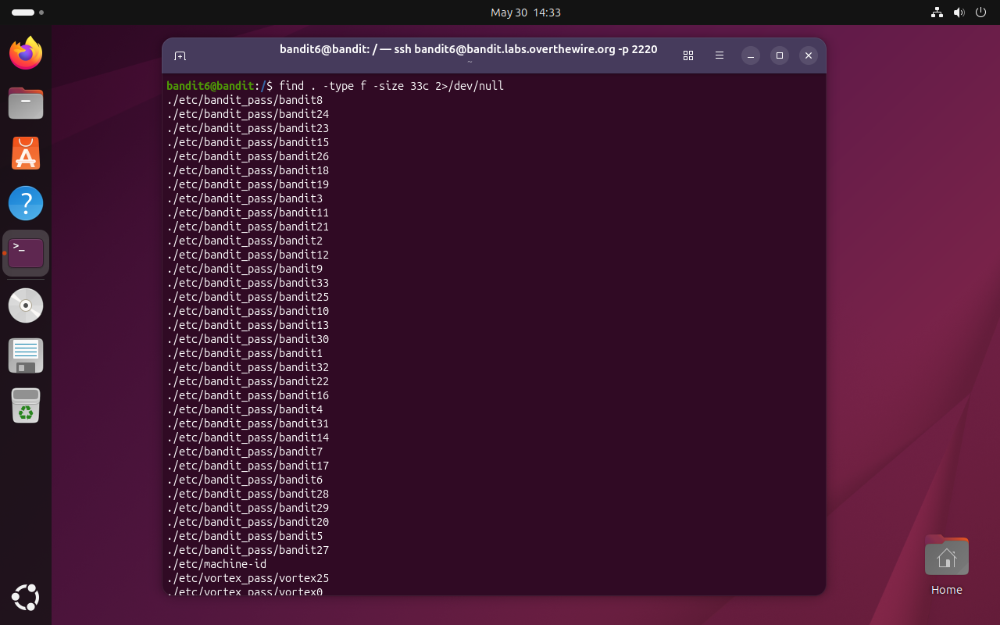
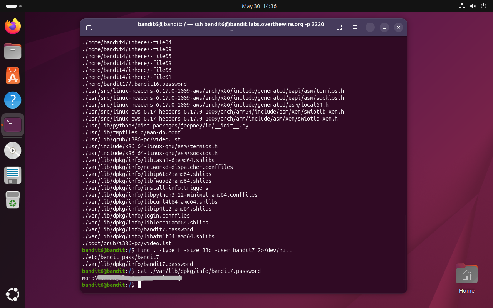

# Bandit Level 6 → 7

## Obiettivo

La password per il livello successivo è contenuta in un file con le seguenti proprietà, nascosto **da qualche parte sul server**:

- di proprietà dell'utente `bandit7`
- di proprietà del gruppo `bandit6`
- dimensione di 33 byte

---

## Informazioni di connessione

| Campo | Valore |
|-------|--------|
| Host | `bandit.labs.overthewire.org` |
| Porta | `2220` |
| Utente | `bandit6` |

```bash
ssh bandit6@bandit.labs.overthewire.org -p 2220
```

---

## Comandi / concetti utili

- `find` — ricerca file nel filesystem secondo criteri specifici
- `-user` — filtra per proprietario del file
- `-group` — filtra per gruppo del file
- `2>/dev/null` — redirige gli errori (es. "Permission denied") per pulire l'output

---

## Soluzione

### Step 1 – Esplorare la home e capire la portata del problema

```bash
bandit6@bandit:~$ ls -a
.  ..  .bash_logout  .bashrc  .profile
```

La home è vuota. A differenza dei livelli precedenti, l'obiettivo specifica che il file si trova "da qualche parte sul server": non c'è una cartella di partenza suggerita, il che significa che la ricerca deve coprire l'intero filesystem. Si risale quindi alla radice con due `cd ..` successivi:

```bash
bandit6@bandit:~$ cd ..
bandit6@bandit:/home$ cd ..
bandit6@bandit:/$
```

Da `/` si ha accesso all'intero albero del filesystem.



### Step 2 – Prima ricerca: solo `-size`, risultato inefficiente

Per prima cosa si prova a riutilizzare l'approccio del livello precedente, filtrando solo per dimensione. Si aggiunge `2>/dev/null` per sopprimere i numerosi errori "Permission denied" che `find` produce tentando di accedere a cartelle riservate:

```bash
bandit6@bandit:/$ find . -type f -size 33c 2>/dev/null
./etc/bandit_pass/bandit8
./etc/bandit_pass/bandit24
./etc/bandit_pass/bandit23
... (decine di risultati)
```

L'output è troppo lungo per essere utile: 33 byte è una dimensione comune, e il filesystem contiene moltissimi file di quella dimensione, incluse tutte le password dei livelli di Bandit. Il solo criterio dimensionale non è sufficiente a isolare il file cercato.



### Step 3 – Aggiungere il criterio `-user` per restringere i risultati

Si aggiunge il filtro sul proprietario del file, sfruttando le informazioni fornite dall'obiettivo:

```bash
bandit6@bandit:/$ find . -type f -size 33c -user bandit7 2>/dev/null
./etc/bandit_pass/bandit7
./var/lib/dpkg/info/bandit7.password
```

L'output si riduce a due soli file. Entrambi sono plausibili, ma `/var/lib/dpkg/info/bandit7.password` è il più rilevante per nome e percorso.

### Step 4 – Leggere il file e ottenere la password

```bash
bandit6@bandit:/$ cat ./var/lib/dpkg/info/bandit7.password
```

Il file contiene la password per accedere al livello successivo (`bandit7`).



---

## Note e osservazioni

**Combinare criteri in `find`**

Questo livello mostra concretamente perché affidarsi a un solo criterio di ricerca può essere insufficiente. La dimensione di 33 byte è condivisa da decine di file sul server; aggiungere `-user bandit7` ha ridotto i risultati da decine a due soli file. In generale, più criteri si combinano, più la ricerca è precisa. `find` supporta anche `-group` per filtrare per gruppo di appartenenza, ad esempio in questo caso sarebbe stato equivalente aggiungere `-group bandit6`.

**Redirezione di stderr con `2>/dev/null`**

In Linux ogni processo ha tre canali standard: `stdin` (input), `stdout` (output), `stderr` (errori). I numeri `0`, `1`, `2` li identificano rispettivamente. La notazione `2>/dev/null` redirige il canale degli errori verso `/dev/null`, un file speciale che scarta tutto ciò che riceve. Senza questa redirezione, `find` avrebbe inondato l'output con messaggi "Permission denied" per ogni cartella a cui `bandit6` non ha accesso, rendendo i risultati illeggibili.

**Ricerca dall'inizio del filesystem**

Avviare `find` da `/` significa cercare nell'intero filesystem del server, incluse cartelle di sistema come `/etc`, `/var`, `/usr` e così via. È una pratica comune in CTF e penetration testing quando non si sa dove si trova un file e si hanno le credenziali per accedervi.
