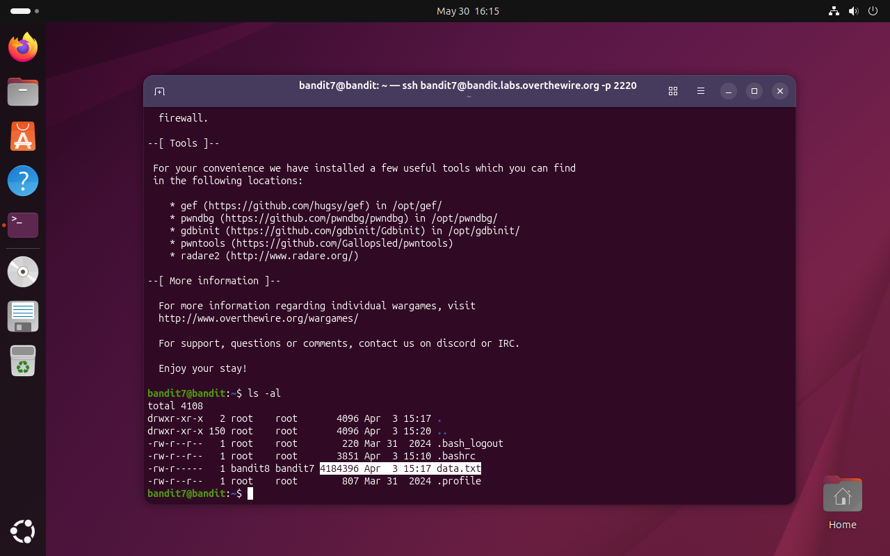
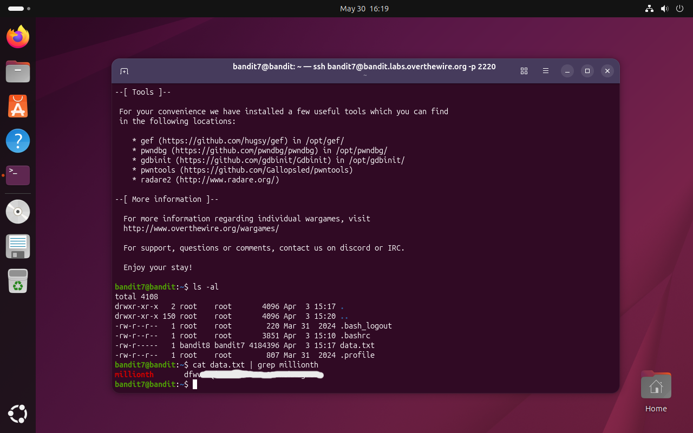

# Bandit Level 7 → 8

## Obiettivo

La password per il livello successivo è contenuta nel file `data.txt`, nella riga accanto alla parola `millionth`.

---

## Informazioni di connessione

| Campo | Valore |
|-------|--------|
| Host | `bandit.labs.overthewire.org` |
| Porta | `2220` |
| Utente | `bandit7` |

```bash
ssh bandit7@bandit.labs.overthewire.org -p 2220
```

---

## Comandi / concetti utili

- `ls -al` — lista file con dettagli estesi (permessi, proprietario, dimensione)
- `cat` — stampa il contenuto di un file
- `grep` — filtra righe di testo contenenti un pattern
- `|` — pipe: redirige l'output di un comando come input al successivo

---

## Soluzione

### Step 1 – Esaminare il file con `ls -al`

```bash
bandit7@bandit:~$ ls -al
total 4108
drwxr-xr-x   2 root    root          4096 Apr  3 15:17 .
drwxr-xr-x 150 root    root          4096 Apr  3 15:20 ..
-rw-r--r--   1 root    root           220 Mar 31  2024 .bash_logout
-rw-r--r--   1 root    root          3851 Apr  3 15:10 .bashrc
-rw-r-----   1 bandit8 bandit7    4184396 Apr  3 15:17 data.txt
-rw-r--r--   1 root    root           807 Mar 31  2024 .profile
```

`data.txt` è immediatamente riconoscibile: pesa circa 4 MB, un ordine di grandezza molto superiore agli altri file. Un `cat` diretto inonderà il terminale con migliaia di righe, rendendo impossibile trovare manualmente quella cercata. L'obiettivo specifica però una parola chiave precisa, `millionth`, che consente di filtrare l'output invece di scorrerlo integralmente.



### Step 2 – Filtrare l'output con `grep` tramite pipe

Si usa la pipe (`|`) per passare l'output di `cat` direttamente a `grep`, che restituisce solo le righe contenenti la parola cercata:

```bash
bandit7@bandit:~$ cat data.txt | grep millionth
millionth       dfwv...
```

Una sola riga corrisponde al pattern: contiene la parola `millionth` seguita dalla password per accedere al livello successivo (`bandit8`).



---

## Note e osservazioni

**`grep` e la pipe `|`**

`grep` è uno degli strumenti più usati in ambito Unix: cerca un pattern testuale all'interno di un input e restituisce solo le righe che lo contengono. Può ricevere input sia da file che da stdin, ed è qui che entra in gioco la pipe.

L'operatore `|` collega due comandi in sequenza: lo stdout del comando a sinistra diventa lo stdin del comando a destra. In questo livello `cat data.txt` produce l'intero contenuto del file, che `grep millionth` filtra restituendo solo la riga rilevante. È un pattern fondamentale della filosofia Unix: costruire soluzioni componendo strumenti semplici.

**Metodo alternativo**

`cat data.txt | grep millionth` è funzionale, ma passa per un passaggio intermedio non necessario. `grep` può leggere direttamente un file senza bisogno di `cat`:

```bash
bandit7@bandit:~$ grep millionth data.txt
```

Il risultato è identico, ma il comando è più conciso ed efficiente: elimina un processo (`cat`) e una pipe, leggendo il file direttamente. Passare l'input a `grep` tramite `cat` è un pattern così comune da avere un nome proprio: **Useless Use of Cat** (UUoC), che è inoltre considerato cattiva pratica quando `grep` può gestire il file autonomamente.
