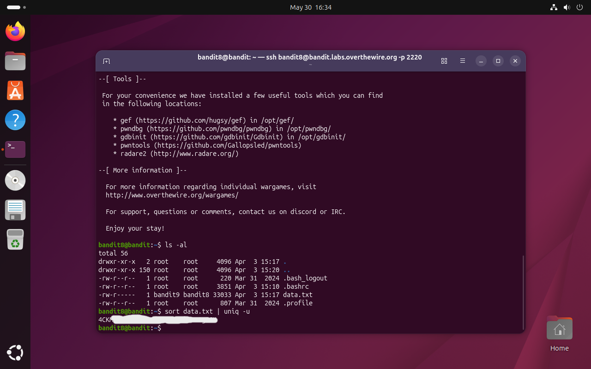

# Bandit Level 8 → 9

## Obiettivo

La password per il livello successivo è contenuta nel file `data.txt` ed è l'unica riga che compare **una sola volta**.

---

## Informazioni di connessione

| Campo | Valore |
|-------|--------|
| Host | `bandit.labs.overthewire.org` |
| Porta | `2220` |
| Utente | `bandit8` |

```bash
ssh bandit8@bandit.labs.overthewire.org -p 2220
```

---

## Comandi / concetti utili

- `ls -al` — lista file con dettagli estesi
- `sort` — ordina le righe di un file alfabeticamente
- `uniq` — filtra righe duplicate adiacenti
- `uniq -u` — mostra solo le righe che compaiono esattamente una volta
- `|` — pipe: collega l'output di un comando all'input del successivo

---

## Soluzione

### Step 1 – Esaminare il file

```bash
bandit8@bandit:~$ ls -al
total 56
drwxr-xr-x   2 root    root     4096 Apr  3 15:17 .
drwxr-xr-x 150 root    root     4096 Apr  3 15:20 ..
-rw-r--r--   1 root    root      220 Mar 31  2024 .bash_logout
-rw-r--r--   1 root    root     3851 Apr  3 15:10 .bashrc
-rw-r-----   1 bandit9 bandit8 33033 Apr  3 15:17 data.txt
-rw-r--r--   1 root    root      807 Mar 31  2024 .profile
```

`data.txt` pesa circa 33 KB. Rispetto al livello precedente non si conosce alcuna parola chiave da cercare con `grep`: l'unica informazione disponibile è che la riga cercata è quella che appare una sola volta. Serve quindi uno strumento che identifichi le righe uniche all'interno di un file con molte ripetizioni.

### Step 2 – Ordinare e filtrare le righe uniche

`uniq` da solo non è sufficiente: individua duplicati solo tra righe **adiacenti**, quindi se le righe identiche sono sparse nel file le lascerebbe passare tutte. Per questo motivo si usa prima `sort`, che raggruppa fisicamente le righe identiche mettendole in sequenza, dopodiché `uniq -u` può riconoscerle correttamente e restituire solo quella che non ha duplicati:

```bash
bandit8@bandit:~$ sort data.txt | uniq -u
4CKM...
```

Una sola riga corrisponde al criterio: è la password per accedere al livello successivo (`bandit9`).



---

## Note e osservazioni

**`sort` e `uniq`: perché servono insieme**

`uniq` opera su righe adiacenti: confronta ogni riga con la precedente e le considera duplicate solo se sono consecutive. Se le occorrenze della stessa stringa fossero sparse nel file, `uniq` non le riconoscerebbe come duplicati. `sort` risolve il problema riorganizzando il file in ordine alfabetico, garantendo che tutte le righe identiche si trovino una di seguito all'altra prima che `uniq` le elabori.

Il flag `-u` (da *unique*) istruisce `uniq` a stampare solo le righe che compaiono esattamente una volta nell'input. Senza flag, `uniq` si limiterebbe a rimuovere i duplicati adiacenti lasciando una copia di ciascuno; con `-u` invece scarta anche quella copia, restituendo solo le righe genuinamente uniche.

La combinazione `sort | uniq -u` è un pattern classico Unix per trovare elementi non ripetuti in un insieme di dati, indipendentemente dall'ordine originale in cui compaiono.
