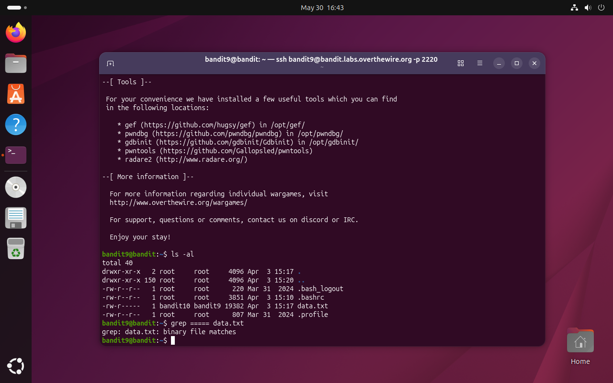
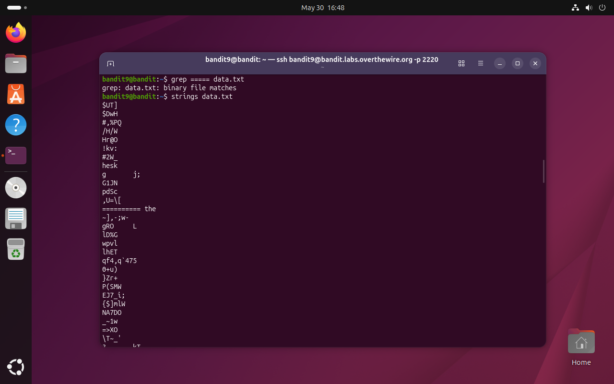
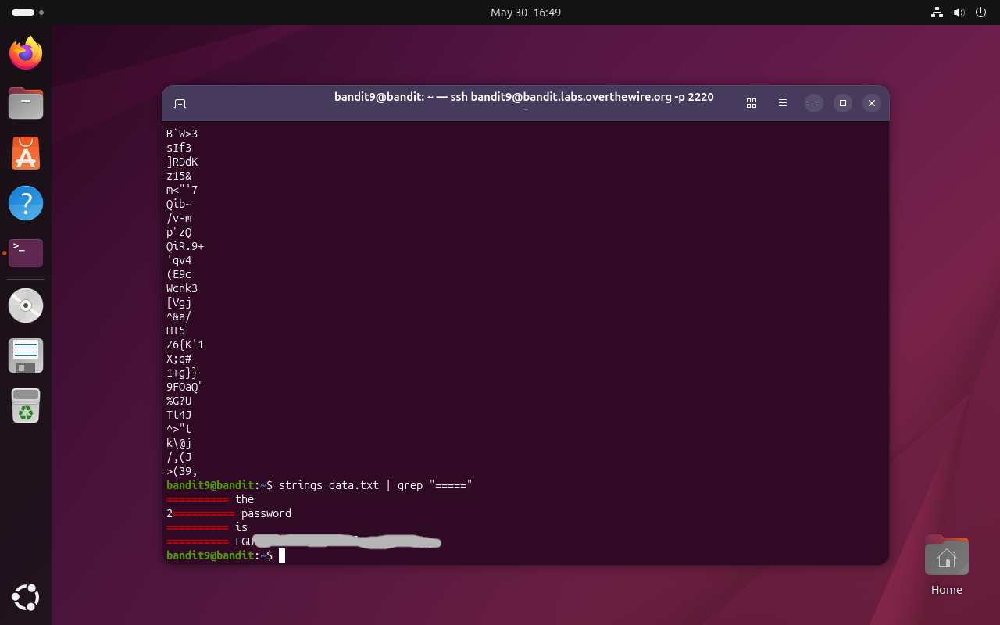

# Bandit Level 9 → 10

## Obiettivo

La password per il livello successivo è contenuta nel file `data.txt`, in una delle poche stringhe leggibili, preceduta da diversi caratteri `=`.

---

## Informazioni di connessione

| Campo | Valore |
|-------|--------|
| Host | `bandit.labs.overthewire.org` |
| Porta | `2220` |
| Utente | `bandit9` |

```bash
ssh bandit9@bandit.labs.overthewire.org -p 2220
```

---

## Comandi / concetti utili

- `ls -al` — lista file con dettagli estesi
- `grep` — filtra righe di testo contenenti un pattern
- `strings` — estrae le sequenze di caratteri stampabili da un file binario
- `|` — pipe: collega l'output di un comando all'input del successivo

---

## Soluzione

### Step 1 – Esaminare il file e tentare con `grep`

```bash
bandit9@bandit:~$ ls -al
total 40
drwxr-xr-x   2 root     root      4096 Apr  3 15:17 .
drwxr-xr-x 150 root     root      4096 Apr  3 15:20 ..
-rw-r--r--   1 root     root       220 Mar 31  2024 .bash_logout
-rw-r--r--   1 root     root      3851 Apr  3 15:10 .bashrc
-rw-r-----   1 bandit10 bandit9  19382 Apr  3 15:17 data.txt
-rw-r--r--   1 root     root       807 Mar 31  2024 .profile
```

`data.txt` pesa circa 19 KB. L'obiettivo menziona la presenza di caratteri `=====` come marcatori, quindi il primo tentativo naturale è usare `grep` per filtrarli direttamente:

```bash
bandit9@bandit:~$ grep ===== data.txt
grep: data.txt: binary file matches
```

`grep` rileva che il file contiene dati binari e si rifiuta di mostrarne il contenuto: segnala solo che esiste una corrispondenza, senza restituirla. Serve un approccio diverso che gestisca i file binari.



### Step 2 – Estrarre le stringhe leggibili con `strings`

`strings` è uno strumento progettato esattamente per questo scenario: analizza un file binario e ne estrae tutte le sequenze di caratteri stampabili di lunghezza minima (default: 4 caratteri). L'output è trattabile come testo normale:

```bash
bandit9@bandit:~$ strings data.txt
$UT]
$DwH
#,%PQ
/H/W
...
```

L'output contiene molte stringhe brevi apparentemente casuali che risultano essere alcuni frammenti leggibili del contenuto binario: utile per confermare che il file ha porzioni testuali, troppo verboso per trovare direttamente la riga cercata.



### Step 3 – Combinare `strings` e `grep` per isolare la password

Si passa l'output di `strings` a `grep` cercando il pattern `=====`, che secondo l'obiettivo precede la password:

```bash
bandit9@bandit:~$ strings data.txt | grep "====="
========== the
2========== password
========== is
========== FGU...
```

L'output mostra quattro righe che formano la frase "the password is [password]", distribuita su righe separate a causa di come i dati sono organizzati nel file binario. La password è l'ultimo token dell'ultima riga.



---

## Note e osservazioni

**`strings` e i file binari**

`strings` è uno strumento standard nei sistemi Unix, originariamente nato per ispezionare file eseguibili compilati alla ricerca di messaggi o costanti testuali embedded nel codice. Funziona scansionando il file byte per byte e raccogliendo sequenze di caratteri stampabili più lunghe di una soglia minima (4 caratteri per default, modificabile con `-n`). Non interpreta il formato del file: estrae semplicemente ciò che sembra testo, indipendentemente dal contesto binario circostante.

In ambito CTF e reverse engineering è uno dei primi comandi da eseguire su un file sconosciuto: rivela rapidamente stringhe di debug, messaggi di errore, URL, chiavi e altri artefatti testuali nascosti in file binari.

**Rendere la frase leggibile in un'unica riga**

L'output di `strings | grep "====="` restituisce la frase spezzata su quattro righe. Per ricongiungerla in un'unica stringa leggibile si può estrarre solo la parte testuale dopo i `=` da ciascuna riga con `awk`, e poi unirla con `xargs`:

```bash
bandit9@bandit:~$ strings data.txt | grep "=====" | awk '{print $NF}' | xargs
the password is FGU...
```

`awk '{print $NF}'` stampa solo l'ultimo campo di ogni riga (il testo dopo `=====`), eliminando i caratteri `=` e i prefissi numerici. `xargs` senza argomenti concatena le righe in una sola, separate da spazi, e restituendo la frase completa in forma leggibile.
