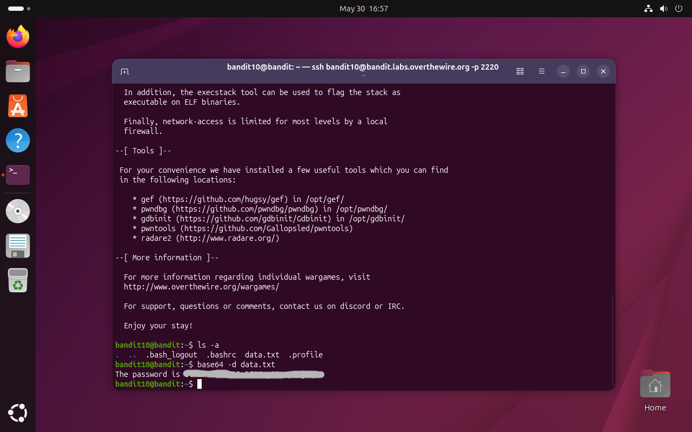

# Bandit Level 10 → 11

## Obiettivo

La password per il livello successivo è contenuta nel file `data.txt`, che contiene dati codificati in **Base64**.

---

## Informazioni di connessione

| Campo | Valore |
|-------|--------|
| Host | `bandit.labs.overthewire.org` |
| Porta | `2220` |
| Utente | `bandit10` |

```bash
ssh bandit10@bandit.labs.overthewire.org -p 2220
```

---

## Comandi / concetti utili

- `ls -a` — lista file inclusi i nascosti
- `base64 -d` — decodifica un file o input codificato in Base64
- `cat` — stampa il contenuto di un file

---

## Soluzione

### Step 1 – Individuare il file e decodificarlo

```bash
bandit10@bandit:~$ ls -a
.  ..  .bash_logout  .bashrc  data.txt  .profile
```

È presente `data.txt`. L'obiettivo specifica che il contenuto è codificato in Base64, quindi un `cat` restituirebbe una stringa apparentemente casuale di caratteri alfanumerici e non la password in chiaro. Il comando `base64` con il flag `-d` (decode) gestisce direttamente la decodifica leggendo il file:

```bash
bandit10@bandit:~$ base64 -d data.txt
The password is [password]
```

Il file decodificato contiene la frase con la password per accedere al livello successivo (`bandit11`).



---

## Note e osservazioni

**Base64: cos'è e come funziona**

Base64 è uno schema di **encoding** (non di cifratura) che converte dati binari arbitrari in una stringa composta esclusivamente da 64 caratteri ASCII stampabili: lettere maiuscole e minuscole (`A-Z`, `a-z`), cifre (`0-9`), e i simboli `+` e `/`. Il carattere `=` viene usato come padding finale per allineare la lunghezza dell'output.

Il meccanismo di funzionamento è il seguente: ogni gruppo di 3 byte dell'input (24 bit) viene suddiviso in 4 blocchi da 6 bit ciascuno. Ciascun blocco da 6 bit può assumere 64 valori distinti (2⁶ = 64), ognuno dei quali viene mappato a un carattere del set Base64. Il risultato è che ogni 3 byte di input diventano 4 caratteri di output — un overhead del circa 33%.

Base64 **non è crittografia**: chiunque in possesso del dato codificato può decodificarlo senza alcuna chiave. Il suo scopo è la compatibilità: permette di trasmettere dati binari (immagini, file, byte arbitrari) attraverso canali che accettano solo testo ASCII, come email, JSON, HTML o variabili d'ambiente. È usato pervasivamente in contesti come allegati email (MIME), autenticazione HTTP Basic, certificati X.509 in formato PEM e payload JWT.

La decodifica è l'operazione inversa: ogni 4 caratteri Base64 vengono riconvertiti nei 3 byte originali, ricostruendo fedelmente il dato di partenza.
