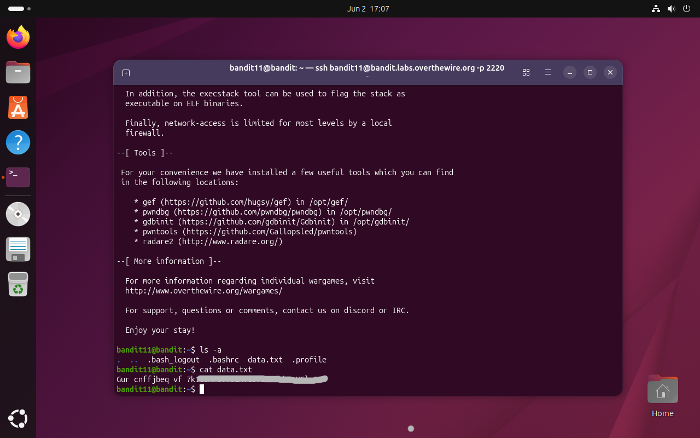
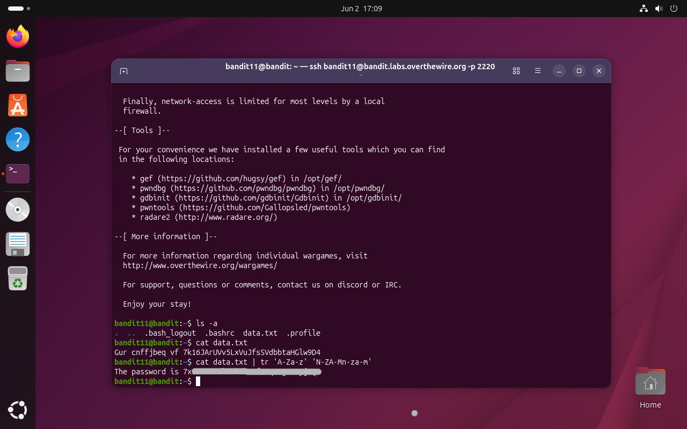

# Bandit Level 11 → 12

## Obiettivo

La password per il livello successivo è contenuta nel file `data.txt`, dove tutte le lettere sono state ruotate di 13 posizioni (cifrario ROT13).

---

## Informazioni di connessione

| Campo | Valore |
|-------|--------|
| Host | `bandit.labs.overthewire.org` |
| Porta | `2220` |
| Utente | `bandit11` |

```bash
ssh bandit11@bandit.labs.overthewire.org -p 2220
```

---

## Comandi / concetti utili

- `ls -a` — lista file inclusi i nascosti
- `cat` — stampa il contenuto di un file
- `tr` — sostituisce o elimina caratteri in un testo
- `|` — pipe: collega l'output di un comando all'input del successivo

---

## Soluzione

### Step 1 – Leggere il file e riconoscere la codifica

```bash
bandit11@bandit:~$ ls -a
.  ..  .bash_logout  .bashrc  data.txt  .profile
bandit11@bandit:~$ cat data.txt
Gur cnffjbeq vf [stringa ROT13]
```

Il contenuto è testo leggibile ma privo di significato: le parole hanno lunghezze plausibili e i caratteri sono tutti ASCII, ma non formano frasi in inglese. È il segnale caratteristico del ROT13, un cifrario di sostituzione che ruota ogni lettera di 13 posizioni nell'alfabeto. Il numero 13 non è casuale: è esattamente metà dei 26 caratteri dell'alfabeto, il che rende ROT13 la propria operazione inversa (applicarlo due volte restituisce il testo originale).



### Step 2 – Decifrare il testo con `tr`

Il comando `tr` permette di sostituire caratteri in modo posizionale: ogni carattere del primo set viene rimpiazzato con il carattere nella stessa posizione del secondo set. Per implementare ROT13 si definiscono i due set in modo che ogni lettera corrisponda a quella 13 posizioni più avanti (con wrap-around), separatamente per maiuscole e minuscole:

```bash
bandit11@bandit:~$ cat data.txt | tr 'A-Za-z' 'N-ZA-Mn-za-m'
The password is [password]
```

Il testo decifrato mostra la password per accedere al livello successivo (`bandit12`).

Il mapping definito dal comando è il seguente:
- `A-Z` → `N-ZA-M`: le lettere maiuscole `A`→`N`, `B`→`O`, ... `M`→`Z`, `N`→`A`, ... `Z`→`M`
- `a-z` → `n-za-m`: stesso meccanismo per le minuscole



---

## Note e osservazioni

**Il comando `tr`**

`tr` (translate) è un comando Unix che legge da stdin e sostituisce o elimina caratteri secondo due set specificati come argomenti. Ogni carattere del primo set viene sostituito con il carattere nella posizione corrispondente del secondo set. I set possono essere specificati come sequenze di caratteri letterali o come intervalli (`A-Z`, `0-9`, ecc.).

Alcuni utilizzi comuni:

```bash
# Convertire in maiuscolo
echo "hello" | tr 'a-z' 'A-Z'

# Eliminare caratteri (flag -d)
echo "h3ll0 w0rld" | tr -d '0-9'

# Sostituire spazi multipli con uno solo (flag -s, squeeze)
echo "hello   world" | tr -s ' '

# Eliminare i newline (utile per unire righe)
cat file.txt | tr -d '\n'
```

`tr` opera esclusivamente su singoli caratteri: non supporta pattern, espressioni regolari o sostituzioni di stringhe. Per sostituzioni più complesse si usa `sed`.

**Metodo alternativo: Python**

Python include il supporto nativo a ROT13 attraverso il modulo `codecs`:

```bash
bandit11@bandit:~$ python3 -c "import codecs; print(codecs.decode(open('data.txt').read(), 'rot_13'))"
The password is [password]
```

Rispetto a `tr`, questo approccio è più esplicito nel nominare la codifica usata (`rot_13`), rendendo il comando autodescrittivo. È anche più robusto in caso di testi con caratteri non ASCII, che `tr` potrebbe gestire in modo inatteso a seconda della locale di sistema.
