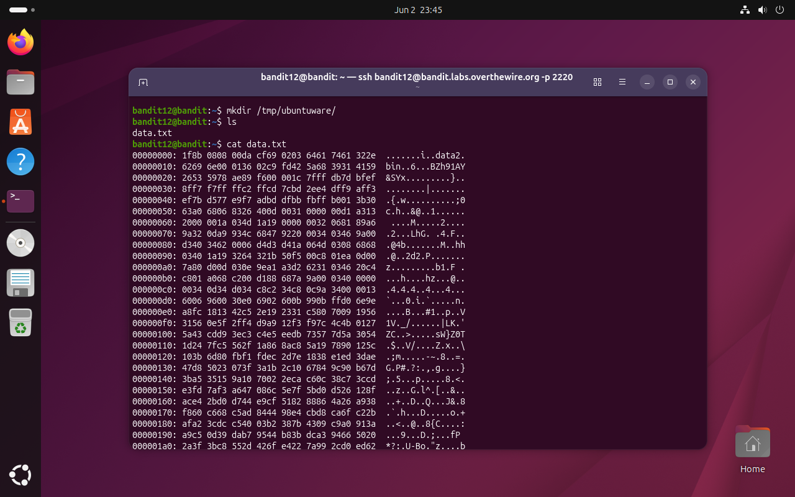
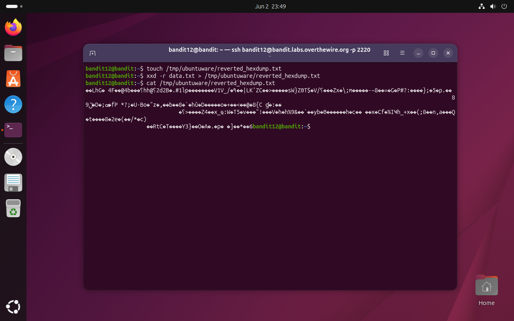
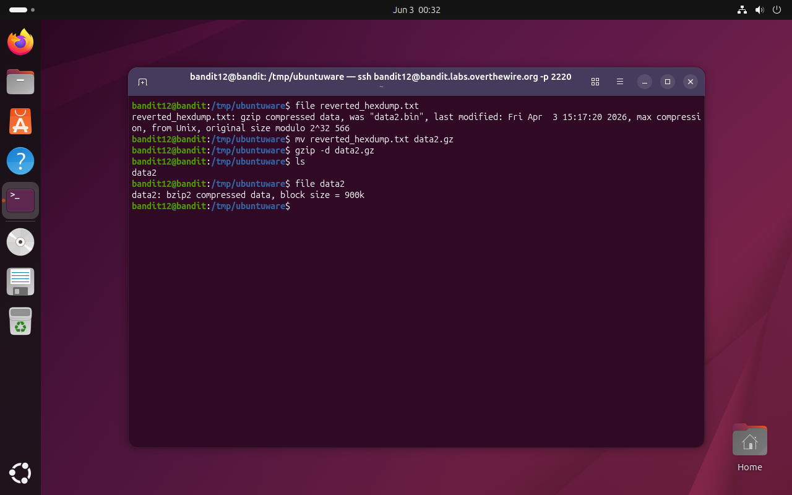
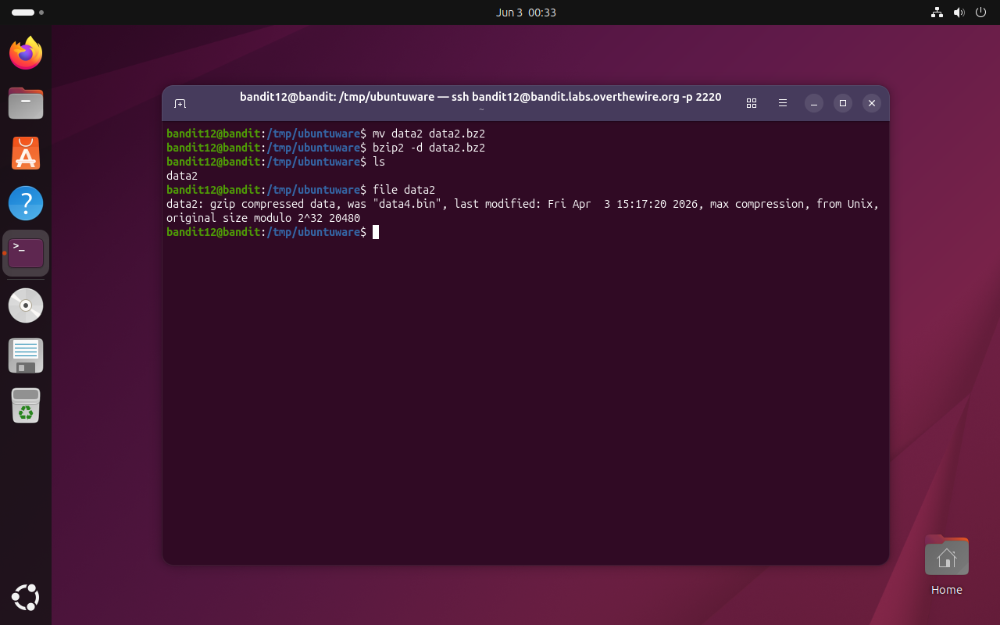
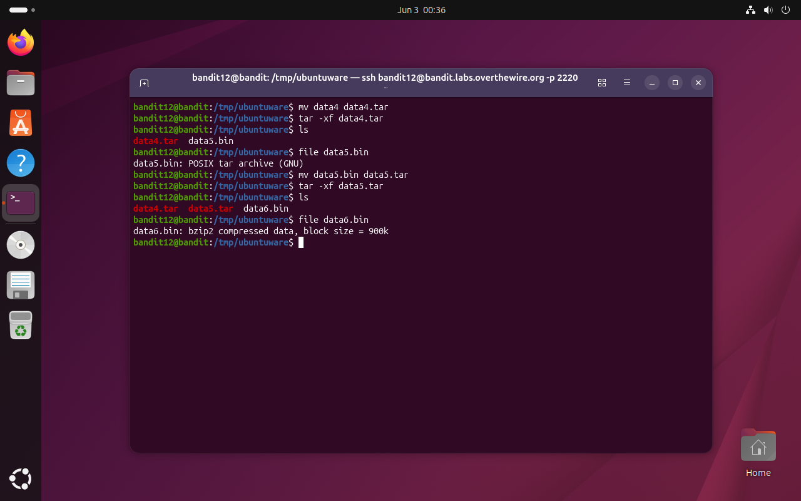
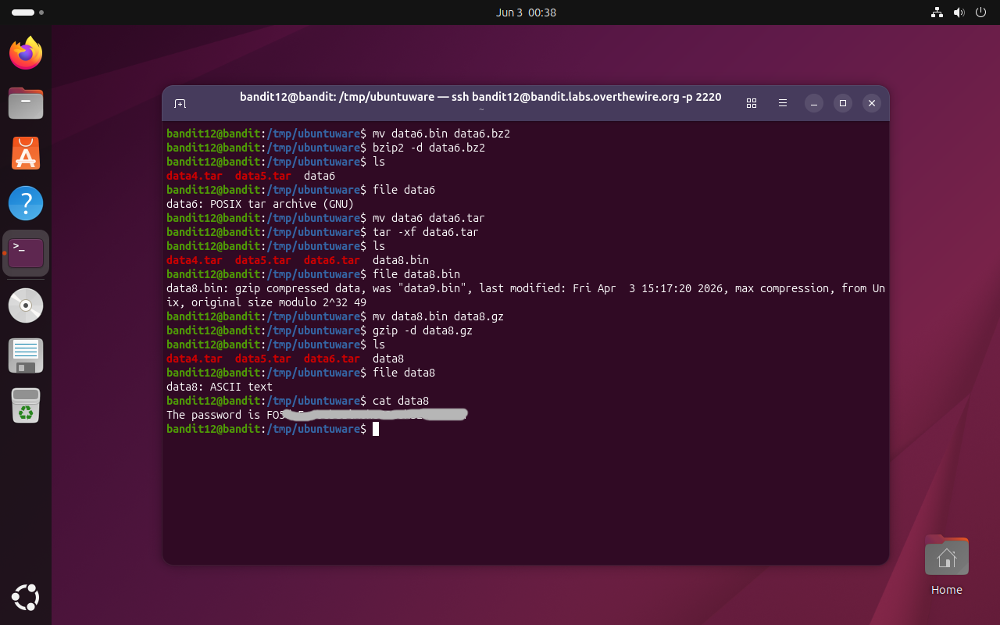

# Bandit Level 12 → 13

## Obiettivo

La password per il livello successivo è contenuta nel file `data.txt`, che è un hexdump di un file compresso più volte con formati diversi.

---

## Informazioni di connessione

| Campo | Valore |
|-------|--------|
| Host | `bandit.labs.overthewire.org` |
| Porta | `2220` |
| Utente | `bandit12` |

```bash
ssh bandit12@bandit.labs.overthewire.org -p 2220
```

---

## Comandi / concetti utili

- `xxd` — genera o legge un hexdump di un file binario
- `xxd -r` — inverte un hexdump testuale, ricostruendo i byte binari originali
- `file` — identifica il tipo di un file ispezionandone il contenuto
- `mv` — rinomina un file (necessario per assegnare l'estensione corretta prima di decomprimere)
- `gzip -d` — decomprime un file `.gz`
- `bzip2 -d` — decomprime un file `.bz2`
- `tar -xf` — estrae il contenuto di un archivio tar
- `mkdir` — crea una directory di lavoro

---

## Soluzione

### Step 1 – Esaminare il file e capire il problema

```bash
bandit12@bandit:~$ ls
data.txt
bandit12@bandit:~$ cat data.txt
00000000: 1f8b 0808 00da cf69 0203 6461 7461 322e  .......i..data2.
00000010: 6269 6e00 0136 02c9 fd42 5a68 3931 4159  bin..6...BZh91AY
00000020: 2653 5978 ae89 f600 001c 7fff db7d bfef  &SYx.........}..
...
```

`data.txt` non contiene testo leggibile: è un hexdump, ovvero una rappresentazione testuale di dati binari in esadecimale prodotta da strumenti come `xxd`. Ogni riga riporta l'offset iniziale, i byte in esadecimale a coppie, e la corrispondente visualizzazione ASCII sulla destra. Prima di poter ispezionare o decomprimere il contenuto reale è necessario invertire questa rappresentazione per ottenere di nuovo i byte binari originali.



### Step 2 – Creare una directory di lavoro e ricostruire il file binario

Dato che la home directory di `bandit12` è in sola lettura, è necessario creare una directory temporanea in `/tmp` dove poter scrivere e rinominare liberamente i file durante il processo di decompressione:

```bash
bandit12@bandit:~$ mkdir /tmp/ubuntuware
```

Si usa `xxd -r` per invertire l'hexdump e scrivere il file binario risultante nella directory di lavoro. Il flag `-r` (*reverse*) converte la rappresentazione testuale esadecimale nei byte originali:

```bash
bandit12@bandit:~$ touch /tmp/ubuntuware/reverted_hexdump.txt
bandit12@bandit:~$ xxd -r data.txt > /tmp/ubuntuware/reverted_hexdump.txt
bandit12@bandit:~$ cat /tmp/ubuntuware/reverted_hexdump.txt
��LhG. 4F@@4b...
```

Il `cat` produce output binario illeggibile, confermando che la ricostruzione ha funzionato: il file ora contiene byte grezzi, non più testo. A questo punto ci si sposta nella directory di lavoro per le fasi successive.



### Step 3 – Primo livello: gzip → bzip2

Si usa `file` per identificare il tipo del file ricostruito, senza aprirlo:

```bash
bandit12@bandit:/tmp/ubuntuware$ file reverted_hexdump.txt
reverted_hexdump.txt: gzip compressed data, was "data2.bin", last modified: Fri Apr 3 15:17:20 2026, max compression, from Unix, original size modulo 2^32 566
```

È un archivio gzip. `gzip -d` richiede che il file abbia estensione `.gz`, quindi prima si rinomina di conseguenza, poi si decomprime:

```bash
bandit12@bandit:/tmp/ubuntuware$ mv reverted_hexdump.txt data2.gz
bandit12@bandit:/tmp/ubuntuware$ gzip -d data2.gz
bandit12@bandit:/tmp/ubuntuware$ ls
data2
bandit12@bandit:/tmp/ubuntuware$ file data2
data2: bzip2 compressed data, block size = 900k
```

Il file decompresso è a sua volta compresso, questa volta con bzip2.



### Step 4 – Secondo livello: bzip2 → gzip

```bash
bandit12@bandit:/tmp/ubuntuware$ mv data2 data2.bz2
bandit12@bandit:/tmp/ubuntuware$ bzip2 -d data2.bz2
bandit12@bandit:/tmp/ubuntuware$ ls
data2
bandit12@bandit:/tmp/ubuntuware$ file data2
data2: gzip compressed data, was "data4.bin", last modified: Fri Apr 3 15:17:20 2026, max compression, from Unix, original size modulo 2^32 20480
```

Il pattern si ripete: un altro strato di compressione, stavolta di nuovo gzip.



### Step 5 – Terzo livello: gzip → tar

```bash
bandit12@bandit:/tmp/ubuntuware$ mv data2 data4.gz
bandit12@bandit:/tmp/ubuntuware$ gzip -d data4.gz
bandit12@bandit:/tmp/ubuntuware$ ls
data4
bandit12@bandit:/tmp/ubuntuware$ file data4
data4: POSIX tar archive (GNU)
```

Questa volta il risultato non è un archivio compresso ma un archivio tar, un formato che raggruppa più file insieme senza comprimerli. Il processo non cambia: si rinomina e si estrae.

```bash
bandit12@bandit:/tmp/ubuntuware$ mv data4 data4.tar
bandit12@bandit:/tmp/ubuntuware$ tar -xf data4.tar
```


### Step 6 – Livelli successivi: tar → tar → bzip2 → tar → gzip → ASCII

Da questo punto la sequenza di decompressione continua meccanicamente, seguendo sempre lo stesso schema: `file` per identificare il tipo, `mv` per assegnare l'estensione corretta, comando appropriato per decomprimere o estrarre.

```bash
bandit12@bandit:/tmp/ubuntuware$ ls
data4.tar  data5.bin
bandit12@bandit:/tmp/ubuntuware$ file data5.bin
data5.bin: POSIX tar archive (GNU)
bandit12@bandit:/tmp/ubuntuware$ mv data5.bin data5.tar
bandit12@bandit:/tmp/ubuntuware$ tar -xf data5.tar
bandit12@bandit:/tmp/ubuntuware$ ls
data4.tar  data5.tar  data6.bin
bandit12@bandit:/tmp/ubuntuware$ file data6.bin
data6.bin: bzip2 compressed data, block size = 900k
bandit12@bandit:/tmp/ubuntuware$ mv data6.bin data6.bz2
bandit12@bandit:/tmp/ubuntuware$ bzip2 -d data6.bz2
bandit12@bandit:/tmp/ubuntuware$ file data6
data6: POSIX tar archive (GNU)
bandit12@bandit:/tmp/ubuntuware$ mv data6 data6.tar
bandit12@bandit:/tmp/ubuntuware$ tar -xf data6.tar
bandit12@bandit:/tmp/ubuntuware$ ls
data4.tar  data5.tar  data6.tar  data8.bin
bandit12@bandit:/tmp/ubuntuware$ file data8.bin
data8.bin: gzip compressed data, was "data9.bin", last modified: Fri Apr 3 15:17:20 2026, max compression, from Unix, original size modulo 2^32 49
bandit12@bandit:/tmp/ubuntuware$ mv data8.bin data8.gz
bandit12@bandit:/tmp/ubuntuware$ gzip -d data8.gz
bandit12@bandit:/tmp/ubuntuware$ file data8
data8: ASCII text
bandit12@bandit:/tmp/ubuntuware$ cat data8
The password is FO5...
```

`file` segnala finalmente `ASCII text`: la catena di compressioni è terminata e il file contiene la password per accedere al livello successivo (`bandit13`).





---

## Note e osservazioni

**Perché `mv` prima di decomprimere**

`gzip -d` e `bzip2 -d` operano su file con estensione corretta (`.gz` e `.bz2` rispettivamente): se il file non la ha, i tool si rifiutano di elaborarlo o producono un errore. `tar` è più tollerante e accetta il flag `-xf` su file con qualsiasi nome, ma rinominarlo con `.tar` mantiene il flusso di lavoro coerente e leggibile. `mv` in questo contesto non copia né sposta: rinomina il file nella stessa directory, un'operazione a costo zero a livello di filesystem.

**Il formato tar e la sua relazione con la compressione**

tar (*tape archive*) è un formato di archiviazione che aggrega più file in uno singolo senza comprimerli. La compressione è un passo separato, storicamente eseguito in pipeline: `tar cf - . | gzip > archivio.tar.gz`. I file `.tar.gz` (o `.tgz`) sono quindi archivi tar compressi con gzip. In questo livello i due strati, archiviazione e compressione, sono applicati e annidati in modo indipendente, il che rende necessario gestirli separatamente.

**Automatizzare con uno script**

La sequenza di decompressioni è ripetitiva e segue sempre lo stesso schema: `file` → `mv` → decomprimi/estrai → ricomincia. Sarebbe tecnicamente possibile scrivere uno script bash che automatizzi l'intero processo, riconoscendo il tipo del file a ogni iterazione e applicando il comando corretto fino a raggiungere un file ASCII. Tuttavia, il focus di questo livello non è l'automazione: l'obiettivo è comprendere i diversi formati di compressione e come identificarli manualmente. Inoltre, per eseguire uno script bash nel contesto di questo wargame occorrerebbe assegnargli i permessi di esecuzione con `chmod +x`, operazione che richiede di essere proprietari del file (condizione che sarebbe soddisfatta creando lo script in `/tmp`) ma che in ogni caso presuppone di avere il file nella directory corrente e i permessi necessari per modificarlo. Non vi sono invece privilegi amministrativi che manchino per questa operazione specifica: `chmod` su file propri funziona senza `sudo`.
