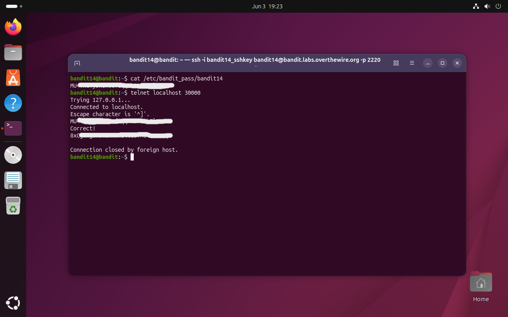

# Bandit Level 14 → 15

## Obiettivo

La password per il livello successivo si ottiene inviando la password del livello corrente (`bandit14`) alla porta `30000` su `localhost`.

---

## Informazioni di connessione

| Campo | Valore |
|-------|--------|
| Host | `bandit.labs.overthewire.org` |
| Porta | `2220` |
| Utente | `bandit14` |

```bash
ssh -i bandit14_sshkey bandit14@bandit.labs.overthewire.org -p 2220
```

---

## Comandi / concetti utili

- `cat` — stampa il contenuto di un file
- `telnet` — apre una connessione TCP interattiva verso un host e una porta
- `nmap` — scanner di rete per rilevare host, porte aperte e servizi attivi

---

## Soluzione

### Step 1 – Recuperare la password corrente

La password di `bandit14` è leggibile direttamente dal file riservato al proprio utente:

```bash
bandit14@bandit:~$ cat /etc/bandit_pass/bandit14
[password bandit14]
```

Questo valore è quello da inviare al servizio in ascolto sulla porta `30000`. È il primo livello in cui la password del livello corrente non è un punto di arrivo ma un input da fornire a un servizio esterno per ottenere quella successiva.

### Step 2 – Connettersi alla porta 30000 con `telnet` e inviare la password

`telnet` apre una connessione TCP interattiva: tutto ciò che si digita viene trasmesso al server, e tutto ciò che il server risponde viene stampato a schermo. È sufficiente connettersi, incollare la password e premere invio:

```bash
bandit14@bandit:~$ telnet localhost 30000
Trying 127.0.0.1...
Connected to localhost.
Escape character is '^]'.
[password bandit14]
Correct!
[password bandit15]

Connection closed by foreign host.
```

Il server risponde `Correct!`, restituisce la password per il livello successivo (`bandit15`) e chiude la connessione.



---

## Note e osservazioni

**`telnet` e il modello client-server su TCP**

`telnet` è uno dei protocolli di rete più antichi ancora in uso, nato negli anni '70 come standard per sessioni di terminale remoto. A differenza di SSH non cifra nulla: trasmette dati in chiaro sul canale TCP, il che lo rende inadatto per sessioni autenticate in ambienti non sicuri. In contesti CTF e di test locale viene però usato regolarmente proprio per questa semplicità: è uno strumento generico per aprire connessioni TCP e scambiare testo con qualsiasi servizio, senza overhead né negoziazione crittografica.

La sequenza di output che produce è standard per qualsiasi connessione TCP riuscita:

- `Trying 127.0.0.1...` — risoluzione dell'hostname e tentativo di connessione all'IP
- `Connected to localhost.` — handshake TCP completato, connessione stabilita
- `Escape character is '^]'.` — avviso del carattere di controllo per uscire dalla sessione (`Ctrl+]`)
- `Connection closed by foreign host.` — il server ha chiuso la connessione dal suo lato dopo aver processato l'input

Una volta connesso, `telnet` non fa altro che trasmettere ciò che si digita e stampare ciò che il server invia: in questo livello il server legge una riga di testo, la confronta con la password attesa, e risponde di conseguenza.

**Come avremmo potuto scoprire la porta 30000 con `nmap`**

L'obiettivo indica esplicitamente la porta da usare, ma in scenari reali o in livelli più avanzati può essere necessario scoprire autonomamente quali porte sono in ascolto su un host. `nmap` (Network Mapper) è lo strumento standard per questo tipo di ricognizione. Per scansionare le porte aperte su localhost:

```bash
bandit14@bandit:~$ nmap -p- localhost
```

Il flag `-p-` istruisce `nmap` a scansionare tutte le 65535 porte TCP (per default scansiona solo le 1000 più comuni). L'output mostrerebbe tra gli altri:

```
PORT      STATE SERVICE
22/tcp    open  ssh
30000/tcp open  unknown
...
```

`nmap` funziona inviando pacchetti TCP (o UDP) a ciascuna porta e analizzando la risposta: una porta che risponde con il flag `SYN-ACK` è aperta, una che risponde con `RST` è chiusa, una che non risponde è filtrata (probabilmente da un firewall). Per ogni porta aperta tenta anche di identificare il servizio in esecuzione confrontando il banner o il comportamento con un database interno. La porta `30000` non corrisponde a nessun servizio noto e verrebbe classificata come `unknown` anche se sarebbe comunque visibile e raggiungibile.

**Metodo alternativo: `nc` al posto di `telnet`**

`netcat` (`nc`) è funzionalmente equivalente a `telnet` per questo tipo di connessione TCP semplice, ed è spesso preferito in ambito CTF perché più flessibile e scriptabile. La stessa operazione si esegue con:

```bash
bandit14@bandit:~$ echo "[password bandit14]" | nc localhost 30000
```

La pipe con `echo` evita la sessione interattiva: invia direttamente la stringa al server e stampa la risposta, senza dover incollare manualmente. È utile quando si vuole integrare il passaggio in uno script o evitare l'overhead della sessione interattiva di `telnet`.
