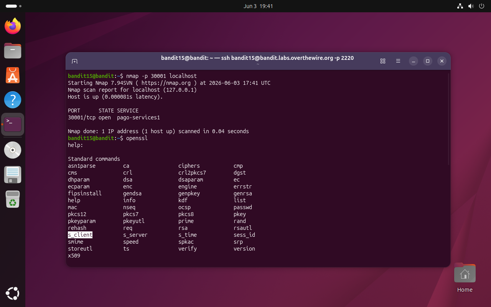
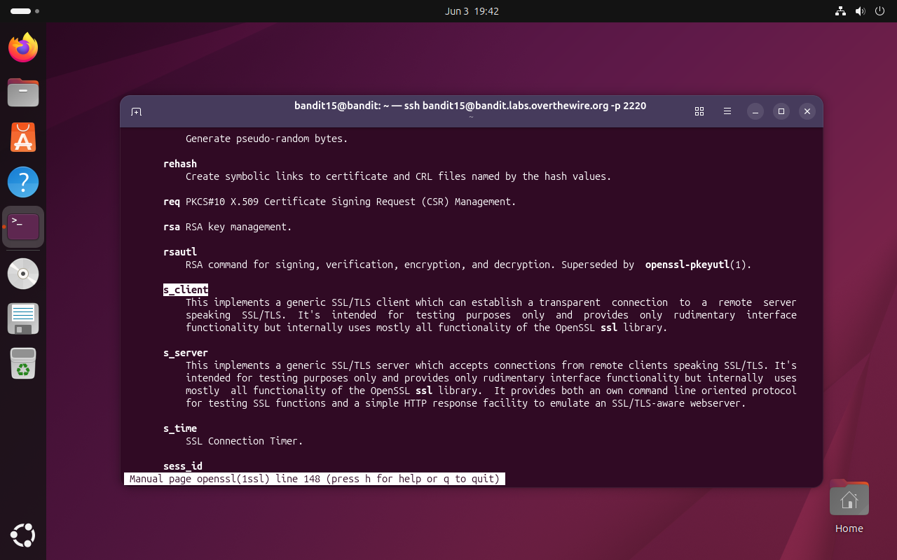
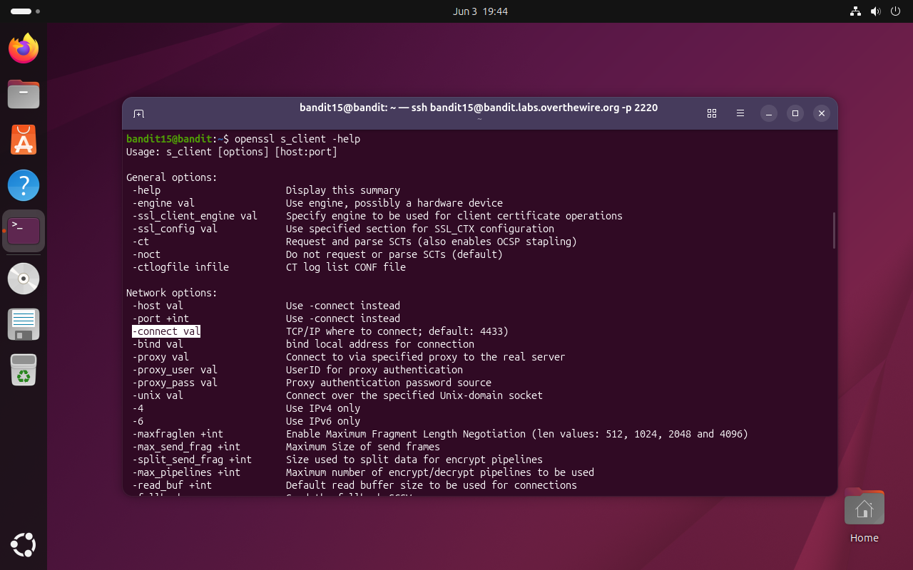
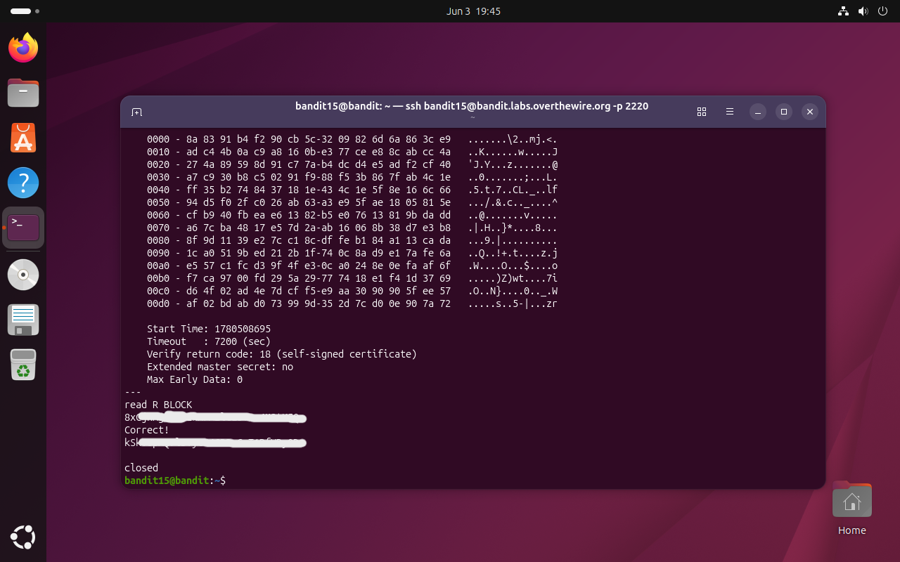

# Bandit Level 15 → 16

## Obiettivo

La password per il livello successivo si ottiene inviando la password del livello corrente (`bandit15`) alla porta `30001` su `localhost`, questa volta usando una connessione cifrata con SSL/TLS.

---

## Informazioni di connessione

| Campo | Valore |
|-------|--------|
| Host | `bandit.labs.overthewire.org` |
| Porta | `2220` |
| Utente | `bandit15` |

```bash
ssh bandit15@bandit.labs.overthewire.org -p 2220
```

---

## Comandi / concetti utili

- `nmap` — scanner di rete per rilevare porte aperte e servizi attivi
- `openssl` — toolkit crittografico con sottocomandi per cifratura, certificati e connessioni SSL/TLS
- `openssl s_client` — sottocomando di `openssl` per aprire connessioni SSL/TLS interattive
- `man openssl` — manuale generale di openssl con lista di tutti i sottocomandi
- `openssl s_client -help` — lista dei flag disponibili per il sottocomando `s_client`

---

## Soluzione

### Step 1 – Verificare la porta con `nmap` e individuare lo strumento

La porta è già indicata dall'obiettivo, ma `nmap` conferma che è effettivamente in ascolto e fornisce un'informazione utile sul tipo di servizio:

```bash
bandit15@bandit:~$ nmap -p 30001 localhost
Starting Nmap 7.94SVN ( https://nmap.org ) at 2026-06-03 17:41 UTC
Nmap scan report for localhost (127.0.0.1)
Host is up (0.000081s latency).

PORT      STATE SERVICE
30001/tcp open  pago-services1

Nmap done: 1 IP address (1 up) scanned in 0.04 seconds
```

La porta è classificata come `pago-services1`, un'etichetta che non corrisponde a nessun protocollo standard riconosciuto da nmap, segnale che il servizio è custom. L'obiettivo specifica che la connessione deve essere SSL/TLS, quindi `telnet` o `nc` semplici non bastano. Serve uno strumento che gestisca l'handshake crittografico: il punto di partenza naturale è `openssl`, eseguito senza argomenti per vedere quali sottocomandi offre:

```bash
bandit15@bandit:~$ openssl
help:

Standard commands
asn1parse       ca              ciphers         cmp
cms             crl             crl2pkcs7       dgst
dhparam         dsa             dsaparam        ec
ecparam         enc             engine          errstr
fipsinstall     gendsa          genpkey         genrsa
help            info            kdf             list
mac             nseq            ocsp            passwd
pkcs12          pkcs7           pkcs8           pkey
pkeyparam       pkeyutl         prime           rand
rehash          req             rsa             rsautl
s_client        s_server        s_time          sess_id
smime           speed           spkac           srp
storeutl        ts              verify          version
x509
```

Nella lista dei **Standard commands** compare `s_client`, che per nome suggerisce un client SSL. È il sottocomando da approfondire.



### Step 2 – Leggere il manuale per capire cosa fa `s_client`

Prima di usare un sottocomando sconosciuto, il manuale è la fonte più affidabile. `man openssl` mostra la descrizione di tutti i sottocomandi nella stessa pagina:

```bash
bandit15@bandit:~$ man openssl
```

Scorrendo fino alla voce `s_client`:

```
s_client
    This implements a generic SSL/TLS client which can establish a
    transparent connection to a remote server speaking SSL/TLS. It's
    intended for testing purposes only and provides only rudimentary
    interface functionality but internally uses mostly all functionality
    of the OpenSSL ssl library.
```

La descrizione conferma che `s_client` è esattamente ciò che serve: un client SSL/TLS generico pensato per test e ispezione di connessioni cifrate.



### Step 3 – Trovare il flag corretto con `-help`

Sapendo che `s_client` è il sottocomando giusto, il passo successivo è capire come specificare host e porta. Invece di aprire di nuovo il manuale, `openssl s_client -help` restituisce direttamente la lista dei flag disponibili:

```bash
bandit15@bandit:~$ openssl s_client -help
Usage: s_client [options] [host:port]

General options:
 -help                      Display this summary
 ...

Network options:
 -host val                  Use -connect instead
 -port +int                 Use -connect instead
 -connect val               TCP/IP where to connect; default: 4433
 ...
```

Il flag `-connect` accetta `host:porta` e ha come default la porta `4433`, il valore da sovrascrivere con `localhost:30001`. La sintassi è ora chiarissima.



### Step 4 – Connettersi e inviare la password

```bash
bandit15@bandit:~$ openssl s_client -connect localhost:30001
```

Dopo la fase di handshake SSL (che produce un output esteso con i dettagli del certificato e la cipher suite negoziata e i dati crittografici della sessione) il terminale entra in modalità interattiva (`read R BLOCK`). Si incolla la password di `bandit15` e si preme invio:

```
...
Verify return code: 18 (self-signed certificate)
---
read R BLOCK
[password bandit15]
Correct!
[password bandit16]

closed
```

Il server risponde `Correct!`, restituisce la password per il livello successivo (`bandit16`) e chiude la connessione.



---

## Note e osservazioni

**L'importanza del manuale in fasi avanzate**

Nei livelli iniziali i comandi da usare erano comuni e documentati ovunque. Da questo livello in poi gli strumenti diventano più specializzati: `openssl` ha decine di sottocomandi e centinaia di flag, e nessuno li conosce tutti a memoria. Il percorso seguito in questo livello (`openssl` senza argomenti per vedere la lista dei sottocomandi, `man openssl` per leggere le descrizioni, `openssl s_client -help` per i flag specifici) è un metodo sistematico applicabile a qualsiasi strumento nuovo. Il manuale è scritto dagli sviluppatori dello strumento, è sempre aggiornato alla versione installata ed è disponibile offline sul server: in un contesto CTF o di penetration testing, dove l'accesso a internet può essere assente o inaffidabile, è spesso l'unica fonte utilizzabile.

**`openssl s_client` e il `Verify return code: 18`**

L'output dell'handshake include la riga `Verify return code: 18 (self-signed certificate)`: significa che il certificato del server è autofirmato, cioè non è rilasciato da una Certificate Authority (CA) riconosciuta, e quindi la catena di fiducia non può essere verificata. Per default `s_client` si connette comunque senza bloccarsi: segnala il problema ma non interrompe la sessione. Questo comportamento è intenzionale per uno strumento di test diagnostico: in un browser o in un client di produzione, un certificato self-signed causerebbe un errore bloccante o un avviso di sicurezza.

**Metodo alternativo: `ncat --ssl`**

`ncat` (la versione moderna di `netcat` inclusa in `nmap`) supporta nativamente SSL con il flag `--ssl`, offrendo la stessa semplicità di utilizzo di `nc` ma con cifratura:

```bash
bandit15@bandit:~$ echo "[password bandit15]" | ncat --ssl localhost 30001
Correct!
[password bandit16]
```

Il vantaggio rispetto a `openssl s_client` è la sintassi più concisa e la possibilità di usare la pipe con `echo` per evitare la sessione interattiva. Lo svantaggio è che non mostra nessuna informazione sul certificato o sul protocollo negoziato, utile se si vuole solo inviare dati, inadeguato se si sta diagnosticando un problema SSL.
