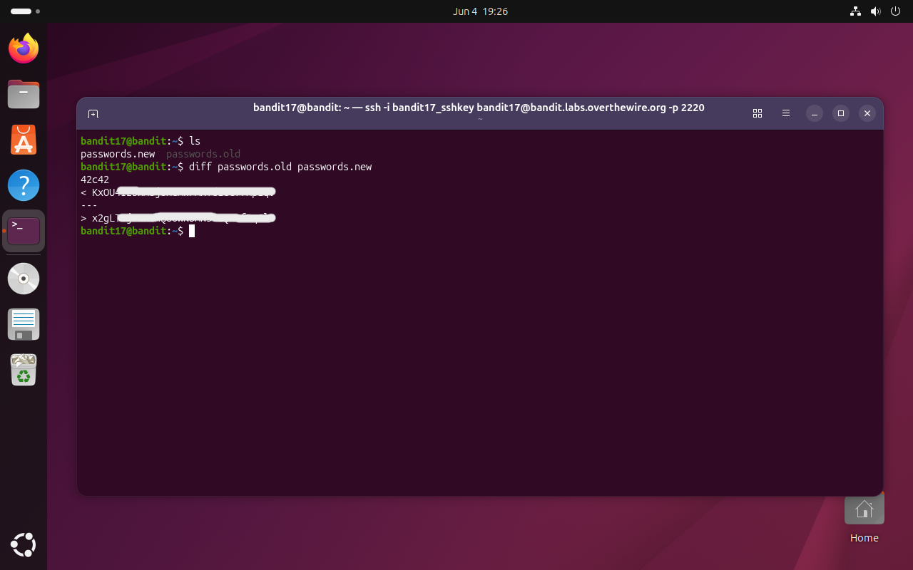

# Bandit Level 17 → 18

## Obiettivo

La password per il livello successivo è l'unica riga che differisce tra i file `passwords.new` e `passwords.old`, presenti nella home directory. La riga cercata si trova in `passwords.new`.

---

## Informazioni di connessione

| Campo | Valore |
|-------|--------|
| Host | `bandit.labs.overthewire.org` |
| Porta | `2220` |
| Utente | `bandit17` |

```bash
ssh -i bandit17_key bandit17@bandit.labs.overthewire.org -p 2220
```

---

## Comandi / concetti utili

- `ls` — lista file nella directory corrente
- `diff` — confronta due file riga per riga e mostra le differenze

---

## Soluzione

### Step 1 – Esaminare la home e confrontare i file

```bash
bandit17@bandit:~$ ls
passwords.new  passwords.old
```

Sono presenti esattamente due file. L'obiettivo specifica che una sola riga differisce tra i due: `diff` è lo strumento diretto per questo compito, senza bisogno di passi intermedi.

Per convenzione si passa prima il file "vecchio" e poi il "nuovo", in modo che l'output sia leggibile nella direzione logica del cambiamento da `old` a `new`:

```bash
bandit17@bandit:~$ diff passwords.old passwords.new
42c42
< KxOU[...]
---
> x2gL[...]
```

La riga preceduta da `>` è quella presente in `passwords.new` ma non in `passwords.old`: è la password per accedere al livello successivo.



---

## Note e osservazioni

**Come leggere l'output di `diff`**

Il formato standard di `diff` può sembrare criptico alla prima lettura, ma segue una struttura precisa. L'output dell'esempio è:

```
42c42
< KxOU[...]
---
> x2gL[...]
```

La prima riga (`42c42`) è l'**intestazione del blocco di differenza** e si legge come `<linea_file1><operazione><linea_file2>`. Le operazioni possibili sono tre:

- `c` (*change*) — la riga esiste in entrambi i file ma ha contenuto diverso
- `a` (*add*) — la riga è presente solo nel secondo file
- `d` (*delete*) — la riga è presente solo nel primo file

`42c42` significa quindi: la riga 42 del primo file (`passwords.old`) è stata modificata e corrisponde alla riga 42 del secondo file (`passwords.new`).

Le righe che seguono mostrano il contenuto:

- `<` indica righe provenienti dal **primo file** (quello di sinistra, `passwords.old`)
- `>` indica righe provenienti dal **secondo file** (quello di destra, `passwords.new`)
- `---` è il separatore tra i due blocchi

In questo livello entrambe le righe occupano la stessa posizione (42) nei rispettivi file: una è stata sostituita dall'altra senza spostare nessun'altra riga nel documento.

**Casi d'uso comuni di `diff`**

`diff` nasce per confrontare file di testo riga per riga, ma i suoi casi d'uso reali vanno ben oltre il semplice confronto visivo:

In **sviluppo software** è alla base del controllo di versione: `git diff` usa internamente lo stesso algoritmo per mostrare le modifiche tra commit, branch o rispetto all'area di staging. L'output di `diff` in formato unificato (`diff -u`) è il formato standard dei **patch file**, file che descrivono le modifiche da applicare a un sorgente per aggiornarlo, distribuiti storicamente via email nelle mailing list dei kernel e dei progetti open source e ancora oggi usati da `git apply` e `patch`.

In **amministrazione di sistema** è utile per confrontare file di configurazione tra versioni (`diff /etc/nginx/nginx.conf /etc/nginx/nginx.conf.bak`), verificare che un deployment abbia modificato solo i file attesi, o confrontare l'output di due esecuzioni dello stesso script.

In **sicurezza** e **forensics** viene usato per rilevare modifiche non autorizzate a file di sistema, confrontando checksum o snapshot presi in momenti diversi.

**Metodo alternativo: `grep -Fxvf`**

`diff` è la scelta naturale, ma lo stesso risultato si ottiene con `grep` sfruttando i flag per la ricerca inversa tra file:

```bash
bandit17@bandit:~$ grep -Fxvf passwords.old passwords.new
x2gL[...]
```

I flag usati: `-F` disabilita le regex trattando il pattern come stringa letterale; `-x` richiede la corrispondenza dell'intera riga (non solo una sottostringa); `-v` inverte il match (seleziona le righe che *non* corrispondono); `-f passwords.old` usa il contenuto di `passwords.old` come lista di pattern. Il risultato è l'insieme delle righe di `passwords.new` che non compaiono in nessuna forma identica in `passwords.old`.

È meno leggibile di `diff` per un confronto generico, ma più conciso quando si vuole estrarre direttamente le righe uniche senza visualizzare il contesto del cambiamento.
