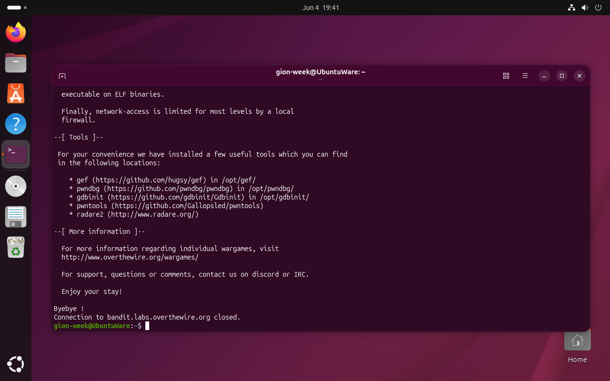
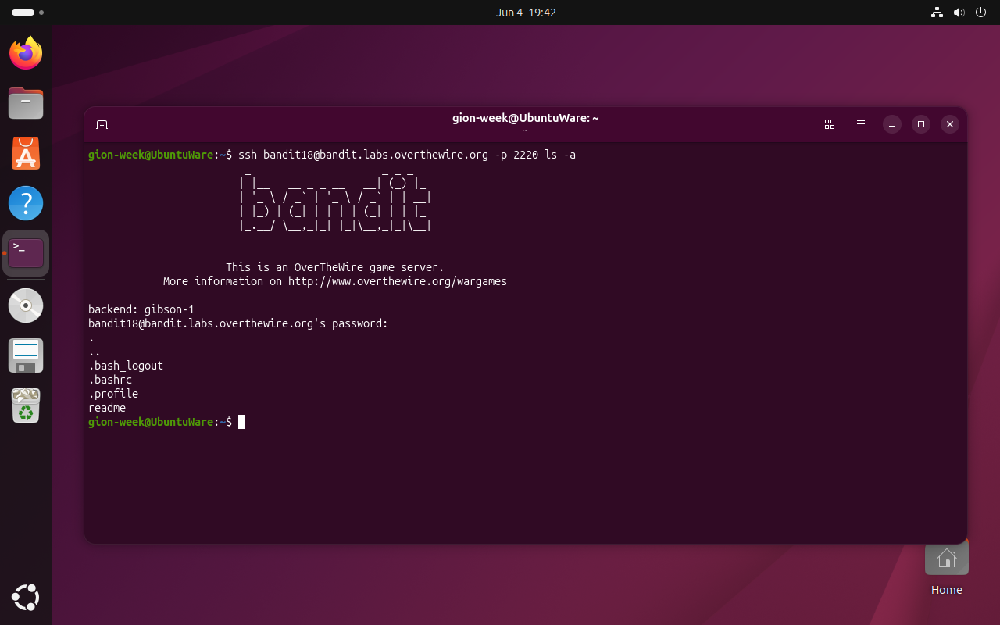
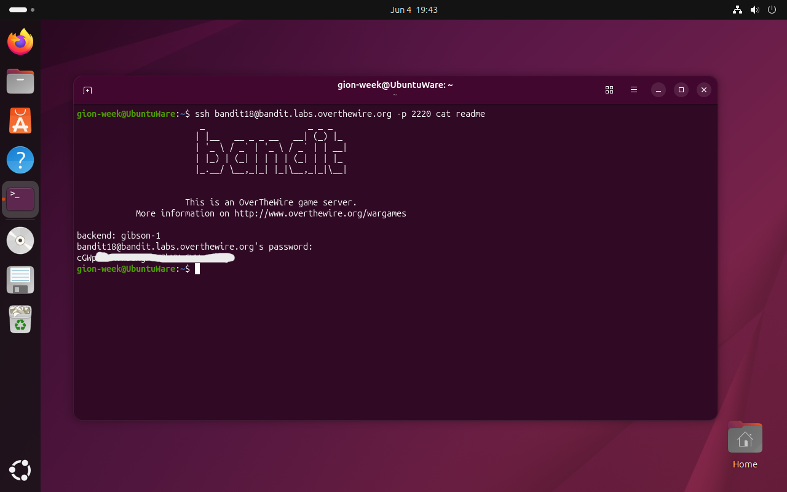
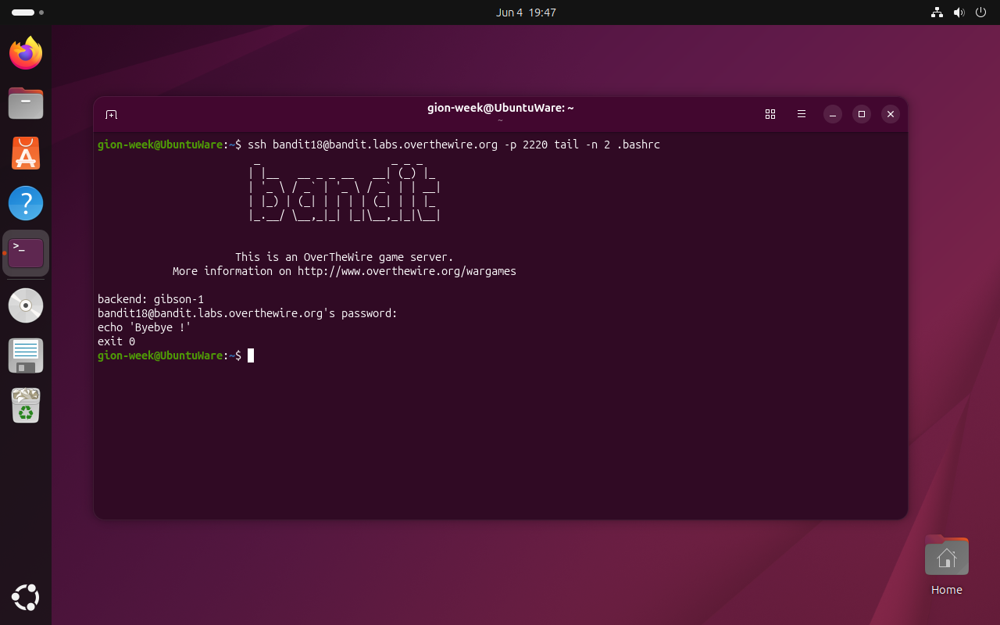

# Bandit Level 18 → 19

## Obiettivo

La password per il livello successivo è contenuta nel file `readme` nella home directory di `bandit18`. Il problema è che qualcuno ha modificato il file `.bashrc` in modo da disconnettere l'utente immediatamente al login.

---

## Informazioni di connessione

| Campo | Valore |
|-------|--------|
| Host | `bandit.labs.overthewire.org` |
| Porta | `2220` |
| Utente | `bandit18` |

```bash
ssh bandit18@bandit.labs.overthewire.org -p 2220
```

---

## Comandi / concetti utili

- `ssh <utente>@<host> -p <porta> <comando>` — esegue un comando remoto senza aprire una shell interattiva
- `ls -a` — lista tutti i file inclusi i nascosti
- `cat` — stampa il contenuto di un file
- `tail -n` — stampa le ultime N righe di un file
- `.bashrc` — file di configurazione eseguito da bash ad ogni avvio di shell interattiva non-login

---

## Soluzione

### Step 1 – Tentativo di login normale: disconnessione immediata

```bash
gion-week@UbuntuWare:~$ ssh bandit18@bandit.labs.overthewire.org -p 2220
...
Byebye !
Connection to bandit.labs.overthewire.org closed.
```

Dopo il banner di benvenuto di OverTheWire, la sessione si chiude immediatamente con il messaggio `Byebye !`. Il problema non è nella connessione SSH in sé, ma in ciò che bash esegue subito dopo averla stabilita: `.bashrc` viene caricato ad ogni avvio di shell interattiva, e in questo caso è stato modificato per terminare la sessione prima che il prompt venga mostrato.



### Step 2 – Esplorare la home senza aprire una shell interattiva

SSH supporta l'esecuzione di un comando remoto senza aprire una shell interattiva: è sufficiente aggiungere il comando come argomento finale. Bash viene avviato in modalità non interattiva, che non carica `.bashrc`, aggirando completamente il meccanismo di disconnessione. Prima di leggere `readme`, si verifica il contenuto della home:

```bash
gion-week@UbuntuWare:~$ ssh bandit18@bandit.labs.overthewire.org -p 2220 ls -a
.
..
.bash_logout
.bashrc
.profile
readme
```

La home contiene i file di configurazione standard di bash e il file `readme` cercato.



### Step 3 – Leggere `readme` e ottenere la password

```bash
gion-week@UbuntuWare:~$ ssh bandit18@bandit.labs.overthewire.org -p 2220 cat readme
[password bandit19]
```

SSH esegue `cat readme` sul server, stampa l'output in locale e chiude la connessione senza che `.bashrc` venga mai eseguito.



### Step 4 (bonus) – Esaminare la modifica a `.bashrc`

Con la stessa tecnica si leggono le ultime righe del file incriminato, usando `tail -n 2` per isolare solo la parte rilevante senza stampare l'intero file:

```bash
gion-week@UbuntuWare:~$ ssh bandit18@bandit.labs.overthewire.org -p 2220 tail -n 2 .bashrc
echo 'Byebye !'
exit 0
```



Le due righe aggiunte in coda a `.bashrc` sono:

- `echo 'Byebye !'` — stampa il messaggio di commiato visibile nel tentativo di login normale
- `exit 0` — termina la shell con codice di uscita `0`

Il codice `0` indica convenzionalmente successo in Unix: la shell non sta segnalando un errore, sta semplicemente terminando in modo pulito. Questo è intenzionale dato che l'obiettivo della modifica è disconnettere l'utente, non simulare un crash. L'effetto pratico per SSH è lo stesso: la sessione si chiude prima che il prompt venga mostrato.

---

## Note e osservazioni

**`.bashrc` e il ciclo di vita di una shell bash**

bash distingue tra diversi tipi di shell, ognuno con un insieme diverso di file di configurazione che carica all'avvio:

- **Login shell** (accesso via SSH tradizionale, `bash --login`): carica `/etc/profile`, poi `~/.bash_profile` o `~/.profile`
- **Shell interattiva non-login** (terminale grafico, nuova scheda nel terminale): carica `~/.bashrc`
- **Shell non interattiva** (esecuzione di un comando via `ssh host comando`, script): non carica né `.bashrc` né `.bash_profile`

In questo livello la modifica colpisce solo la shell interattiva non-login. Passare un comando direttamente a SSH avvia una shell non interattiva che non carica `.bashrc`, aggirando completamente il meccanismo. È questo comportamento documentato di bash e non una vulnerabilità a rendere possibile la soluzione.

**Metodo alternativo: shell alternativa con `ssh -t`**

Un'altra via è avviare una shell diversa da bash che non carichi `.bashrc`:

```bash
gion-week@UbuntuWare:~$ ssh bandit18@bandit.labs.overthewire.org -p 2220 -t /bin/sh
$
```

Il flag `-t` forza l'allocazione di uno pseudo-terminale, necessario per avere una shell interattiva. `/bin/sh` su Debian/Ubuntu è `dash`, che non carica `.bashrc` di bash. Una volta ottenuto il prompt si legge il file normalmente:

```bash
$ cat readme
[password bandit19]
```

Lo svantaggio rispetto al comando diretto è che apre una sessione interattiva completa, utile quando si vuole esplorare il filesystem, non necessario quando il file da leggere è già noto.
