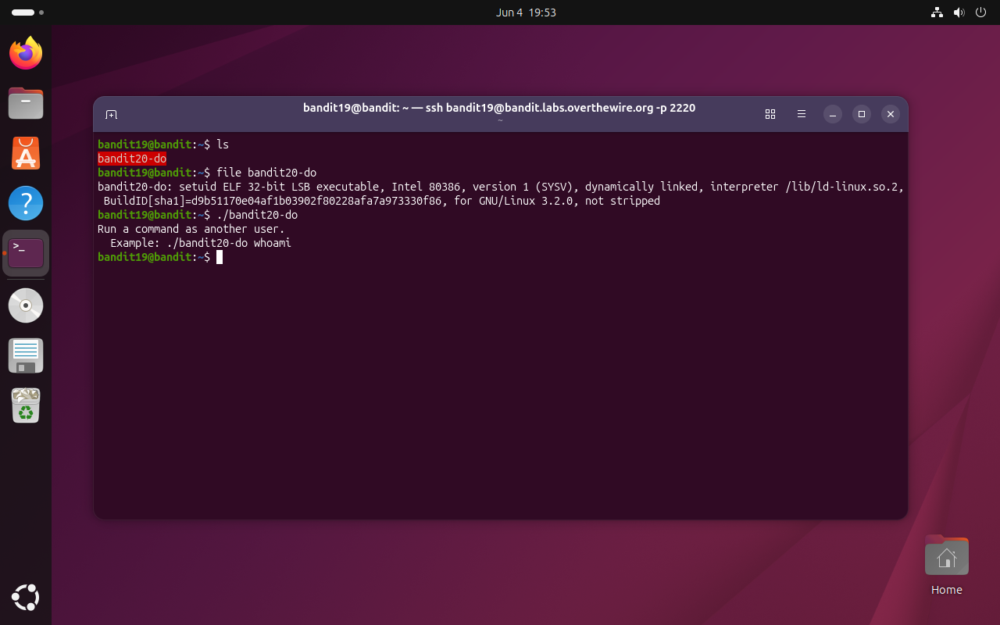
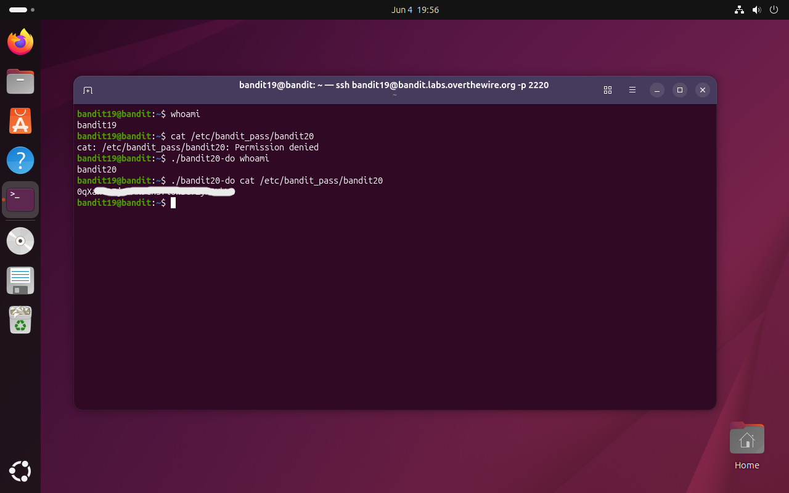

# Bandit Level 19 → 20

## Obiettivo

Per accedere alla password del livello successivo è necessario usare il file setuid presente nella home directory. La password di `bandit20` si trova, come di consueto, in `/etc/bandit_pass/bandit20`.

---

## Informazioni di connessione

| Campo | Valore |
|-------|--------|
| Host | `bandit.labs.overthewire.org` |
| Porta | `2220` |
| Utente | `bandit19` |

```bash
ssh bandit19@bandit.labs.overthewire.org -p 2220
```

---

## Comandi / concetti utili

- `ls` — lista file nella directory corrente
- `file` — identifica il tipo di un file ispezionandone il contenuto
- `whoami` — stampa il nome dell'utente corrente
- `./` — prefisso per eseguire un file nella directory corrente

---

## Soluzione

### Step 1 – Identificare e capire `bandit20-do`

```bash
bandit19@bandit:~$ ls
bandit20-do
```

Un solo file nella home, con nome evocativo: `bandit20-do`. Il terminale lo mostra in rosso, indicando che ha il bit di esecuzione impostato. Prima di eseguirlo, `file` rivela di che tipo di file si tratta:

```bash
bandit19@bandit:~$ file bandit20-do
bandit20-do: setuid ELF 32-bit LSB executable, Intel 80386, version 1 (SYSV),
dynamically linked, interpreter /lib/ld-linux.so.2,
BuildID[sha1]=d9b51170e04af1b03902f80228afa7a973330f86,
for GNU/Linux 3.2.0, not stripped
```

La parola chiave è **setuid**: indica che questo eseguibile, quando viene lanciato, gira con i privilegi del suo **proprietario** (in questo caso `bandit20`) indipendentemente da chi lo esegue. Eseguendolo senza argomenti il programma stesso spiega cosa fa:

```bash
bandit19@bandit:~$ ./bandit20-do
Run a command as another user.
  Example: ./bandit20-do whoami
```

È un wrapper che esegue un comando arbitrario con i privilegi di `bandit20`.



### Step 2 – Verificare i privilegi e leggere la password

Prima di usare il wrapper è utile confermare il contesto attuale e il limite di permessi:

```bash
bandit19@bandit:~$ whoami
bandit19
bandit19@bandit:~$ cat /etc/bandit_pass/bandit20
cat: /etc/bandit_pass/bandit20: Permission denied
```

Come atteso, `bandit19` non può leggere il file della password di `bandit20`. Si verifica poi che il wrapper elevi effettivamente i privilegi:

```bash
bandit19@bandit:~$ ./bandit20-do whoami
bandit20
```

`whoami` eseguito tramite `bandit20-do` restituisce `bandit20`: il programma sta girando con la sua identità. A questo punto si usa il wrapper per leggere direttamente il file:

```bash
bandit19@bandit:~$ ./bandit20-do cat /etc/bandit_pass/bandit20
[password bandit20]
```



---

## Note e osservazioni

**Il bit setuid e come funziona**

In Unix ogni file ha tre set di permessi (proprietario, gruppo, altri) e tre bit speciali aggiuntivi: **setuid**, **setgid** e **sticky bit**. Il bit setuid (`s` al posto di `x` nei permessi del proprietario, es. `-rwsr-xr-x`) ha un comportamento specifico sugli eseguibili: quando il kernel avvia un processo da un file con setuid attivo, assegna al processo l'**effective user ID** del proprietario del file invece di quello dell'utente che lo ha lanciato.

In pratica esistono due identità distinte durante l'esecuzione:
- **Real UID** — l'utente che ha avviato il processo (in questo caso `bandit19`)
- **Effective UID** — l'utente con cui il processo opera effettivamente per i controlli di accesso (in questo caso `bandit20`)

Il kernel usa l'effective UID per tutte le verifiche sui permessi come lettura di file, apertura di socket, chiamate di sistema riservate. È per questo che `./bandit20-do cat /etc/bandit_pass/bandit20` riesce: il `cat` viene eseguito con effective UID `bandit20`, che ha accesso in lettura al file.

Il caso d'uso legittimo più noto di setuid in produzione è `sudo` stesso, che gira con effective UID `root` ma viene avviato da utenti normali — e `passwd`, che deve scrivere in `/etc/shadow` (leggibile solo da root) quando un utente cambia la propria password. La differenza tra questi strumenti e `bandit20-do` è che `sudo` e `passwd` validano chi li chiama e cosa viene richiesto prima di procedere; `bandit20-do` esegue qualsiasi comando senza nessun controllo, rendendolo un esempio deliberatamente insicuro di come **non** implementare un wrapper setuid.

**Implicazioni di sicurezza**

Un eseguibile setuid che accetta comandi arbitrari dall'utente è una vulnerabilità critica in qualsiasi ambiente reale: chiunque possa eseguirlo ottiene di fatto i privilegi del proprietario del file senza restrizioni. In penetration testing, trovare un binario setuid mal configurato è spesso il punto di ingresso per la privilege escalation, la tecnica con cui un attaccante con accesso limitato ottiene privilegi più elevati sul sistema. Strumenti come `find / -perm -4000 -type f 2>/dev/null` vengono usati sistematicamente in fase di ricognizione per individuare tutti i binari setuid presenti sul sistema.
