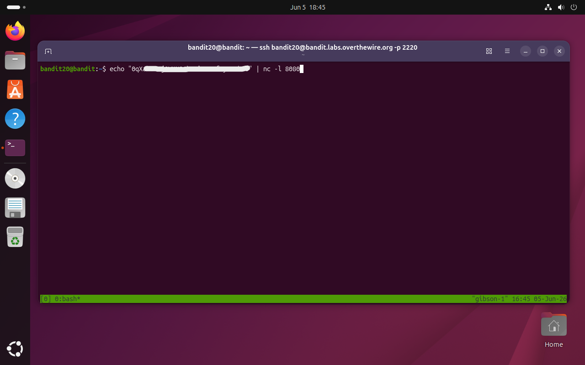
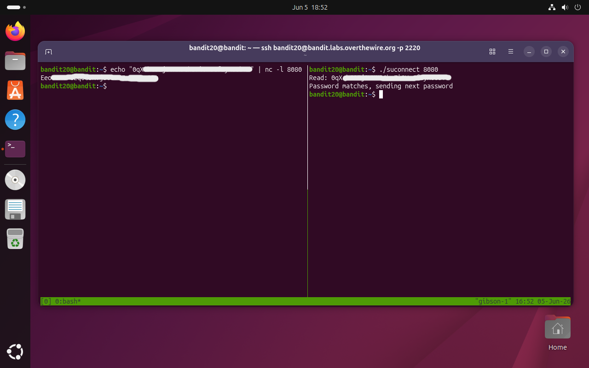
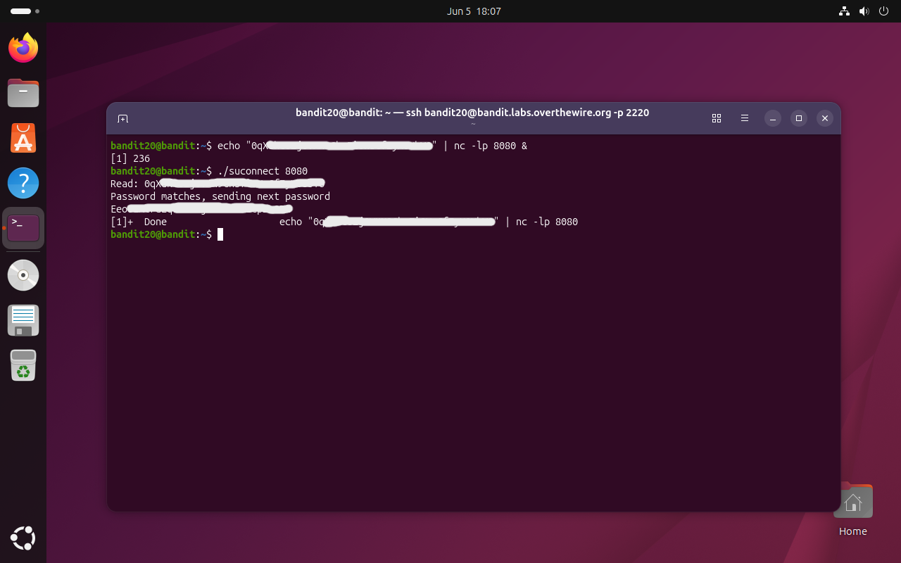
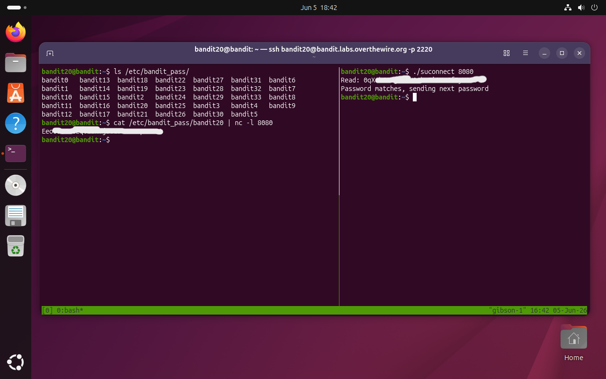

# Bandit Level 20 → 21

## Obiettivo

Nella home directory è presente un eseguibile setuid chiamato `suconnect`. Il programma si connette a una porta specificata su `localhost`, legge una riga di testo e la confronta con la password di `bandit20`: se corrisponde, risponde con la password del livello successivo (`bandit21`).

Il problema è che servono **due processi attivi simultaneamente** nella stessa sessione SSH: uno in ascolto che fornisce la password corrente, e uno che esegue `suconnect`. Questo rende necessario uno strumento per gestire più terminali nella stessa connessione.

---

## Informazioni di connessione

| Campo | Valore |
|-------|--------|
| Host | `bandit.labs.overthewire.org` |
| Porta | `2220` |
| Utente | `bandit20` |

```bash
ssh bandit20@bandit.labs.overthewire.org -p 2220
```

---

## Comandi / concetti utili

- `tmux` — multiplexer di terminale: gestisce più sessioni/finestre/pannelli in una singola connessione
- `nc -l` — avvia netcat in modalità ascolto su una porta
- `echo ... | nc -l` — pipe che fa servire una stringa a netcat come risposta alla prima connessione
- `&` — avvia un processo in background (job control della shell)
- `./suconnect <porta>` — il binario setuid da usare per ottenere la password

---

## Soluzione

### Step 1 – Avviare tmux e preparare il listener

Il problema richiede due processi concorrenti nella stessa sessione SSH: uno server che aspetta la connessione di `suconnect` e invia la password corrente, e `suconnect` stesso che si connette e riceve la password successiva. `tmux` risolve questo permettendo di aprire più pannelli nello stesso terminale.

Si avvia tmux:

```bash
bandit20@bandit:~$ tmux
```

Il terminale entra nella sessione tmux. Nel primo pannello si imposta il listener: `echo` passa la password corrente a `nc` che la servirà alla prima connessione in arrivo sulla porta `8080`:

```bash
$ echo "[password bandit20]" | nc -l 8080
```

Il comando blocca il pannello in attesa di una connessione in arrivo.



### Step 2 – Aprire un secondo pannello ed eseguire `suconnect`

Senza chiudere il listener, si apre un nuovo pannello in tmux con `Ctrl+b %` (split verticale) o `Ctrl+b "` (split orizzontale), oppure una nuova finestra con `Ctrl+b c`. Nel secondo pannello si esegue `suconnect` puntando alla stessa porta:

```bash
$ ./suconnect 8080
Read: [password bandit20]
Password matches, sending next password
Eeo[...]
```

`suconnect` si connette al listener, riceve la password, la valida e risponde con quella del livello successivo. Il listener nel primo pannello si chiude automaticamente dopo aver servito la risposta.



### Step 3 (bonus) – Metodo alternativo: job control con `&`

Se non si vuole usare tmux, lo stesso risultato si ottiene con il job control della shell: il carattere `&` in coda a un comando lo avvia come processo in background, restituendo immediatamente il prompt. Si usa `-lp` per specificare la porta esplicitamente:

```bash
bandit20@bandit:~$ echo "[password bandit20]" | nc -lp 8080 &
[1] 236
bandit20@bandit:~$ ./suconnect 8080
Read: [password bandit20]
Password matches, sending next password
Eeo[...]
[1]+  Done    echo "[password bandit20]" | nc -lp 8080
```

Il numero `[1]` è il job ID assegnato dalla shell al processo in background; `236` è il PID del processo. Quando `suconnect` si connette e il listener ha finito di servire la risposta, la shell notifica automaticamente che il job è completato con `Done`.



### Step 4 (bonus 2) – Ottimizzazione del listener: lettura diretta con `cat`

Un'ulteriore ottimizzazione del metodo basato su `tmux` prevede l'eliminazione del passaggio manuale di copia-incolla della password corrente. Sfruttando la configurazione del sistema esplorata nei livelli precedenti, è noto che le password di alcuni di essi sono memorizzate all'interno della directory `/etc/bandit_pass/`.

Dato che l'utente corrente possiede i permessi di lettura per il proprio file di password, è possibile utilizzare `cat` in combinazione con la pipe `|` verso `nc`. Questo automatizza completamente l'invio della stringa corretta al listener senza doverla esporre in chiaro nel comando.

Nel primo pannello di tmux si esegue il comando di lettura e ascolto:

```bash
bandit20@bandit:~$ cat /etc/bandit_pass/bandit20 | nc -l 8080
```

Il comando rimane in attesa bloccante. Nel secondo pannello si invoca l'eseguibile suconnect sulla medesime porta:

```bash
bandit20@bandit:~$ ./suconnect 8080
Read: [password bandit20]
Password matches, sending next password
Eeo[...]
```



---

## Note e osservazioni

**`tmux`: multiplexer di terminale**

`tmux` (Terminal MUltipleXer) permette di gestire più sessioni di terminale all'interno di una singola connessione SSH. È uno strumento fondamentale in ambienti remoti per tre motivi principali:

- **Persistenza**: una sessione tmux sopravvive alla disconnessione SSH. Se la connessione cade, i processi continuano a girare; al successivo login si riattacca alla sessione con `tmux attach`.
- **Parallelismo**: più pannelli e finestre nello stesso terminale, senza aprire connessioni SSH separate.
- **Organizzazione**: in sessioni di lavoro complesse (debug, monitoring, editing) si tengono tool diversi in finestre separate senza perdere il contesto.

I comandi base per muoversi in tmux (il prefisso default è `Ctrl+b`):

| Combinazione | Azione |
|---|---|
| `Ctrl+b %` | Split verticale (nuovo pannello a destra) |
| `Ctrl+b "` | Split orizzontale (nuovo pannello in basso) |
| `Ctrl+b c` | Nuova finestra |
| `Ctrl+b <freccia>` | Spostarsi tra pannelli |
| `Ctrl+b n` / `p` | Finestra successiva / precedente |
| `Ctrl+b d` | Detach dalla sessione (continua in background) |
| `Ctrl+b [` | Modalità scroll (uscire con `q`) |

**Job control della shell**

Il job control è un meccanismo integrato in bash (e nelle shell POSIX in generale) per gestire processi in foreground e background nella stessa sessione:

- `comando &` — avvia il processo in background; la shell assegna un job ID (`[N]`) e un PID, poi restituisce il prompt
- `jobs` — elenca i processi in background nella sessione corrente con il loro stato (`Running`, `Done`, `Stopped`)
- `fg %N` — porta il job numero N in foreground (o l'ultimo job se omesso)
- `bg %N` — riprende in background un job sospeso
- `Ctrl+Z` — sospende il processo in foreground (stato `Stopped`), restituendo il prompt

Nel contesto di questo livello, `&` è sufficiente perché il listener deve solo aspettare una connessione e poi terminare. In scenari più complessi (come server che girano a lungo o processi che producono output) tmux è preferibile perché il job in background condivide lo stesso stdout del terminale, il che può sovrapporre output di processi diversi in modo confuso.

La differenza tra `-l 8080` e `-lp 8080` nella chiamata a `nc`: `-l` attiva la modalità listen; la porta può essere specificata come argomento posizionale (`nc -l 8080`, sintassi ncat moderna) o con il flag esplicito `-p` (`nc -lp 8080`, sintassi compatibile con versioni più vecchie di netcat). Entrambe funzionano sulla versione installata sul server.

**Permessi e gestione dei segreti in `/etc/bandit_pass/`**

Il file system Linux gestisce l'accesso ai file tramite i permessi POSIX standard. L'utente `bandit20` non ha i privilegi per leggere i file degli altri livelli, ma ha accesso esclusivo in lettura al proprio. L'utilizzo di `cat` combinato alla pipe `|` verso un'utility di rete come `nc` rappresenta una buona pratica di command-line injection controllata, poiché evita di memorizzare informazioni sensibili, come in questo caso la password in chiaro, nella cronologia della shell (`.bash_history`).
