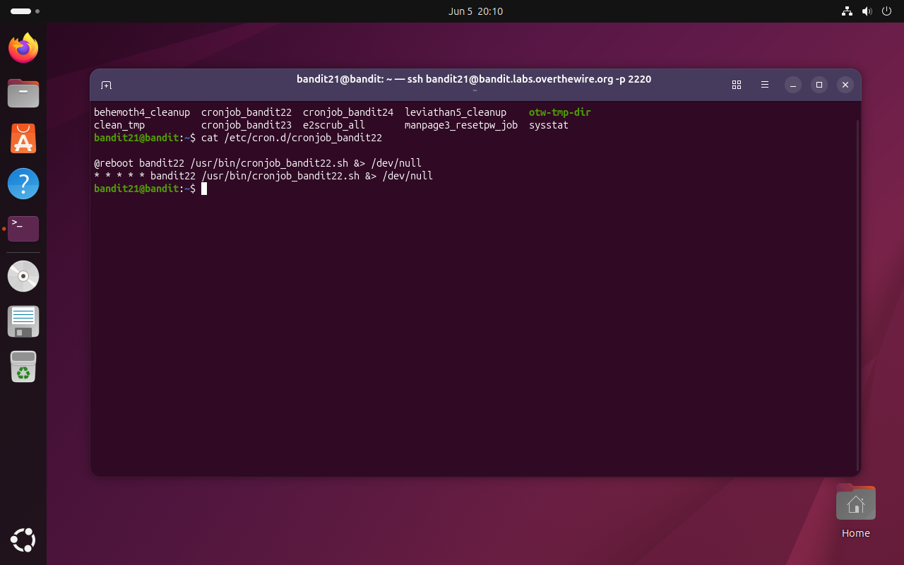
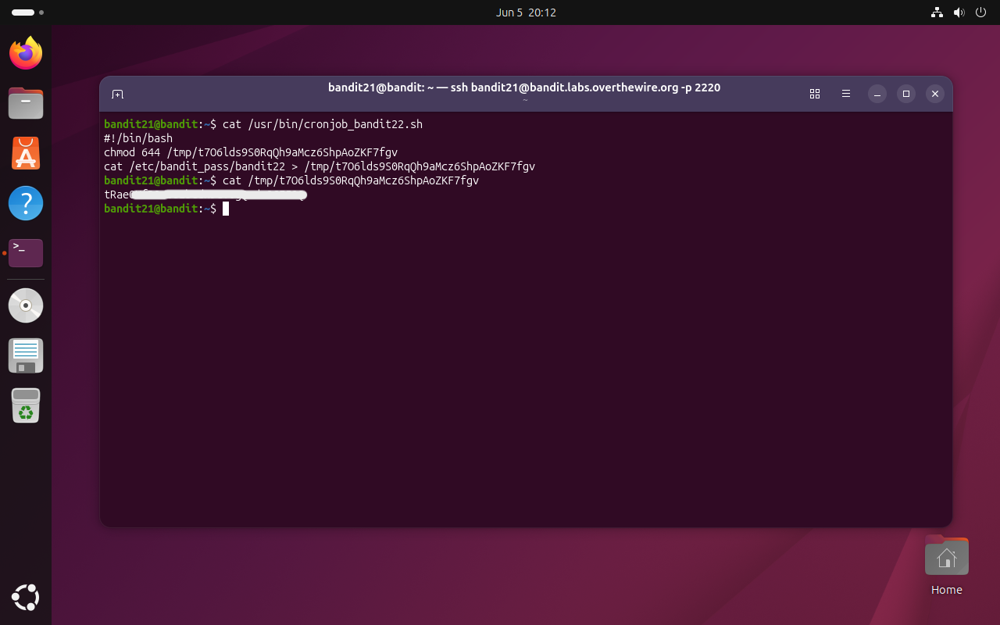

# Bandit Level 21 → 22

## Obiettivo

La password per il livello successivo è ottenibile esaminando i cronjob in esecuzione sul sistema e capendo cosa fanno.

---

## Informazioni di connessione

| Campo | Valore |
|-------|--------|
| Host | `bandit.labs.overthewire.org` |
| Porta | `2220` |
| Utente | `bandit21` |

```bash
ssh bandit21@bandit.labs.overthewire.org -p 2220
```

---

## Comandi / concetti utili

- `ls /etc/cron.d/` — elenca i file di configurazione dei cronjob di sistema
- `cat` — legge il contenuto di un file
- `cron` — daemon di sistema che esegue comandi pianificati
- `chmod 644` — permessi lettura per tutti, scrittura solo per il proprietario

---

## Soluzione

### Step 1 – Esplorare `/etc/cron.d/` e identificare il cronjob rilevante

```bash
bandit21@bandit:~$ ls /etc/cron.d/
behemoth4_cleanup  cronjob_bandit22  cronjob_bandit24  leviathan5_cleanup  otw-tmp-dir
clean_tmp          cronjob_bandit23  e2scrub_all       manpage3_resetpw_job  sysstat
```

Nella directory sono presenti più file di configurazione cron. `cronjob_bandit22` è il più interessante per il livello corrente. Lo si legge per capire cosa pianifica:

```bash
bandit21@bandit:~$ cat /etc/cron.d/cronjob_bandit22
@reboot bandit22 /usr/bin/cronjob_bandit22.sh &> /dev/null
* * * * * bandit22 /usr/bin/cronjob_bandit22.sh &> /dev/null
```

Il file definisce due trigger per lo stesso script, eseguito come utente `bandit22`: uno all'avvio del sistema (`@reboot`) e uno ogni minuto (`* * * * *`). L'output dello script viene scartato (`&> /dev/null`), quindi non produce nulla di visibile nel terminale, anche se lo script stesso potrebbe scrivere dati da qualche parte.



### Step 2 – Leggere lo script e trovare il file temporaneo

```bash
bandit21@bandit:~$ cat /usr/bin/cronjob_bandit22.sh
#!/bin/bash
chmod 644 /tmp/t7O6lds9S0RqQh9aMcz6ShpAoZKF7fgv
cat /etc/bandit_pass/bandit22 > /tmp/t7O6lds9S0RqQh9aMcz6ShpAoZKF7fgv
```

Lo script fa due cose: imposta i permessi `644` su un file in `/tmp` (rendendolo leggibile da tutti gli utenti), poi ci scrive dentro la password di `bandit22`. Dato che lo script gira ogni minuto come `bandit22` il file in `/tmp` viene aggiornato continuamente ed è accessibile a chiunque sul server, incluso `bandit21`.

Il nome del file (`t7O6lds9S0RqQh9aMcz6ShpAoZKF7fgv`) non deve essere indovinato, è scritto esplicitamente nello script.

```bash
bandit21@bandit:~$ cat /tmp/t7O6lds9S0RqQh9aMcz6ShpAoZKF7fgv
[password bandit22]
```



---

## Note e osservazioni

**`cron` e il formato crontab**

`cron` è un demone che gira in background e si occupa di eseguire comandi in modo pianificato. La configurazione avviene tramite file in formato **crontab** (cron table), che possono trovarsi in diverse posizioni:

- `/etc/cron.d/` — file di sistema, uno per servizio, usati da pacchetti e applicazioni
- `/etc/crontab` — crontab globale di sistema
- `crontab -e` (per utente) — crontab personale dell'utente corrente, in `/var/spool/cron/crontabs/`

Il formato delle righe in `/etc/cron.d/` aggiunge un campo utente rispetto al crontab personale:

```
minuto  ora  giorno_mese  mese  giorno_settimana  utente  comando
```

Ogni campo accetta:
- `*` — qualsiasi valore (ogni minuto, ogni ora, ecc.)
- un numero — valore specifico (es. `0` = ora zero, mezzanotte)
- `*/N` — ogni N unità (es. `*/5` nei minuti = ogni 5 minuti)
- `N,M` — lista di valori (es. `1,15` nel giorno del mese = il 1° e il 15°)

La riga `* * * * * bandit22 ...` ha tutti i campi temporali a `*`: il comando viene eseguito ogni minuto di ogni ora di ogni giorno.

**`@reboot` e le direttive speciali**

Oltre ai 5 campi numerici, cron supporta alcune direttive speciali che sostituiscono l'intera parte temporale:

| Direttiva | Equivalente | Significato |
|---|---|---|
| `@reboot` | — | Una volta all'avvio del sistema |
| `@hourly` | `0 * * * *` | Ogni ora, al minuto zero |
| `@daily` | `0 0 * * *` | Una volta al giorno, a mezzanotte |
| `@weekly` | `0 0 * * 0` | Una volta a settimana, domenica a mezzanotte |
| `@monthly` | `0 0 1 * *` | Una volta al mese, il primo giorno |

**`&> /dev/null` e la redirezione combinata**

`&>` è una scorciatoia bash che redirige sia `stdout` (canale 1) che `stderr` (canale 2) alla stessa destinazione. `&> /dev/null` scarta quindi qualsiasi output del comando, sia normale che di errore. È il modo standard per far girare script cron "silenziosamente": senza questa redirezione, cron tenterebbe di inviare l'output via email all'utente proprietario, il che in ambienti senza mail server produce errori o file di log ingombranti.

**Il file in `/tmp` e la sua accessibilità**

Il `chmod 644` eseguito dallo script è il dettaglio che rende possibile la soluzione. Senza di esso il file avrebbe permessi determinati dalla umask di `bandit22` al momento della creazione, che probabilmente escluderebbero la lettura da parte di altri utenti. Con `644`, il file è leggibile da tutti (`r--` per gruppo e altri): chiunque sul server conosca il percorso può leggerlo. Il percorso non è pubblicato o indovinabile via bruteforcing, ma è ricavabile direttamente dallo script che chiunque può leggere perché si trova in `/usr/bin` con permessi di lettura globali.

**Metodo alternativo (circa)**

Non esiste un percorso sostanzialmente diverso per questo livello: la catena di ragionamento (cron.d → script → file in /tmp) è l'unica via. Si potrebbe arrivare al file in `/tmp` anche senza leggere lo script, cercando file leggibili da tutti in `/tmp` con `find /tmp -readable -type f 2>/dev/null`, ma senza sapere quale sia quello rilevante tra molti risultati potenziali, leggere lo script rimane un passaggio necessario.
