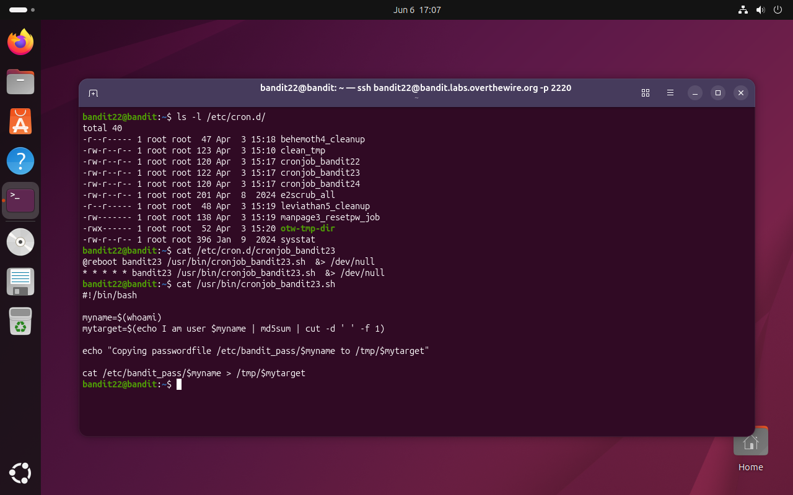
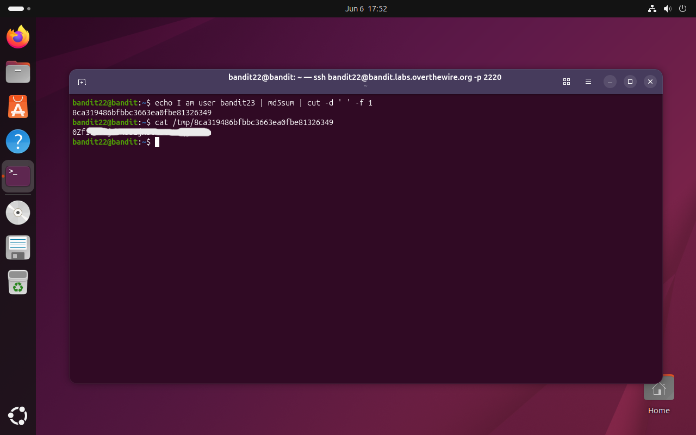

# Bandit Level 22 → 23

## Obiettivo

La password per il livello successivo è ottenibile esaminando un cronjob attivo sul sistema e analizzando lo script che esegue per ricavare il percorso del file temporaneo in cui scrive la password.

---

## Informazioni di connessione

| Campo | Valore |
|-------|--------|
| Host | `bandit.labs.overthewire.org` |
| Porta | `2220` |
| Utente | `bandit22` |

```bash
ssh bandit22@bandit.labs.overthewire.org -p 2220
```

---

## Comandi / concetti utili

- `ls -l /etc/cron.d/` — elenca i cronjob di sistema con dettagli sui permessi
- `cat` — legge il contenuto di un file
- `md5sum` — calcola l'hash MD5 di un file o di input da stdin
- `cut -d ' ' -f 1` — estrae il primo campo da una stringa delimitata da spazi
- `echo ... | md5sum | cut ...` — pipeline per ricavare il nome del file temporaneo

---

## Soluzione

### Step 1 – Esplorare `/etc/cron.d/` e leggere il cronjob

```bash
bandit22@bandit:~$ ls -l /etc/cron.d/
total 40
-r--r----- 1 root root  47 Apr  3 15:18 behemoth4_cleanup
-rw-r--r-- 1 root root 123 Apr  3 15:10 clean_tmp
-rw-r--r-- 1 root root 120 Apr  3 15:17 cronjob_bandit22
-rw-r--r-- 1 root root 122 Apr  3 15:17 cronjob_bandit23
-rw-r--r-- 1 root root 120 Apr  3 15:17 cronjob_bandit24
...
```

Si legge la configurazione del cronjob relativo a `bandit23`:

```bash
bandit22@bandit:~$ cat /etc/cron.d/cronjob_bandit23
@reboot bandit23 /usr/bin/cronjob_bandit23.sh &> /dev/null
* * * * * bandit23 /usr/bin/cronjob_bandit23.sh &> /dev/null
```

Lo script viene eseguito come `bandit23` ogni minuto. Nuovamente, si legge lo script per capire cosa fa:

```bash
bandit22@bandit:~$ cat /usr/bin/cronjob_bandit23.sh
#!/bin/bash

myname=$(whoami)
mytarget=$(echo I am user $myname | md5sum | cut -d ' ' -f 1)

echo "Copying passwordfile /etc/bandit_pass/$myname to /tmp/$mytarget"

cat /etc/bandit_pass/$myname > /tmp/$mytarget
```

A differenza del livello precedente, il nome del file in `/tmp` non è scritto esplicitamente: viene **calcolato** a partire dal nome dell'utente. Lo script esegue come `bandit23`, quindi `$myname` varrà `bandit23`, e `$mytarget` sarà l'hash MD5 della stringa `I am user bandit23`. Per trovare il file basta replicare la stessa computazione manualmente, sostituendo `$myname` con `bandit23`.



### Step 2 – Replicare il calcolo del nome file e leggere la password

Si esegue la stessa pipeline dello script, sostituendo `$myname` con `bandit23`:

```bash
bandit22@bandit:~$ echo I am user bandit23 | md5sum | cut -d ' ' -f 1
8ca319486bfbbc3663ea0fbe81326349
```

Il risultato è deterministico: la stessa stringa in input produce sempre lo stesso hash. Il file temporaneo è quindi `/tmp/8ca319486bfbbc3663ea0fbe81326349`:

```bash
bandit22@bandit:~$ cat /tmp/8ca319486bfbbc3663ea0fbe81326349
[password bandit23]
```



---

## Note e osservazioni

**`md5sum` e cosa produce**

`md5sum` è uno strumento che calcola l'hash **MD5** (Message Digest 5) di un file o, come in questo caso, di input ricevuto da stdin. MD5 è una funzione di hash crittografica che trasforma una sequenza arbitraria di byte in una stringa esadecimale di lunghezza fissa: **32 caratteri** (128 bit). Le proprietà fondamentali di una funzione di hash sono:

- **Determinismo**: lo stesso input produce sempre lo stesso output
- **Unidirezionalità**: dall'hash non si può risalire all'input originale in modo efficiente
- **Effetto valanga**: una piccola modifica all'input cambia radicalmente l'output

Quando legge da stdin, `md5sum` produce una riga nel formato:
```
8ca319486bfbbc3663ea0fbe81326349  -
```
L'hash è seguito da due spazi e dal simbolo `-`, che indica stdin come sorgente. È questo formato che rende necessario il passaggio successivo nella pipeline.

**`cut -d ' ' -f 1` e il parsing dell'output**

`cut` è un comando per estrarre colonne o campi da righe di testo. I flag usati:

- `-d ' '` — imposta il delimitatore di campo al carattere spazio
- `-f 1` — seleziona solo il primo campo (tutto ciò che precede il primo spazio)

Applicato all'output di `md5sum`, taglia via `  -` tenendo solo l'hash. Il risultato è una stringa di 32 caratteri esadecimali usata come nome del file in `/tmp`.

MD5 è considerato **crittograficamente debole** dal 2004 (vulnerabile a collisioni deliberate) e non è adatto per firme digitali o autenticazione. In questo script viene usato non per sicurezza ma come funzione deterministica che genera un nome file apparentemente casuale a partire da una stringa: un uso lecito e ancora comune.

**Perché questo è più difficile del livello precedente**

Nel livello 21 il nome del file in `/tmp` era una stringa fissa nello script, leggibile direttamente. Qui il nome viene **calcolato dinamicamente** a runtime, richiedendo di capire la logica dello script e riprodurla. È il primo livello in cui non basta leggere passivamente i file di configurazione: occorre ragionare su cosa farebbe lo script se eseguito come `bandit23`, e simularlo manualmente. Questa è la struttura dei livelli seguenti: gli script diventano progressivamente più complessi e richiedono un'analisi più profonda.