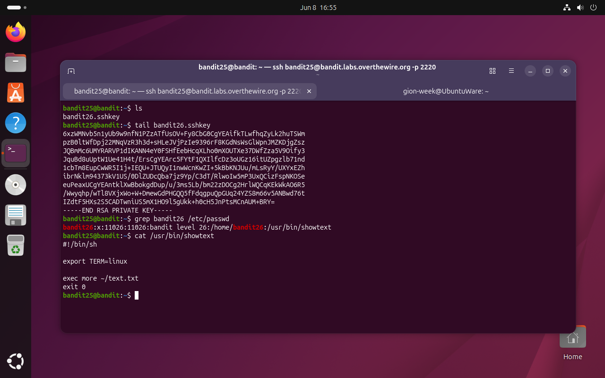
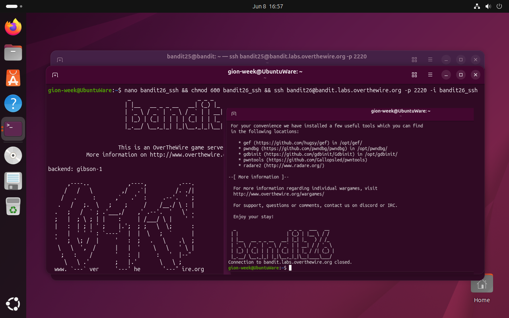
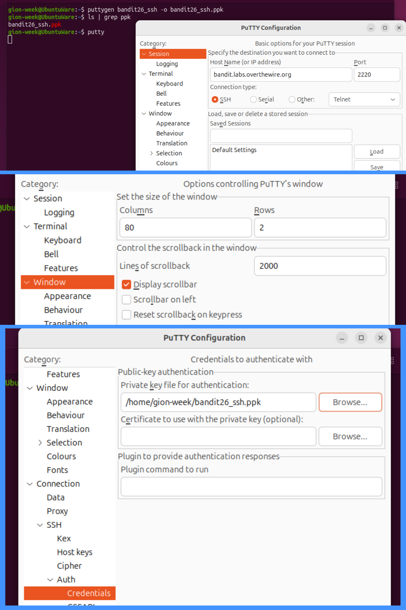
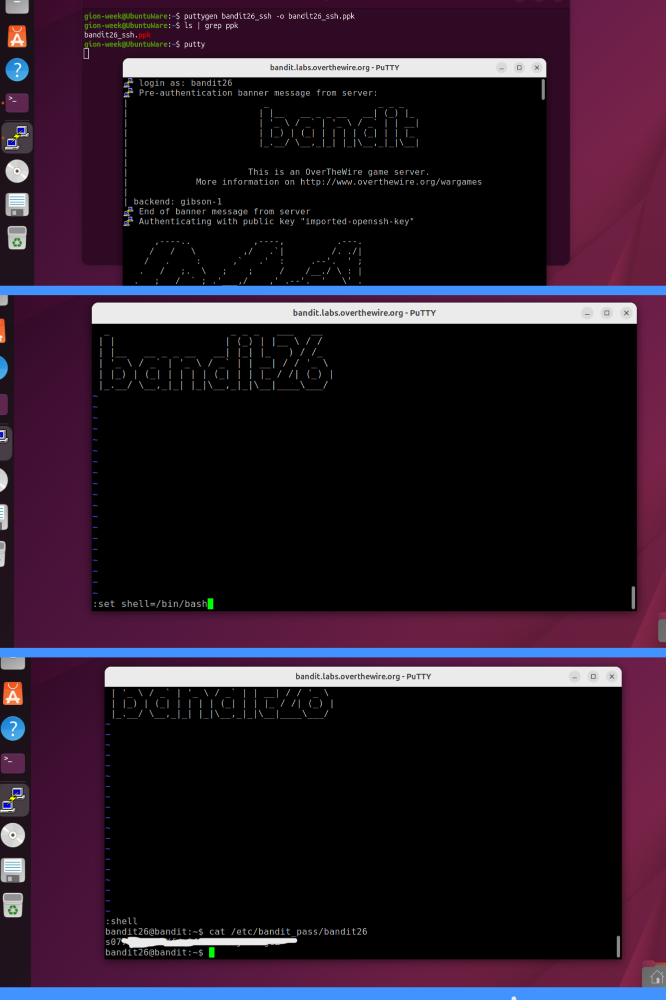

# Bandit Level 25 → 26

## Obiettivo

La connessione a `bandit26` tramite la chiave SSH presente nella home di `bandit25` si chiude immediatamente. L'obiettivo è capire perché e trovare un modo per ottenere una shell interattiva nonostante il meccanismo di chiusura, per poi leggere la password del livello successivo.

---

## Informazioni di connessione

| Campo | Valore |
|-------|--------|
| Host | `bandit.labs.overthewire.org` |
| Porta | `2220` |
| Utente | `bandit25` |

```bash
ssh bandit25@bandit.labs.overthewire.org -p 2220
```

---

## Comandi / concetti utili

- `grep` — cerca pattern in file di testo
- `/etc/passwd` — file di sistema con informazioni sugli utenti, inclusa la shell di login
- `more` — paginatore di testo con modalità interattiva
- `puttygen` — strumento per convertire chiavi SSH nel formato PuTTY (`.ppk`)
- `putty` — client SSH con finestra di dimensione configurabile
- `v` (in `more`) — apre l'editor `vi`/`vim` sul file corrente
- `:set shell=/bin/bash` (in vim) — imposta la shell da usare con `:shell`
- `:shell` (in vim) — apre una shell interattiva

---

## Soluzione

### Step 1 – Esaminare la home e identificare il meccanismo di blocco

```bash
bandit25@bandit:~$ ls
bandit26.sshkey
bandit25@bandit:~$ tail bandit26.sshkey
[...]
-----END RSA PRIVATE KEY-----
bandit25@bandit:~$ grep bandit26 /etc/passwd
bandit26:x:11026:11026:bandit level 26:/home/bandit26:/usr/bin/showtext
bandit25@bandit:~$ cat /usr/bin/showtext
#!/bin/sh

export TERM=linux

exec more ~/text.txt
exit 0
```

La chiave SSH per `bandit26` è disponibile. Prima di usarla, vale la pena capire cosa succederebbe una volta connessi: `grep bandit26 /etc/passwd` rivela che la shell di login di `bandit26` non è `/bin/bash` ma `/usr/bin/showtext`. Ogni volta che ci si autentica come `bandit26`, SSH non avvia bash ma questo script.

Lo script fa tre cose:
- `export TERM=linux` — imposta il tipo di terminale
- `exec more ~/text.txt` — esegue `more` sul file `text.txt` **sostituendo il processo shell** (non avviandolo come sottoprocesso)
- `exit 0` — questa riga è **irraggiungibile**: `exec` non ritorna mai, perché il processo corrente viene rimpiazzato da `more`

Quando `more` finisce di mostrare il file ed esce, non c'è nessuna shell a cui tornare e la connessione SSH si chiude.



### Step 2 – Confermare il comportamento: connessione che si chiude subito

Si copia la chiave in locale, si impostano i permessi e si testa la connessione:

```bash
gion-week@UbuntuWare:~$ nano bandit26_ssh && chmod 600 bandit26_ssh && ssh bandit26@bandit.labs.overthewire.org -p 2220 -i bandit26_ssh
```

La connessione si apre, mostra il banner di benvenuto di OverTheWire, e si chiude immediatamente con `Connection to bandit.labs.overthewire.org closed.` esattamente come previsto: `more` mostra `text.txt`, non trova abbastanza testo da richiedere paginazione con un terminale di dimensione standard, ed esce.



### Nota sulla dimensione del terminale: perché è necessario PuTTY

La chiave per aggirare il meccanismo è la modalità interattiva di `more`: se il file `text.txt` non entra interamente nella finestra del terminale, `more` si ferma e attende input prima di procedere ed è in questo stato sospeso che si può interagire con esso.

Il problema pratico è che la finestra del terminale deve avere un numero di righe sufficientemente **piccolo** da non contenere l'intero file. Sul terminale GNOME di Ubuntu e su Windows CMD, ridurre manualmente la finestra non era sufficiente: lo scrolldown automatico dell'output SSH faceva sì che `more` ricevesse dimensioni errate o uscisse prima che fosse possibile interagire. Anche tmux non risolveva il problema, poiché gestisce le dimensioni del terminale in modo indipendente dalla finestra fisica. PuTTY permette di impostare il numero di righe **in modo persistente nella configurazione della sessione**, garantendo che il terminale abbia esattamente le dimensioni scelte prima che la connessione venga stabilita.

### Step 3 – Configurare PuTTY con finestra piccola e chiave convertita

PuTTY richiede le chiavi private nel proprio formato `.ppk`. Si converte la chiave con `puttygen`:

```bash
gion-week@UbuntuWare:~$ puttygen bandit26_ssh -o bandit26_ssh.ppk
gion-week@UbuntuWare:~$ ls | grep ppk
bandit26_ssh.ppk
gion-week@UbuntuWare:~$ putty
```

Nella configurazione di PuTTY si impostano tre cose:
- **Session**: Host `bandit.labs.overthewire.org`, porta `2220`, tipo SSH, username `bandit26`
- **Window**: Rows = `2` — questo è il parametro critico; con solo 2 righe visibili, qualsiasi file di più righe farà entrare `more` in modalità interattiva
- **Connection > SSH > Auth > Credentials**: chiave privata `bandit26_ssh.ppk`



### Step 4 – Connettersi, entrare in vim e aprire una shell

Con la finestra PuTTY ridotta a 2 righe, la connessione si stabilisce e `more` si ferma in modalità interattiva dato che il file `text.txt` non entra nelle 2 righe disponibili. A questo punto si preme `v` per aprire il file in `vi`/`vim`:

In vim si impostano prima la shell desiderata e poi si richiama:

```
:set shell=/bin/bash
:shell
```

Il primo comando ridefinisce la shell che vim usa per i comandi di sistema. Il secondo apre una shell interattiva come sottoprocesso di vim. Poiché vim gira come `bandit26` (è stato avviato da `more` che è stato avviato dalla shell di login di `bandit26`), la shell aperta con `:shell` ha i privilegi di `bandit26`:

```bash
bandit26@bandit:~$ cat /etc/bandit_pass/bandit26
[password bandit26]
```



---

## Note e osservazioni

**`more` e la modalità interattiva**

`more` è un paginatore: mostra il contenuto di un file una schermata alla volta. Se il file entra interamente nella finestra, `more` lo stampa e termina senza entrare in modalità interattiva. Se invece il contenuto eccede il numero di righe disponibili, si ferma alla fine della prima schermata e attende input. In modalità interattiva i comandi principali sono:

- `Spazio` — avanza di una schermata
- `Invio` — avanza di una riga
- `q` — esce
- `v` — apre `vi` sul file corrente; questo è il vettore sfruttato in questo livello
- `/pattern` — cerca un pattern nel testo

**`exec` e il processo di sostituzione**

`exec comando` in bash/sh non avvia un processo figlio: **sostituisce** il processo shell corrente con il comando specificato. Il PID rimane lo stesso, ma il programma in esecuzione cambia. Questo ha due implicazioni rilevanti qui: primo, quando `more` termina non c'è una shell padre a cui tornare, quindi la connessione SSH si chiude; secondo, la riga `exit 0` dopo `exec more ~/text.txt` non viene mai eseguita (è codice irraggiungibile, probabilmente inserito per chiarezza o come residuo).

**Fuga da vim con `:shell` e `:!comando`**

vim offre due modalità per eseguire comandi di sistema:

- `:!comando` — esegue il comando e mostra l'output, poi torna a vim
- `:shell` — apre una shell interattiva; si torna a vim con `exit`

Entrambi usano la shell definita in `shell` (opzione di vim, modificabile con `:set shell=`). In contesti di sicurezza, vim è uno dei tool inclusi nelle liste di "GTFOBins" (Go-To-File-Based binaries): programmi che, se avviati con privilegi elevati o in contesti ristretti, possono essere usati per ottenere accesso a una shell o leggere file privilegiati.

**`puttygen` e il formato `.ppk`**

PuTTY usa il proprio formato di chiave privata (`.ppk`) invece del formato OpenSSH standard (PEM). `puttygen` è lo strumento della suite PuTTY per generare e convertire chiavi: `-o` specifica il file di output. La conversione è necessaria ogni volta che si vuole usare una chiave OpenSSH con PuTTY; il processo inverso (da `.ppk` a OpenSSH) si fa con `puttygen chiave.ppk -O private-openssh -o chiave`.
