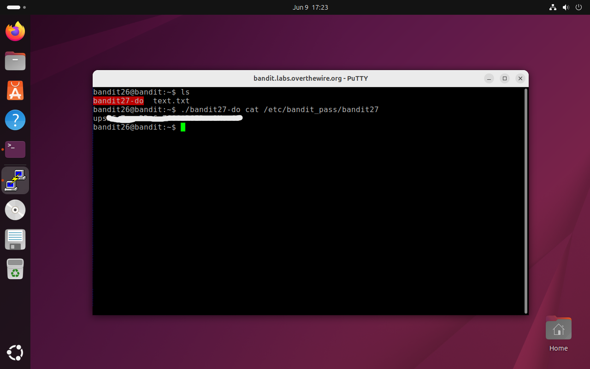

# Bandit Level 26 → 27

## Obiettivo

Ottenere la password di `bandit27` sfruttando un eseguibile setuid presente nella home di `bandit26`, dalla shell interattiva ottenuta nel livello precedente.

---

## Informazioni di connessione

| Campo | Valore |
|-------|--------|
| Host | `bandit.labs.overthewire.org` |
| Porta | `2220` |
| Utente | `bandit26` |

```
Connessione tramite PuTTY con finestra a 2 righe e chiave bandit26_ssh.ppk,
poi fuga da more via vim (:set shell=/bin/bash → :shell) come nel livello precedente.
```

Una connessione SSH standard come `bandit26`, anche disponendo della password ottenuta nel livello precedente, si chiuderebbe immediatamente per lo stesso motivo visto prima: la shell di login di `bandit26` è `/usr/bin/showtext`, che esegue `more ~/text.txt` e termina. Per lavorare come `bandit26` è necessario entrare attraverso il percorso PuTTY + vim che è stato scoperto.

---

## Comandi / concetti utili

- `ls` — lista file nella directory corrente
- `./bandit27-do` — eseguibile setuid che permette di eseguire comandi come `bandit27`

---

## Soluzione

### Step 1 – Esplorare la home e usare il binario setuid

Dalla shell ottenuta tramite vim nel livello precedente:

```bash
bandit26@bandit:~$ ls
bandit27-do  text.txt
```

Oltre a al file mostrato da `more` ad ogni login è presente `bandit27-do`, un eseguibile setuid identico per funzionamento a `bandit20-do` del livello 19: consente di eseguire un comando arbitrario con i privilegi di `bandit27`. Lo si usa direttamente per leggere la password:

```bash
bandit26@bandit:~$ ./bandit27-do cat /etc/bandit_pass/bandit27
[password bandit27]
```



---

## Note e osservazioni

**Perché la password di `bandit26` non basta per una connessione standard**

Anche conoscendo la password di `bandit26` tentare `ssh bandit26@bandit.labs.overthewire.org -p 2220` produce lo stesso risultato visto nel livello 25: la connessione si apre, `showtext` viene eseguito come shell di login, `more` mostra `text.txt` su un terminale di dimensioni normali senza entrare in modalità interattiva e la sessione si chiude immediatamente. La password è corretta ma inutile finché la shell di login rimane `/usr/bin/showtext`. L'unico accesso interattivo a `bandit26` passa per il workaround PuTTY + vim del livello precedente.

**`bandit27-do` e il pattern setuid**

Il binario `bandit27-do` è strutturalmente identico a `bandit20-do` del livello 19: un eseguibile con il bit setuid impostato, di proprietà di `bandit27`, che esegue un comando arbitrario con i privilegi del proprietario. Il pattern si ripete: quando non si può accedere direttamente a un utente, un binario setuid correttamente posizionato può servire da proxy per operazioni che richiedono i suoi privilegi.
