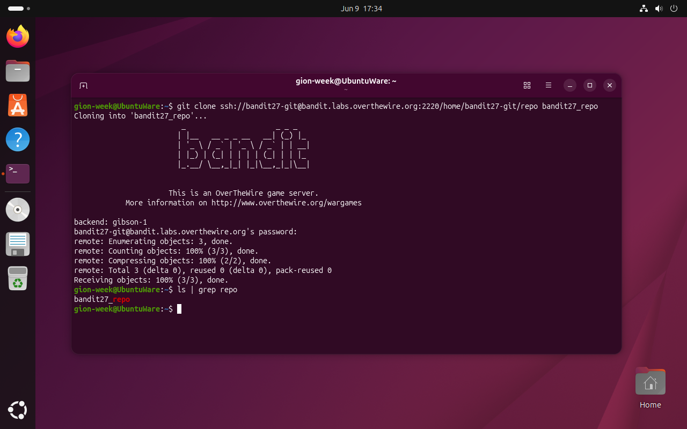
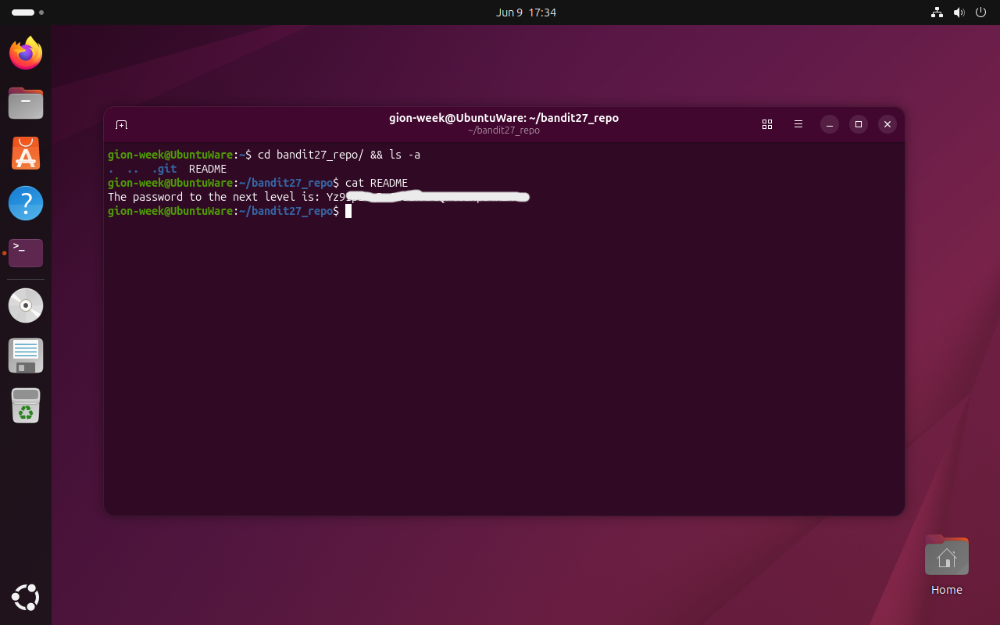

# Bandit Level 27 → 28

## Obiettivo

La password per il livello successivo è contenuta in un repository git ospitato sul server di Bandit. Bisogna clonarlo e leggerne il contenuto.

---

## Informazioni di connessione

| Campo | Valore |
|-------|--------|
| Host | `bandit.labs.overthewire.org` |
| Porta | `2220` |
| Utente | `bandit27` |

```bash
ssh bandit27@bandit.labs.overthewire.org -p 2220
```

---

## Comandi / concetti utili

- `git clone` — copia un repository remoto in locale
- `ls -a` — lista tutti i file inclusi i nascosti (come `.git`)
- `cat` — legge il contenuto di un file

---

## Soluzione

### Step 1 – Clonare il repository

Il repository è raggiungibile via SSH sulla stessa porta del server Bandit. La URL segue il formato `ssh://utente@host:porta/percorso`. Si clona direttamente dalla VM locale usando la password di `bandit27`:

```bash
gion-week@UbuntuWare:~$ git clone ssh://bandit27-git@bandit.labs.overthewire.org:2220/home/bandit27-git/repo bandit27_repo
Cloning into 'bandit27_repo'...
bandit27-git@bandit.labs.overthewire.org's password:
remote: Enumerating objects: 3, done.
remote: Counting objects: 100% (3/3), done.
remote: Compressing objects: 100% (2/2), done.
remote: Total 3 (delta 0), reused 0 (delta 0), pack-used 0
Receiving objects: 100% (3/3), done.
gion-week@UbuntuWare:~$ ls | grep repo
bandit27_repo
```



### Step 2 – Leggere il file README

```bash
gion-week@UbuntuWare:~$ cd bandit27_repo/ && ls -a
.  ..  .git  README
gion-week@UbuntuWare:~/bandit27_repo$ cat README
The password to the next level is: Yz9[...]
```

Il repository contiene un solo file visibile, `README`, che riporta direttamente la password per `bandit28`. La cartella nascosta `.git` è la struttura interna del repository, non un file da leggere ma l'intera storia e configurazione del progetto gestita da git.



---

## Note e osservazioni

**Git e GitHub: cosa sono e come si relazionano**

**git** è un sistema di controllo di versione distribuito: registra la storia completa delle modifiche a un insieme di file (il *repository*), permettendo di tornare a qualsiasi versione precedente, lavorare su rami paralleli e unire contributi di più persone. È uno strumento da riga di comando, indipendente da qualsiasi servizio online.

**GitHub** (e analogamente GitLab, Bitbucket) è una piattaforma web che ospita repository git remoti aggiungendo funzionalità collaborative: pull request, issue tracker, CI/CD, controllo degli accessi. GitHub non è git: è un servizio costruito sopra git che ne usa il protocollo per il trasferimento dei dati.

In questo livello il server remoto non è GitHub ma il server di OverTheWire, che espone un repository git accessibile via SSH, lo stesso protocollo che GitHub usa per l'autenticazione con chiave. La URL `ssh://bandit27-git@bandit.labs.overthewire.org:2220/home/bandit27-git/repo` è strutturata esattamente come un remote SSH di GitHub (`git@github.com:utente/repo.git`), con la differenza che la porta è esplicita perché non è la 22 standard.

**I comandi git usati anche in questo progetto**

Il repository che stai leggendo usa git e GitHub con gli stessi comandi base di questo livello:

- `git clone` — usato per ottenere una copia locale del repository su una nuova macchina
- `git add` — aggiunge file modificati all'area di staging
- `git commit -m "messaggio"` — registra uno snapshot delle modifiche con un messaggio descrittivo
- `git push` — invia i commit locali al repository remoto su GitHub

`git clone` è il primo comando da eseguire quando si vuole lavorare su un repository esistente: crea una copia completa del repository (tutta la storia, tutti i branch) nella directory specificata, configurando automaticamente il remote `origin` che punta all'URL di origine.
