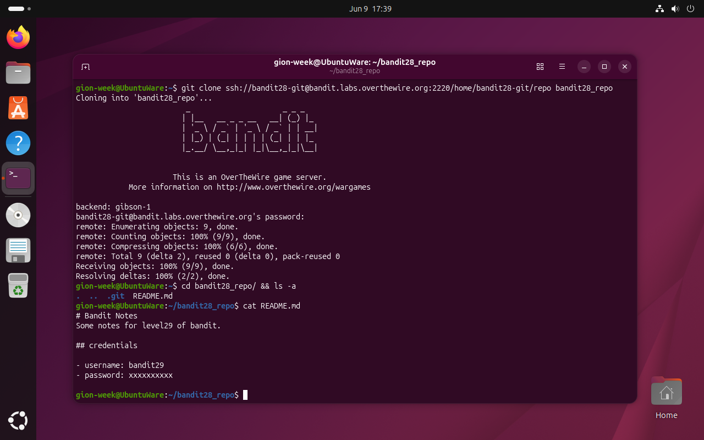
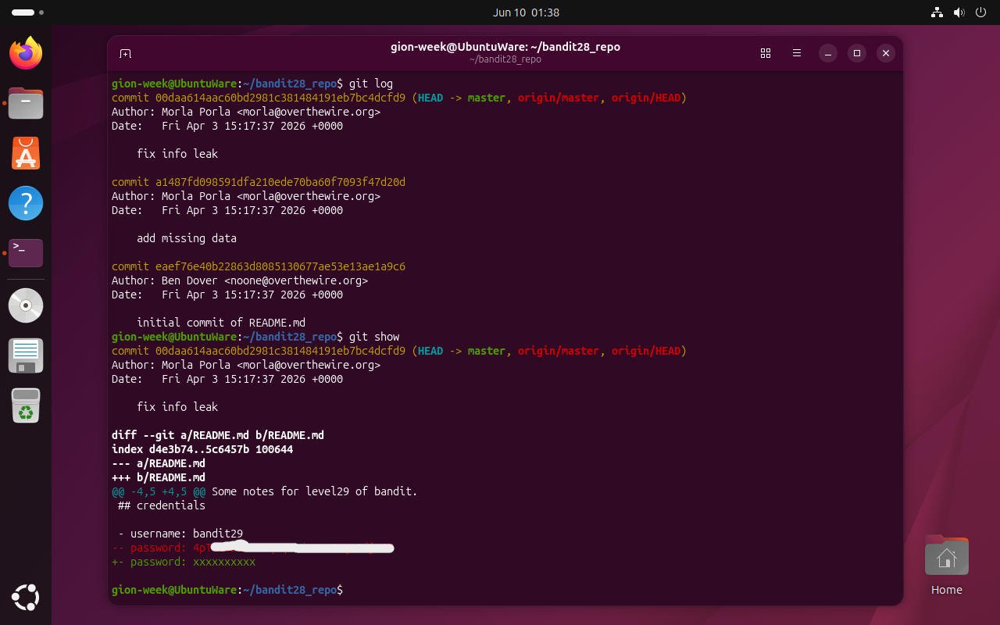

# Bandit Level 28 → 29

## Obiettivo

La password per il livello successivo è nascosta nella storia di un repository git: il file `README.md` nella versione attuale contiene un campo password censurato, ma un commit precedente rivela il valore originale.

---

## Informazioni di connessione

| Campo | Valore |
|-------|--------|
| Host | `bandit.labs.overthewire.org` |
| Porta | `2220` |
| Utente | `bandit28` |

```bash
ssh bandit28@bandit.labs.overthewire.org -p 2220
```

---

## Comandi / concetti utili

- `git clone` — clona un repository remoto in locale
- `git log` — mostra la lista dei commit con autore, data e messaggio
- `git show` — mostra i dettagli e il diff del commit più recente (o di un commit specificato)

---

## Soluzione

### Step 1 – Clonare il repository ed esaminare il contenuto attuale

```bash
gion-week@UbuntuWare:~$ git clone ssh://bandit28-git@bandit.labs.overthewire.org:2220/home/bandit28-git/repo bandit28_repo
Cloning into 'bandit28_repo'...
bandit28-git@bandit.labs.overthewire.org's password:
remote: Enumerating objects: 9, done.
remote: Counting objects: 100% (9/9), done.
remote: Compressing objects: 100% (6/6), done.
remote: Total 9 (delta 2), reused 0 (delta 0), pack-reused 0
Receiving objects: 100% (9/9), done.
Resolving deltas: 100% (2/2), done.
gion-week@UbuntuWare:~$ cd bandit28_repo/ && ls -a
.  ..  .git  README.md
gion-week@UbuntuWare:~/bandit28_repo$ cat README.md
# Bandit Notes
Some notes for level29 of bandit.

## credentials

- username: bandit29
- password: xxxxxxxxxx
```

A differenza del livello precedente, il campo password è stato sostituito con `xxxxxxxxxx`. Il file attuale non contiene la risposta, ma il repository ha 9 oggetti clonati, segno che c'è una storia più ricca di un singolo commit. Vale la pena esaminarla.



### Step 2 – Esaminare la storia dei commit e recuperare la password

`git log` mostra la lista completa dei commit nel branch corrente:

```bash
gion-week@UbuntuWare:~/bandit28_repo$ git log
commit 00daa614aac60bd2981c381484191eb7bc4dcfd9 (HEAD -> master, origin/master, origin/HEAD)
Author: Morla Porla <morla@overthewire.org>
Date:   Fri Apr 3 15:17:37 2026 +0000

    fix info leak

commit a1487fd098591dfa210ede70ba60f7093f47d20d
Author: Morla Porla <morla@overthewire.org>
Date:   Fri Apr 3 15:17:37 2026 +0000

    add missing data

commit eaef76e40b22863d8085130677ae53e13ae1a9c6
Author: Ben Dover <noone@overthewire.org>
Date:   Fri Apr 3 15:17:37 2026 +0000

    initial commit of README.md
```

Il commit più recente si chiama **"fix info leak"**, un indizio diretto: qualcosa è stato rimosso perché non avrebbe dovuto essere lì. `git show` senza argomenti mostra il diff di questo commit, ovvero esattamente cosa è cambiato:

```bash
gion-week@UbuntuWare:~/bandit28_repo$ git show
commit 00daa614aac60bd2981c381484191eb7bc4dcfd9 (HEAD -> master, origin/master, origin/HEAD)
Author: Morla Porla <morla@overthewire.org>
Date:   Fri Apr 3 15:17:37 2026 +0000

    fix info leak

diff --git a/README.md b/README.md
index d4e3b74..5c6457b 100644
--- a/README.md
+++ b/README.md
@@ -4,5 +4,5 @@ Some notes for level29 of bandit.
 ## credentials
 
 - username: bandit29
-- password: 4p[...]
+- password: xxxxxxxxxx
```

Il diff mostra la riga rimossa (preceduta da `--`) e quella aggiunta (`+`): la password reale è visibile nella riga che è stata sostituita con `xxxxxxxxxx`.



---

## Note e osservazioni

**`git log` e `git show`: ispezionare la storia di un repository**

`git log` è il punto di partenza per capire cosa è successo in un repository: elenca tutti i commit in ordine cronologico inverso (il più recente in cima), con hash, autore, data e messaggio. I messaggi di commit sono particolarmente rilevanti in un contesto investigativo: in questo livello "fix info leak" indicava esplicitamente che qualcosa era stato rimosso per nasconderlo.

`git show` senza argomenti mostra il diff del commit puntato da `HEAD` (il più recente). Per ispezionare un commit specifico si usa l'hash: `git show [hash]`. Il diff usa la sintassi unificata già vista con il comando `diff` del livello 17: `--` per le righe rimosse, `++` per quelle aggiunte.

**Git non dimentica: le implicazioni per la sicurezza**

Questo livello illustra un principio fondamentale: **committare un segreto in un repository git significa che quel segreto è permanentemente registrato nella storia**, anche se rimosso in un commit successivo. Chiunque abbia accesso al repository (incluso un clone) può recuperare qualsiasi dato mai committato con `git log`, `git show`, o `git diff`. La rimozione con un nuovo commit non cancella il passato.

In ambito sicurezza e sviluppo, è prassi comune scansionare la storia dei repository alla ricerca di credenziali accidentalmente esposte usando strumenti dedicati come `truffleHog`, `gitleaks` o `git-secrets`. La contromisura corretta non è rimuovere il segreto con un nuovo commit, ma **riscrivere la storia** con `git filter-branch` o `git filter-repo`, operazione più complessa che richiede di aggiornare forzatamente tutti i clone esistenti. In pratica, una credenziale esposta va considerata compromessa e ruotata indipendentemente da quanto si riesca a "cancellare" dalla storia del repository.
