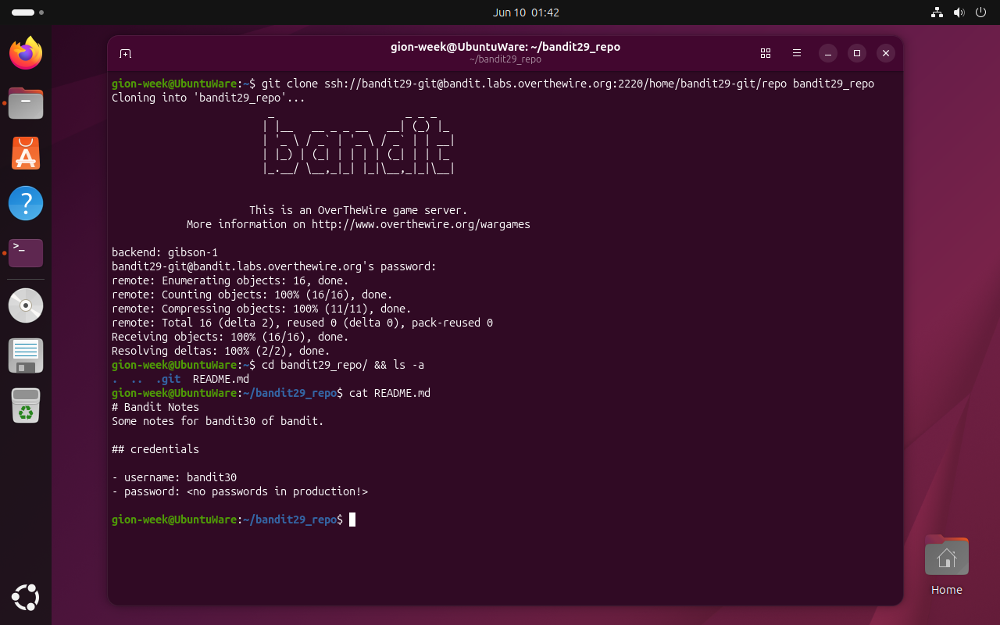
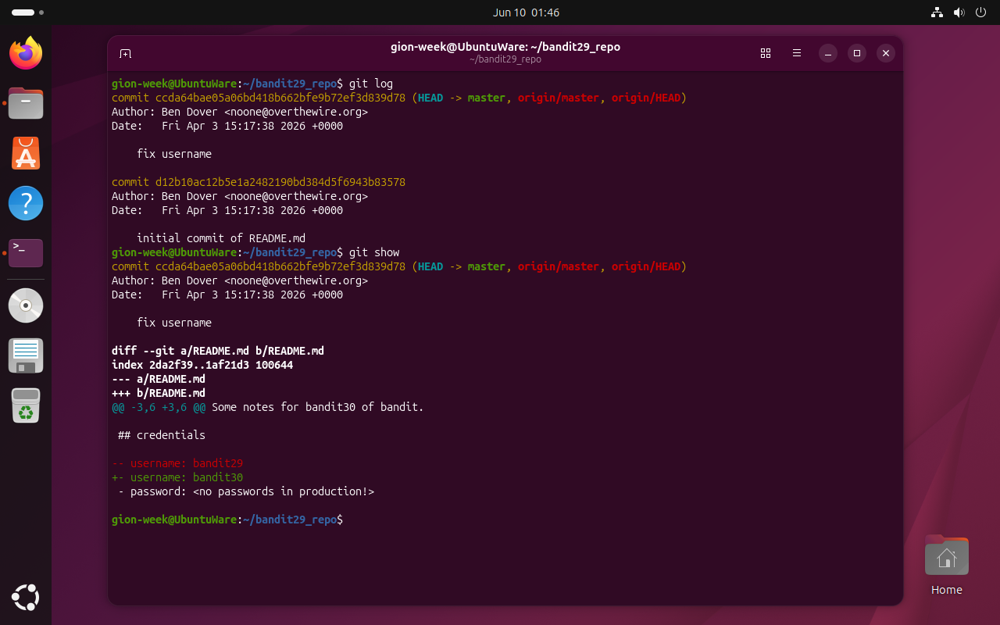
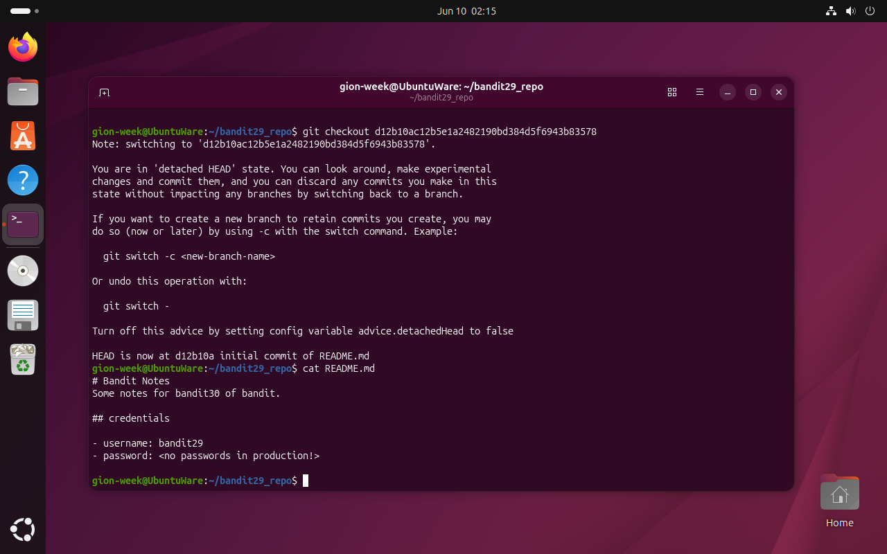
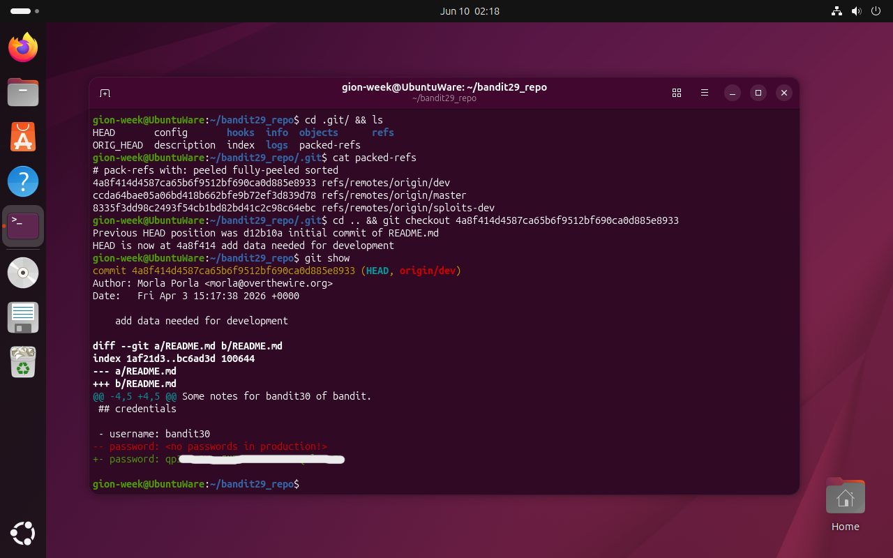

# Bandit Level 29 → 30

## Obiettivo

La password per il livello successivo è nascosta in un repository git con più branch. Il branch principale non contiene mai la password quindi è necessario scoprire i branch remoti esistenti e ispezionarne la storia.

---

## Informazioni di connessione

| Campo | Valore |
|-------|--------|
| Host | `bandit.labs.overthewire.org` |
| Porta | `2220` |
| Utente | `bandit29` |

```bash
ssh bandit29@bandit.labs.overthewire.org -p 2220
```

---

## Comandi / concetti utili

- `git clone` — clona un repository remoto in locale
- `git log` — mostra la storia dei commit del branch corrente
- `git show` — mostra il diff del commit puntato da HEAD
- `git checkout <hash>` — sposta HEAD a un commit specifico (detached HEAD)
- `cat .git/packed-refs` — mostra tutti i riferimenti remoti compressi in un singolo file

---

## Soluzione

### Step 1 – Clonare il repository e leggere lo stato attuale

```bash
gion-week@UbuntuWare:~$ git clone ssh://bandit29-git@bandit.labs.overthewire.org:2220/home/bandit29-git/repo bandit29_repo
[...]
remote: Total 16 (delta 2), reused 0 (delta 0), pack-reused 0
Receiving objects: 100% (16/16), done.
gion-week@UbuntuWare:~$ cd bandit29_repo/ && ls -a
.  ..  .git  README.md
gion-week@UbuntuWare:~/bandit29_repo$ cat README.md
# Bandit Notes
Some notes for bandit30 of bandit.

## credentials

- username: bandit30
- password: <no passwords in production!>
```

Il messaggio `<no passwords in production!>` è un indizio: la password non è mai stata nel branch di produzione (`master`). Ma il repository ha 16 oggetti clonati, ben più di quanto ci si aspetterebbe da due soli commit su un branch, segno che c'è altro da esplorare.



### Step 2 – Esaminare la storia di `master`: nessuna password

```bash
gion-week@UbuntuWare:~/bandit29_repo$ git log
commit ccda64bae05a06bd418b662bfe9b72ef3d839d78 (HEAD -> master, origin/master, origin/HEAD)
Author: Ben Dover <noone@overthewire.org>
Date:   Fri Apr 3 15:17:38 2026 +0000

    fix username

commit d12b10ac12b5e1a2482190bd384d5f6943b83578
Author: Ben Dover <noone@overthewire.org>
Date:   Fri Apr 3 15:17:38 2026 +0000

    initial commit of README.md
gion-week@UbuntuWare:~/bandit29_repo$ git show
[...]
-- username: bandit29
+- username: bandit30
 - password: <no passwords in production!>
```

Solo due commit su `master`. Il più recente ha cambiato solo lo username. Il diff non mostra nessuna modifica alla password: il campo `<no passwords in production!>` era presente fin dall'inizio.



### Step 3 – Verificare il commit iniziale: conferma che master non ha mai avuto la password

```bash
gion-week@UbuntuWare:~/bandit29_repo$ git checkout d12b10ac12b5e1a2482190bd384d5f6943b83578
Note: switching to 'd12b10ac12b5e1a2482190bd384d5f6943b83578'.
You are in 'detached HEAD' state. [...]
HEAD is now at d12b10a initial commit of README.md
gion-week@UbuntuWare:~/bandit29_repo$ cat README.md
# Bandit Notes
Some notes for bandit30 of bandit.

## credentials

- username: bandit29
- password: <no passwords in production!>
```

Anche il commit iniziale ha `<no passwords in production!>`. La password non è mai esistita nel branch `master`: occorre cercare altrove in altri branch.



### Step 4 – Trovare i branch remoti in `packed-refs` e fare checkout su `dev`

I branch remoti non sempre compaiono come file individuali in `.git/refs/`: git li comprime periodicamente in un unico file chiamato `packed-refs`. Si ispeziona la cartella `.git/` per trovarlo:

```bash
gion-week@UbuntuWare:~/bandit29_repo$ cd .git/ && ls
HEAD  config  hooks  info  objects  refs  ORIG_HEAD  description  index  logs  packed-refs
gion-week@UbuntuWare:~/bandit29_repo/.git$ cat packed-refs
# pack-refs with: peeled fully-peeled sorted
4a8f414d4587ca65b6f9512bf690ca0d885e8933 refs/remotes/origin/dev
ccda64bae05a06bd418b662bfe9b72ef3d839d78 refs/remotes/origin/master
8335f3dd98c2493f54cb1bd82bd41c2c98c64ebc refs/remotes/origin/sploits-dev
```

Esistono tre branch remoti: `master`, `dev` e `sploits-dev`. Il branch `master` è già stato esaminato. Il nome `dev` corrisponde all'indizio del README (`<no passwords in production!>`): i dati di sviluppo, password incluse, potrebbero essere lì. Si fa checkout sull'hash corrispondente e si ispeziona il commit:

```bash
gion-week@UbuntuWare:~/bandit29_repo/.git$ cd .. && git checkout 4a8f414d4587ca65b6f9512bf690ca0d885e8933
Previous HEAD position was d12b10a initial commit of README.md
HEAD is now at 4a8f414 add data needed for development
gion-week@UbuntuWare:~/bandit29_repo$ git show
commit 4a8f414d4587ca65b6f9512bf690ca0d885e8933 (HEAD, origin/dev)
Author: Morla Porla <morla@overthewire.org>
Date:   Fri Apr 3 15:17:38 2026 +0000

    add data needed for development

diff --git a/README.md b/README.md
[...]
-- password: <no passwords in production!>
+- password: qp[...]
```

Il diff mostra che nel branch `dev` la password è stata aggiunta realmente. La riga rimossa (`--`) contiene il placeholder; quella aggiunta (`+-`) contiene la password per `bandit30`.



---

## Note e osservazioni

**`git checkout` e il detached HEAD**

`git checkout <hash>` sposta `HEAD` direttamente a un commit specifico invece che a un branch. Git chiama questo stato **detached HEAD**: `HEAD` punta a un commit anziché a un branch, il che significa che eventuali nuovi commit non apparterebbero a nessun branch e andrebbero persi al prossimo cambio. Il messaggio che git mostra quando si entra in questo stato spiega esattamente cosa succede e come uscirne (`git switch -` per tornare al branch precedente).

`git checkout` è uno strumento versatile: con un nome di branch (`git checkout master`) sposta HEAD al branch corrente; con un hash entra in detached HEAD; con `git checkout -- file` scarta le modifiche locali a un file; con `git checkout -b nuovo-branch` crea e passa a un nuovo branch. Nei repository moderni si tende a usare `git switch` per cambiare branch e `git restore` per i file, separando i due usi.

**La struttura di `.git/`**

La cartella `.git/` è l'intero repository: contiene tutta la storia, la configurazione e le strutture dati di git. Rimuoverla equivale a distruggere il repository mantenendo solo i file di lavoro. I file e le directory principali:

| Percorso | Contenuto |
|---|---|
| `HEAD` | Riferimento al commit o branch corrente |
| `config` | Configurazione locale del repository (remote, branch tracking) |
| `objects/` | Tutti i dati: commit, alberi di file, blob (contenuti), compressi e indicizzati per hash SHA-1 |
| `refs/` | Riferimenti a branch e tag locali come file individuali |
| `packed-refs` | Riferimenti compressi in un unico file (branch remoti, tag vecchi) |
| `logs/` | Storia degli spostamenti di HEAD e dei branch |
| `index` | Area di staging: snapshot dell'albero di lavoro pronto per il prossimo commit |
| `hooks/` | Script eseguibili invocati automaticamente da git in eventi specifici (pre-commit, post-push, ecc.) |
| `ORIG_HEAD` | Hash del commit precedente prima di operazioni che spostano HEAD (merge, rebase, reset) |

**Perché cercare `packed-refs`**

git mantiene i riferimenti a branch e tag in due modi: come file individuali in `.git/refs/heads/` (branch locali), `.git/refs/remotes/` (branch remoti) e `.git/refs/tags/` (tag); oppure compressi nel file `packed-refs`. Quando si fa `git clone`, i branch remoti vengono spesso scritti direttamente in `packed-refs` invece che come file separati. Se `git branch -a` (che mostra tutti i branch inclusi i remoti) non rivelasse nulla di interessante o non fosse disponibile, leggere direttamente `packed-refs` è il modo più diretto per vedere tutti i riferimenti esistenti nel repository.

In questo livello `packed-refs` ha rivelato tre branch (`master`, `dev`, `sploits-dev`): il fatto che `master` avesse sempre avuto `<no passwords in production!>` suggeriva che i dati sensibili si trovassero altrove e `dev` era il candidato più naturale.
