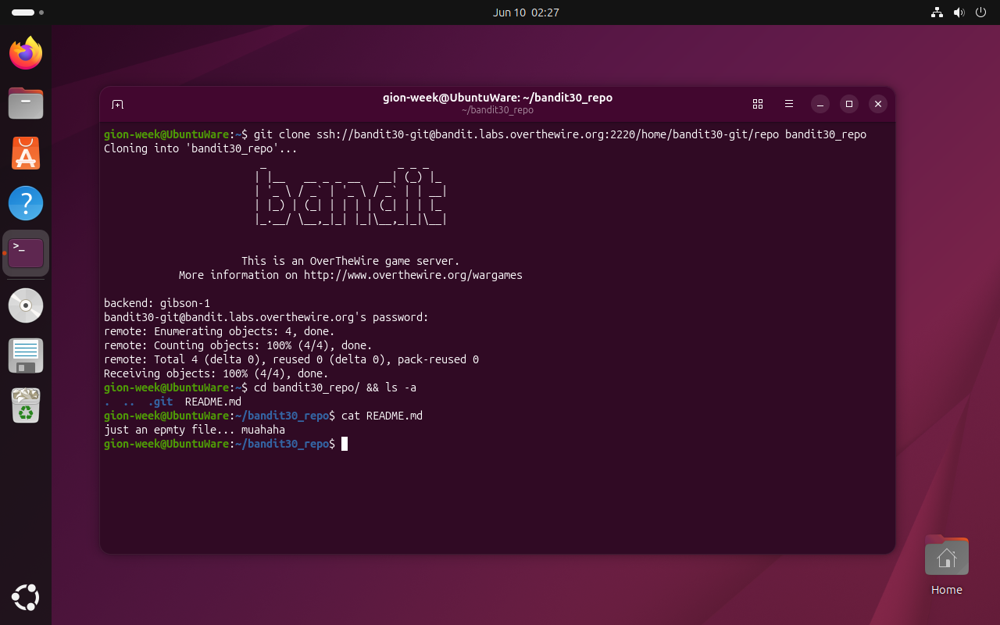
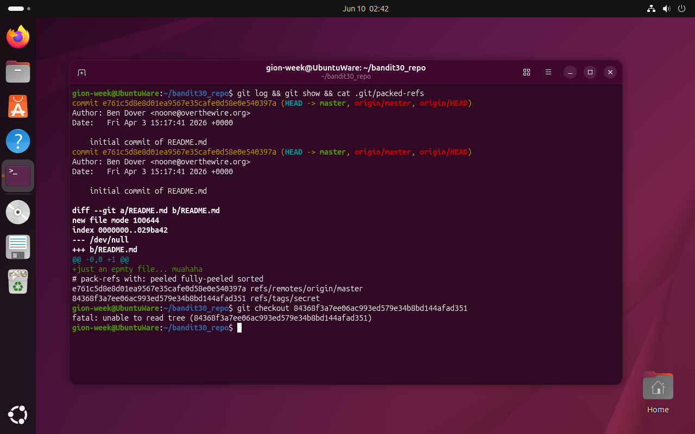
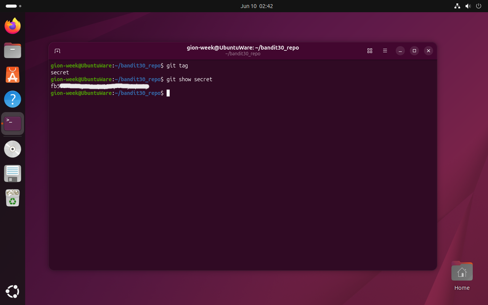

# Bandit Level 30 → 31

## Obiettivo

La password per il livello successivo è nascosta in un tag git del repository. La storia dei commit e i branch remoti non contengono informazioni util: è necessario ispezionare i tag.

---

## Informazioni di connessione

| Campo | Valore |
|-------|--------|
| Host | `bandit.labs.overthewire.org` |
| Porta | `2220` |
| Utente | `bandit30` |

```bash
ssh bandit30@bandit.labs.overthewire.org -p 2220
```

---

## Comandi / concetti utili

- `git clone` — clona un repository remoto
- `git log` / `git show` — ispeziona commit e diff
- `cat .git/packed-refs` — legge tutti i riferimenti compressi (branch remoti e tag)
- `git tag` — elenca i tag presenti nel repository
- `git show <tag>` — mostra il contenuto di un tag

---

## Soluzione

### Step 1 – Clonare il repository: README non informativo

```bash
gion-week@UbuntuWare:~$ git clone ssh://bandit30-git@bandit.labs.overthewire.org:2220/home/bandit30-git/repo bandit30_repo
[...]
remote: Total 4 (delta 0), reused 0 (delta 0), pack-reused 0
gion-week@UbuntuWare:~$ cd bandit30_repo/ && ls -a
.  ..  .git  README.md
gion-week@UbuntuWare:~/bandit30_repo$ cat README.md
just an epmty file... muahaha
```

Solo 4 oggetti clonati e README non informativo. Non ci sono indizi nel file di lavoro.



### Step 2 – Esaminare commit, diff e `packed-refs`: un tag sospetto

```bash
gion-week@UbuntuWare:~/bandit30_repo$ git log && git show && cat .git/packed-refs
commit e761c5d8e8d01ea9567e35cafe0d58e0e540397a (HEAD -> master, origin/master, origin/HEAD)
Author: Ben Dover <noone@overthewire.org>
Date:   Fri Apr 3 15:17:41 2026 +0000

    initial commit of README.md
[...]
+just an epmty file... muahaha
# pack-refs with: peeled fully-peeled sorted
e761c5d8e8d01ea9567e35cafe0d58e0e540397a refs/remotes/origin/master
84368f3a7ee06ac993ed579e34b8bd144afad351 refs/tags/secret
```

Un solo commit su `master` e nessun branch remoto aggiuntivo. `packed-refs` rivela però un tag chiamato `secret` con hash `84368f3a7ee06ac993ed579e34b8bd144afad351`. Purtroppo il tentativo di fare checkout direttamente sull'hash fallisce:

```bash
gion-week@UbuntuWare:~/bandit30_repo$ git checkout 84368f3a7ee06ac993ed579e34b8bd144afad351
fatal: unable to read tree (84368f3a7ee06ac993ed579e34b8bd144afad351)
```

L'errore indica che l'hash non punta al tipo di oggetto che `git checkout` si aspetta come un commit o a un albero di file. Il tag `secret` è di tipo diverso, da ispezionare con `git tag` che elenca tutti i tag del repository. 



### Step 3 – Ispezionare il tag con `git tag` e `git show`

```bash
gion-week@UbuntuWare:~/bandit30_repo$ git tag
secret
gion-week@UbuntuWare:~/bandit30_repo$ git show secret
fb5[...]
```

`git show secret` non mostra nessun commit né diff ma restituisce direttamente una stringa: la password per `bandit31`.



---

## Note e osservazioni

**Perché `git checkout <hash>` non funziona**

In git ogni dato è memorizzato come uno di quattro tipi di oggetti, identificati dal loro hash SHA-1:

- **blob** — il contenuto grezzo di un file
- **tree** — la struttura di una directory (lista di blob e subtree con nomi e permessi)
- **commit** — uno snapshot: punta a un tree, ha metadati (autore, data, messaggio) e punta al commit precedente
- **tag** — un riferimento annotato che punta a un altro oggetto (di solito un commit)

`git checkout` si aspetta di ricevere un hash di tipo **commit** o **tree**: da un commit recupera il tree associato e aggiorna i file di lavoro di conseguenza. L'hash `84368f3a7ee06ac993ed579e34b8bd144afad351` punta invece direttamente a un **blob** (un oggetto senza struttura ad albero). Non c'è nessun "file system" da ripristinare, quindi git restituisce `unable to read tree`. `git show`, al contrario, è in grado di mostrare il contenuto di qualsiasi tipo di oggetto git, inclusi i blob.

**I tag in git: cosa sono e come vengono usati**

Un tag in git è un riferimento con nome a uno specifico oggetto nel repository, di solito un commit, ma come dimostra questo livello può puntare anche a un blob. Ne esistono due tipi:

- **Lightweight tag** (`git tag nome`): un semplice puntatore a un oggetto, senza metadati aggiuntivi. Funziona come un branch che non si sposta mai.
- **Annotated tag** (`git tag -a nome -m "messaggio"`): un oggetto tag completo con autore, data, messaggio e firma opzionale GPG. È il tipo raccomandato per marcare rilasci pubblici.

In un flusso di lavoro reale i tag vengono usati principalmente per marcare versioni stabili del software (`v1.0.0`, `v2.3.1`), rendendole facilmente rintracciabili nella storia del repository. `git tag` senza argomenti elenca tutti i tag; `git show <tag>` mostra i dettagli dell'oggetto puntato; `git checkout <tag>` porta il repository allo stato del commit corrispondente (in detached HEAD).

In questo livello il tag `secret` è un uso non convenzionale: punta direttamente a un blob contenente solo la password, senza alcun commit associato. Questo oggetto non fa parte di nessun albero di file e non è referenziato da nessun commit: esiste nel repository solo attraverso il tag, che è l'unico modo per raggiungerlo.
