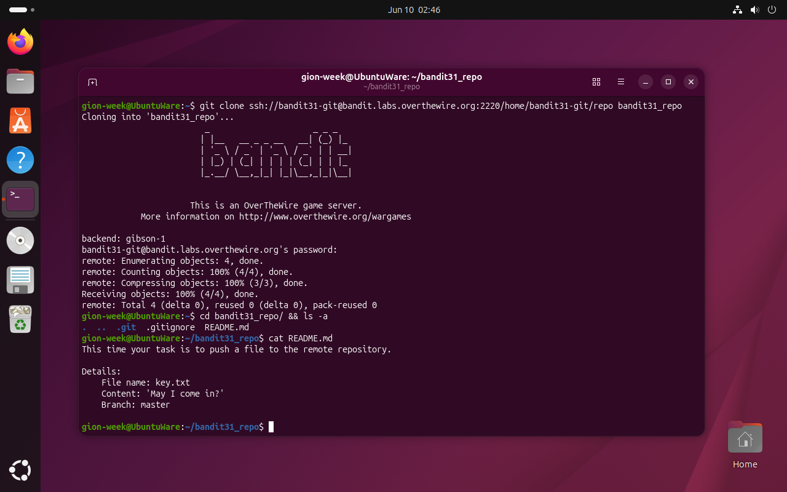
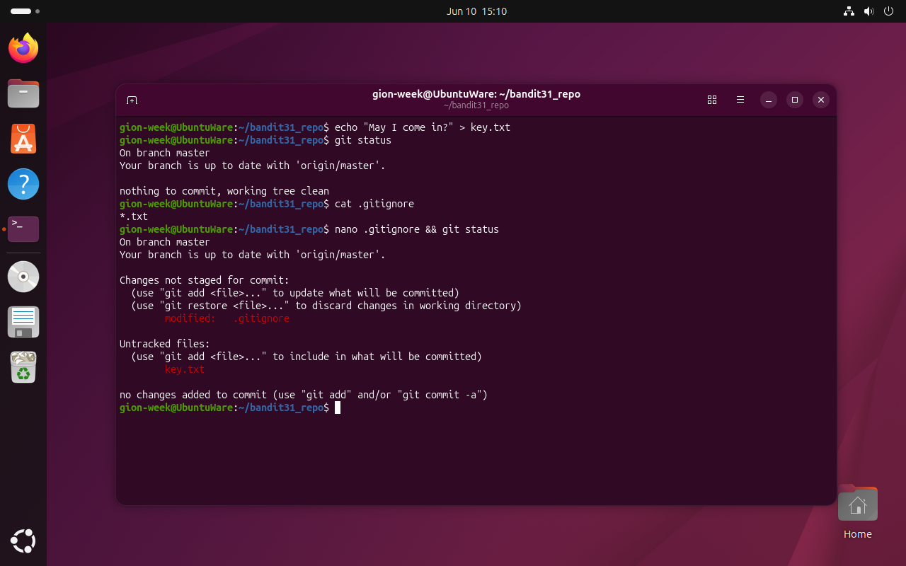
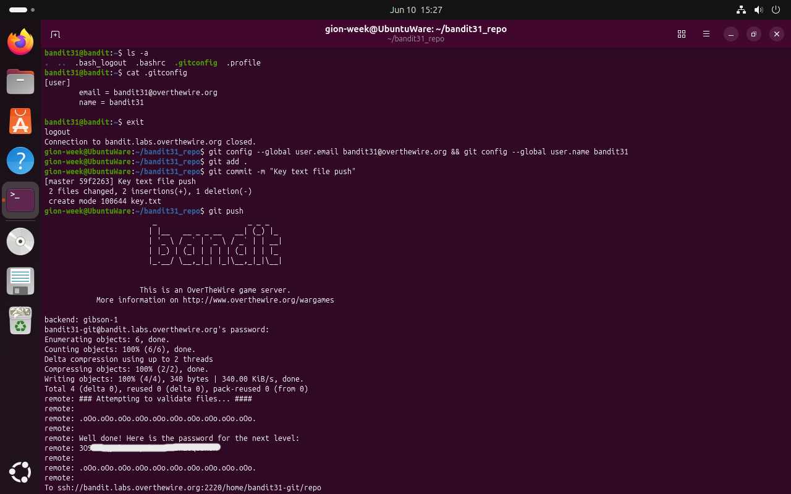

# Bandit Level 31 → 32

## Obiettivo

Questo livello inverte la direzione rispetto ai precedenti: invece di estrarre dati da un repository, bisogna **pubblicare** un file sul repository remoto.

---

## Informazioni di connessione

| Campo | Valore |
|-------|--------|
| Host | `bandit.labs.overthewire.org` |
| Porta | `2220` |
| Utente | `bandit31` |

```bash
ssh bandit31@bandit.labs.overthewire.org -p 2220
```

---

## Comandi / concetti utili

- `git status` — mostra lo stato dei file nel working tree rispetto all'ultimo commit
- `cat .gitignore` — legge le regole di esclusione dei file dal tracking git
- `nano .gitignore` — modifica il file `.gitignore` per rimuovere l'esclusione
- `git config --global` — imposta la configurazione globale di git (nome utente, email)
- `git add` — aggiunge file all'area di staging
- `git commit -m` — crea un commit con messaggio
- `git push` — pubblica i commit locali sul repository remoto

---

## Soluzione

### Step 1 – Clonare il repository e leggere le istruzioni

```bash
gion-week@UbuntuWare:~$ git clone ssh://bandit31-git@bandit.labs.overthewire.org:2220/home/bandit31-git/repo bandit31_repo
[...]
gion-week@UbuntuWare:~$ cd bandit31_repo/ && ls -a
.  ..  .git  .gitignore  README.md
gion-week@UbuntuWare:~/bandit31_repo$ cat README.md
This time your task is to push a file to the remote repository.

Details:
    File name: key.txt
    Content: 'May I come in?'
    Branch: master
```

Le istruzioni sono chiare: creare `key.txt` con il contenuto specificato e pubblicarlo su `master`. Oltre a `README.md` è presente anche un `.gitignore`, un file mai visto nei repository dei livelli precedenti e la cui presenza è già un indizio.



### Step 2 – Creare il file e scoprire che viene ignorato

```bash
gion-week@UbuntuWare:~/bandit31_repo$ echo "May I come in?" > key.txt
gion-week@UbuntuWare:~/bandit31_repo$ git status
On branch master
Your branch is up to date with 'origin/master'.

nothing to commit, working tree clean
```

`git status` non mostra `key.txt` tra i file non tracciati come se non esistesse. Il motivo è nel `.gitignore`:

```bash
gion-week@UbuntuWare:~/bandit31_repo$ cat .gitignore
*.txt
```

Il `.gitignore` esclude tutti i file con estensione `.txt` e `key.txt` rientra esattamente in questa regola, venendo silenziosamente ignorato da git. Per poterlo tracciare è necessario modificare il `.gitignore`:

```bash
gion-week@UbuntuWare:~/bandit31_repo$ nano .gitignore && git status
On branch master
Your branch is up to date with 'origin/master'.

Changes not staged for commit:
      modified:   .gitignore

Untracked files:
      key.txt

no changes added to commit (use "git add" and/or "git commit -a")
```

Dopo la modifica, `git status` mostra entrambi: `.gitignore` come modificato e `key.txt` come file non tracciato. Ora git li vede entrambi.



### Step 3 – Configurare l'identità git e fare il push

Prima di poter committare è necessaria una configurazione git valida: nome e email dell'autore. Senza di essa git rifiuta di creare commit, quindi bisogna recuperare la configurazione corretta cercandola direttamente tra i file dell'utente sul server:

```bash
bandit31@bandit:~$ ls -a
.bash_logout  .bashrc  .gitconfig  .profile
bandit31@bandit:~$ cat .gitconfig
[user]
        email = bandit31@overthewire.org
        name = bandit31
bandit31@bandit:~$ exit
```

Si imposta la stessa configurazione in locale, si aggiungono i file all'area di staging, si committa e si pusha:

```bash
gion-week@UbuntuWare:~/bandit31_repo$ git config --global user.email bandit31@overthewire.org && git config --global user.name bandit31
gion-week@UbuntuWare:~/bandit31_repo$ git add .
gion-week@UbuntuWare:~/bandit31_repo$ git commit -m "Key text file push"
[master 59f2263] Key text file push
 2 files changed, 2 insertions(+), 1 deletion(-)
 create mode 100644 key.txt
gion-week@UbuntuWare:~/bandit31_repo$ git push
bandit31-git@bandit.labs.overthewire.org's password:
[...]
remote: ### Attempting to validate files... ####
remote:
remote: Well done! Here is the password for the next level:
remote: 309[...]
remote:
remote: To ssh://bandit.labs.overthewire.org:2220/home/bandit31-git/repo
```

Il server riceve il push, valida il contenuto di `key.txt` e restituisce la password per `bandit32` direttamente nell'output del comando.



---

## Note e osservazioni

**`.gitignore`: cosa fa e perché andava modificato**

`.gitignore` è un file di testo che elenca pattern di file e directory che git deve **ignorare completamente**: non tracciarli, non mostrarli in `git status`, non includerli in `git add`. È usato per escludere file generati automaticamente (file compilati, cache, log), credenziali, configurazioni locali e tutto ciò che non ha senso versionare. I pattern seguono la sintassi glob: `*.txt` esclude qualsiasi file con estensione `.txt`, `build/` esclude l'intera directory `build`, `!importante.txt` reintroduce un'eccezione.

In questo livello `*.txt` escludeva proprio il file che si sarebbe dovuto pubblicare: la soluzione era quindi rimuovere quella regola o aggiungere `!key.txt` come eccezione esplicita. Senza modificare `.gitignore`, `git add key.txt` avrebbe fallito silenziosamente e il file non sarebbe mai entrato nel commit.

**Il ciclo completo `add → commit → push`**

Questo livello mette in pratica il flusso di lavoro standard di git:

1. `git add .` — sposta le modifiche dall'area di lavoro all'**area di staging** (o *index*): un'istantanea intermedia di cosa farà parte del prossimo commit
2. `git commit -m "messaggio"` — registra lo snapshot nella storia locale del repository con un messaggio descrittivo
3. `git push` — invia i commit locali al repository remoto, autenticandosi con password (o chiave SSH)

**Dai livelli git a questa repository**

I livelli 27–31 hanno introdotto in progressione tutti gli strumenti fondamentali di git: clonare, leggere la storia, navigare branch e tag, e infine pubblicare modifiche. Questa progressione è stata la diretta ispirazione per creare la repository che stai leggendo: ogni concetto incontrato durante la risoluzione dei livelli (clone, commit, push, branch, `.gitignore`, README) è stato applicato in pratica per documentare il percorso. La struttura della repo (una cartella per livello, README con analisi dei passi, screenshot inline) è il risultato concreto dell'esperienza con git maturata risolvendo i livelli stessi.
