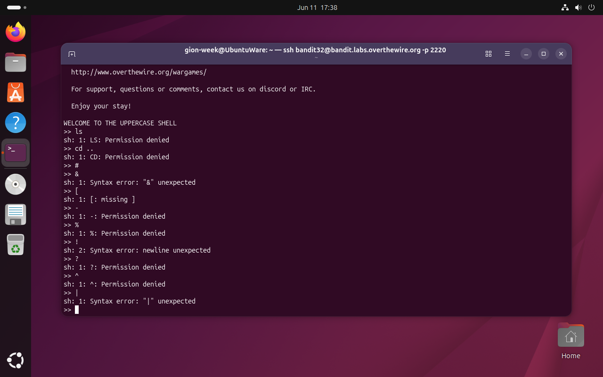
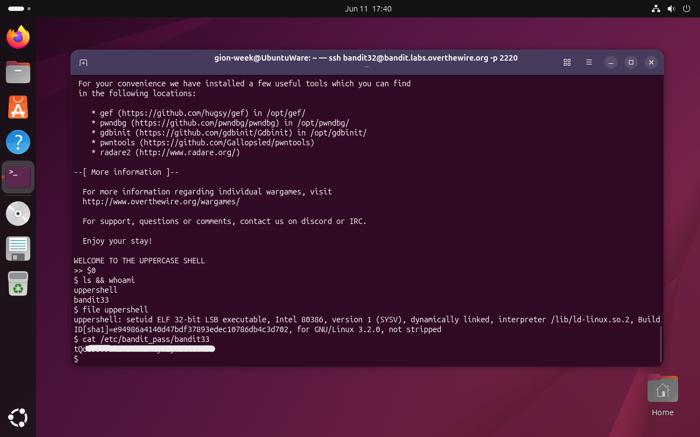

# Bandit Level 32 → 33

## Obiettivo

All'accesso come `bandit32` si viene accolti da una shell non standard che converte tutto l'input in maiuscolo prima di eseguirlo. L'obiettivo è uscire da questa restrizione e ottenere una shell normale con i privilegi di `bandit33`.

---

## Informazioni di connessione

| Campo | Valore |
|-------|--------|
| Host | `bandit.labs.overthewire.org` |
| Porta | `2220` |
| Utente | `bandit32` |

```bash
ssh bandit32@bandit.labs.overthewire.org -p 2220
```

---

## Comandi / concetti utili

- `$0` — variabile speciale della shell che contiene il nome o il percorso della shell corrente
- `file` — identifica il tipo di un eseguibile
- `cat /etc/bandit_pass/bandit33` — legge la password una volta ottenuta la shell corretta

---

## Soluzione

### Step 1 – Esplorare i limiti dell'uppercase shell

All'accesso compare il messaggio `WELCOME TO THE UPPERCASE SHELL`. Qualsiasi comando viene convertito in maiuscolo prima dell'esecuzione:

```
>> ls
sh: 1: LS: Permission denied
>> cd ..
sh: 1: CD: Permission denied
>> &
sh: 1: Syntax error: "&" unexpected
>> |
sh: 1: Syntax error: "|" unexpected
```

`ls` diventa `LS`, `cd` diventa `CD`, comandi che non esistono. I caratteri speciali come `&` e `|` causano errori di sintassi perché non sono nomi di comandi validi in quel contesto. Insomma qualsiasi tentativo di usare comandi alfabetici viene sabotato dalla conversione.

La chiave è trovare qualcosa che la shell non possa convertire in maiuscolo: i caratteri non alfabetici e in particolare le **variabili speciali** della shell che iniziano con `$`.



### Step 2 – Usare `$0` per avviare una shell standard

`$0` è una variabile speciale della shell che contiene il nome o il percorso dell'eseguibile della shell corrente. Non contenendo lettere alfabetiche la conversione in maiuscolo non la tocca e, quando viene eseguita come comando, espande al percorso della shell e ne avvia una nuova istanza:

```
>> $0
$ ls && whoami
uppershell
bandit33
$ file uppershell
uppershell: setuid ELF 32-bit LSB executable, Intel 80386, [...]
$ cat /etc/bandit_pass/bandit33
[password bandit33]
```

Il prompt cambia da `>>` a `$`: siamo in una shell `sh` standard. `whoami` conferma che stiamo operando come `bandit33` dato che la shell eredita i privilegi del processo padre `uppershell` che è un eseguibile setuid di proprietà di `bandit33`.



---

## Note e osservazioni

**Le variabili speciali nelle shell POSIX**

Le shell POSIX (bash, sh, dash e derivate) gestiscono due categorie di variabili speciali legate alla gestione dei processi e dei parametri:

**Parametri posizionali**: rappresentano gli argomenti passati alla shell o a uno script al momento dell'avvio

| Variabile | Contenuto |
|---|---|
| `$0` | Nome o percorso della shell o dello script corrente |
| `$1` | Primo argomento passato allo script o alla funzione |
| `$2`, `$3`, … | Secondo, terzo argomento, e così via |
| `$#` | Numero totale di argomenti passati |
| `$@` | Tutti gli argomenti come parole separate |
| `$*` | Tutti gli argomenti come stringa unica |

**Variabili di stato**: informazioni sul processo e sull'esecuzione corrente

| Variabile | Contenuto |
|---|---|
| `$$` | PID della shell corrente |
| `$?` | Codice di uscita dell'ultimo comando eseguito |
| `$!` | PID dell'ultimo processo avviato in background |
| `$-` | Flag di opzione attivi nella shell corrente |

**Perché `$0` avvia una nuova istanza e perché non è ristretta**

Quando si digita `$0` nella shell, la variabile viene espansa al percorso dell'eseguibile della shell corrente, ad esempio `/bin/sh`. La shell interpreta questa stringa come un comando da eseguire: avvia un nuovo processo figlio usando quel percorso come programma. Il risultato è una nuova istanza di `sh`, completamente indipendente dalla shell "uppercase" che la ha avviata.

La nuova shell non è ristretta per una ragione precisa: **la restrizione non è implementata in `sh` stesso**, ma nell'eseguibile `uppershell`, che legge l'input, lo converte in maiuscolo e lo passa a `sh`. Quando `$0` viene valutato, avvia direttamente `sh` senza passare per `uppershell`: il nuovo processo è un interprete POSIX standard che non sa nulla della conversione in maiuscolo. L'uppercase shell è un wrapper applicativo, non una restrizione del kernel o del filesystem, aggirarlo significa semplicemente non passarci attraverso.

I privilegi di `bandit33` derivano invece da `uppershell` stesso, che è un eseguibile setuid: il processo figlio (`sh`) eredita l'effective UID del padre, che era già `bandit33`.
