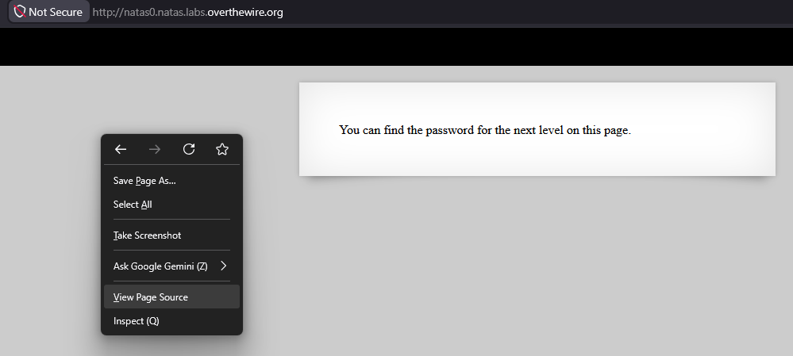
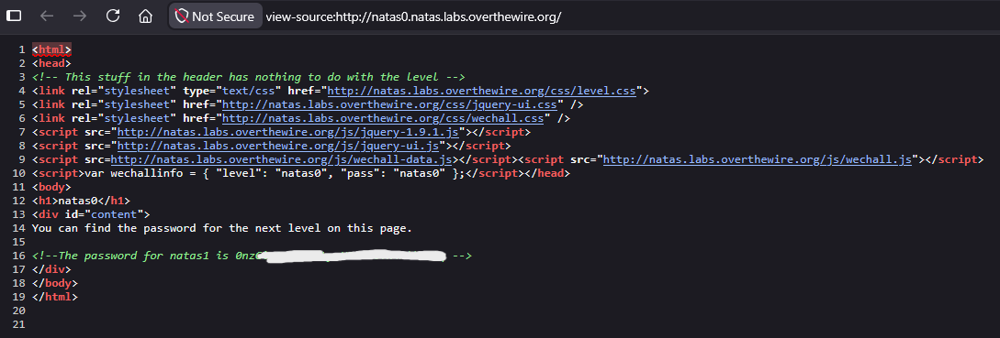

# Natas Level 0 → 1

## Obiettivo

La pagina del livello afferma che la password per il livello successivo è presente sulla pagina stessa. L'obiettivo è trovarla.

---

## Informazioni di accesso

| Campo | Valore |
|-------|--------|
| URL | `http://natas0.natas.labs.overthewire.org` |
| Username | `natas0` |
| Password | `natas0` |

---

## Strumenti / concetti utili

- `View Page Source` (tasto destro → "Visualizza sorgente pagina", oppure `Ctrl+U`) — mostra l'HTML grezzo inviato dal server, incluso ciò che il browser non renderizza
- Commenti HTML (`<!-- ... -->`) — blocchi di testo ignorati dal browser in fase di rendering ma presenti nel sorgente

---

## Soluzione

### Step 1 – Analisi della pagina renderizzata

Aprendo l'URL nel browser la pagina mostra un solo elemento visibile:

> *You can find the password for the next level on this page.*

Non ci sono form, link, immagini o altri elementi interattivi. Il contenuto visibile non contiene la password.



### Step 2 – Ispezione del sorgente HTML

Aprendo il sorgente della pagina (`Ctrl+U` oppure tasto destro → *View Page Source*) si trova alla riga 16 un commento HTML contenente la password in chiaro:

```html
<!--The password for natas1 is [REDACTED] -->
```



### Step 3 – Password trovata

La password per accedere al livello 1 è contenuta in un commento HTML nel sorgente della pagina, non visibile nella pagina renderizzata dal browser.

---

## Note e osservazioni

**Perché ispezionare il sorgente è stato il primo passo**

La pagina afferma esplicitamente che la password è presente "su questa pagina", ma la pagina renderizzata non mostra nulla di utile. Questa è la situazione tipica che in web security porta immediatamente a guardare il sorgente HTML: il browser renderizza solo ciò che è visibile, come testo, immagini e form, ma scarta silenziosamente tutto il resto. Tra le cose che il browser non mostra mai all'utente finale ci sono:

- **Commenti HTML** (`<!-- ... -->`): usati dagli sviluppatori per note interne, debug o — come in questo caso — per "nascondere" informazioni in modo del tutto inefficace
- **Attributi `hidden`** su elementi HTML
- **Variabili JavaScript** definite nel `<head>` ma non stampate a schermo
- **Meta tag** nel `<head>`

In questo livello il sorgente contiene anche la riga:

```javascript
var wechallinfo = { "level": "natas0", "pass": "natas0" };
```

Questo è un artefatto del sistema di OverTheWire per tracciare il livello, non rilevante per la soluzione, ma conferma che il sorgente contiene informazioni non visibili nella pagina.

**Commenti HTML e sicurezza**

I commenti HTML non offrono alcuna protezione: sono inviati dal server al browser esattamente come il resto del documento e sono leggibili da chiunque. Lasciare credenziali, path interni, note di debug o logica applicativa nei commenti HTML di una pagina pubblica è una vulnerabilità classificata come **CWE-615** (*Inclusion of Sensitive Information in Source Code Comments*).
