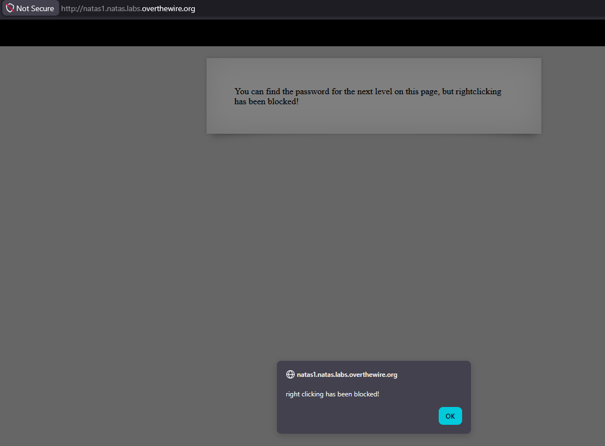
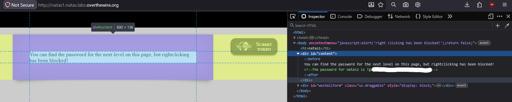

# Natas Level 1 → 2

## Obiettivo

La pagina afferma che la password per il livello successivo è presente sulla pagina, ma il tasto destro è stato bloccato.

---

## Informazioni di accesso

| Campo | Valore |
|-------|--------|
| URL | `http://natas1.natas.labs.overthewire.org` |
| Username | `natas1` |
| Password | *(password trovata al livello 0)* |

---

## Strumenti / concetti utili

- `F12` — apre i DevTools del browser (Inspector, Console, Debugger, ecc.)
- **Inspector / Pannello Elements** — mostra l'albero DOM della pagina con il sorgente HTML espandibile nodo per nodo
- `oncontextmenu` — attributo HTML che intercetta l'evento del tasto destro del mouse
- `return false` — istruzione JavaScript che annulla il comportamento predefinito di un evento

---

## Soluzione

### Step 1 – Tentativo con tasto destro: bloccato

Il tasto destro del mouse mostra un alert JavaScript:

> *right clicking has been blocked!*

La pagina impedisce esplicitamente l'accesso al menu contestuale del browser, che nel livello 0 era il vettore principale per aprire il sorgente.



### Step 2 – Apertura DevTools con F12 e ispezione del DOM

Il blocco del tasto destro è un meccanismo puramente lato client: non impedisce l'accesso al sorgente in nessun altro modo. Si apre l'Inspector con `F12` e si espande il nodo `<div id="content">`, che è il contenitore del testo visibile sulla pagina e il candidato più probabile per trovare la password.

All'interno del `<div id="content">` è presente un commento HTML con la password:

```html
<!--The password for natas2 is [REDACTED]-->
```



### Step 3 – Password trovata

La password per accedere al livello 2 è contenuta in un commento HTML all'interno di `div#content`, identica per struttura al livello 0.

---

## Note e osservazioni

**Come funziona il blocco del tasto destro**

Ispezionando il sorgente tramite DevTools è visibile l'attributo sul tag `<body>`:

```html
<body oncontextmenu="javascript:alert('right clicking has been blocked!');return false;">
```

`oncontextmenu` è un event handler che viene eseguito ogni volta che l'utente fa clic con il tasto destro. Il codice fa due cose in sequenza: mostra l'alert, poi restituisce `false`. In JavaScript, restituire `false` da un event handler equivale a chiamare `event.preventDefault()`: annulla il comportamento predefinito dell'evento, che in questo caso è la comparsa del menù contestuale del browser.

**Perché questo blocco non ha alcun valore di sicurezza**

Il blocco agisce esclusivamente sull'interfaccia visiva del browser: impedisce la comparsa del menù contestuale, non l'accesso al sorgente. Il documento HTML viene inviato integralmente dal server al browser prima che qualsiasi JavaScript venga eseguito. Esistono almeno tre modi per aggirarlo senza alcuno strumento specializzato:

- `F12` — apre i DevTools direttamente, senza passare per il menu contestuale
- `Ctrl+U` — apre il sorgente grezzo in una nuova scheda (come nel livello precedente), scorciatoia di sistema che JavaScript non può intercettare
- Disabilitare JavaScript nella pagina dal browser — rimuove del tutto l'event handler

Qualsiasi meccanismo di protezione basato esclusivamente su JavaScript lato client è aggirabile dall'utente finale, perché il client ha il controllo completo sull'esecuzione del codice ricevuto. Questo vale per il blocco del tasto destro, per l'offuscamento del sorgente e per qualsiasi altra "protezione" implementata nel browser.
