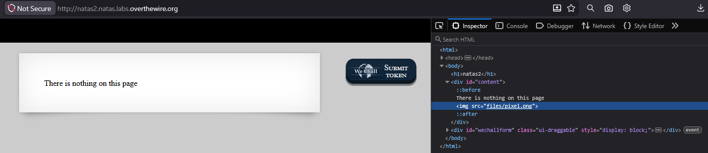
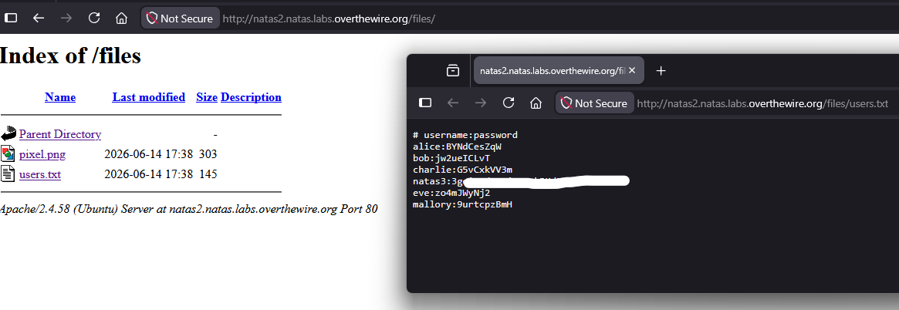

# Natas Level 2 → 3

## Obiettivo

La pagina afferma che non c'è nulla su di essa. L'obiettivo è trovare la password per il livello successivo nonostante questa affermazione.

---

## Informazioni di accesso

| Campo | Valore |
|-------|--------|
| URL | `http://natas2.natas.labs.overthewire.org` |
| Username | `natas2` |
| Password | *(password trovata al livello 1)* |

---

## Strumenti / concetti utili

- **Inspector / DevTools** (`F12`) — ispezione del DOM per identificare risorse caricate dalla pagina
- **Directory listing** — funzionalità del server web che elenca il contenuto di una cartella quando non è presente un file indice (`index.html`)
- **Navigazione manuale dell'URL** — modifica diretta dell'URL nella barra degli indirizzi per esplorare percorsi del server

---

## Soluzione

### Step 1 – Analisi della pagina e del DOM

La pagina renderizzata mostra solo il testo "There is nothing on this page". A differenza dei livelli precedenti, non è presente alcun commento HTML nel `div#content`. Aprendo l'Inspector con `F12` però si nota un elemento aggiuntivo che non è visibile sulla pagina: un tag `` con percorso `files/pixel.png`.

```html

```

Un'immagine da 1×1 pixel non ha alcun scopo visivo. La sua presenza nel codice rivela però un'informazione importante: esiste una sottocartella `files/` sul server.



### Step 2 – Esplorazione della cartella `files/`

Navigando manualmente all'URL `http://natas2.natas.labs.overthewire.org/files/` il server risponde con un elenco dei file contenuti nella cartella:

```
Index of /files
pixel.png     2026-06-14 17:38    303
users.txt     2026-06-14 17:38    145
```

Il server ha il **directory listing** abilitato: in assenza di un file indice nella cartella, Apache elenca direttamente tutti i file presenti. Tra questi è visibile `users.txt`.



### Step 3 – Lettura di `users.txt` e password trovata

Aprendo `http://natas2.natas.labs.overthewire.org/files/users.txt` si trova un file di testo con coppie `username:password`:

```
# username:password
alice:BYNdCesZqW
bob:jw2ueICLvT
charlie:G5vCxkVV3m
natas3:[REDACTED]
eve:zo4mJWyNj2
mallory:9urtcpzBmH
```

La riga `natas3:[REDACTED]` contiene la password per il livello successivo.

---

## Note e osservazioni

**Perché `pixel.png` è stato l'indizio verso la soluzione**

L'immagine in sé non ha alcun contenuto utile: un file PNG da 303 byte è quasi certamente un pixel trasparente 1×1. Il suo valore in questo livello non era visivo ma strutturale: l'attributo `src="files/pixel.png"` nel tag `` rivela che sul server esiste una directory chiamata `files/`. Senza questo indizio nel DOM, la cartella sarebbe rimasta sconosciuta in quanto non c'era nessun link cliccabile sulla pagina che portasse lì.

Questo è un pattern ricorrente nell'analisi di applicazioni web: le risorse caricate da una pagina (immagini, script, fogli di stile, font) espongono la struttura del filesystem sul server anche quando la pagina non contiene link espliciti. L'Inspector o la scheda Network dei DevTools sono i posti giusti dove cercare questi riferimenti.

**Cos'è il directory listing e perché è un problema**

Quando un browser richiede una URL che corrisponde a una cartella del server (es. `/files/`), il server cerca un file indice da servire, tipicamente `index.html` o `index.php`. Se quel file non esiste e il directory listing è abilitato, Apache (e altri server web) risponde generando automaticamente una pagina HTML che elenca tutti i file e le sottocartelle presenti.

Questo comportamento è comodo in ambienti di sviluppo, ma in produzione espone l'intera struttura di una directory a chiunque conosca o indovini il percorso. Nel caso di questo livello il risultato è la visibilità diretta di un file di credenziali. Il modo corretto per prevenirlo è disabilitare il directory listing nella configurazione del server (in Apache, con la direttiva `Options -Indexes`) e garantire che ogni cartella pubblica contenga un file indice.
