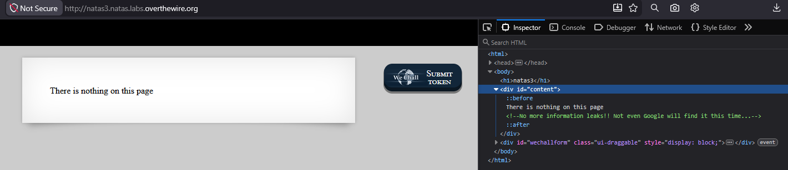
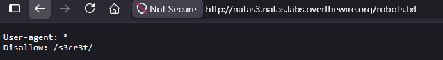
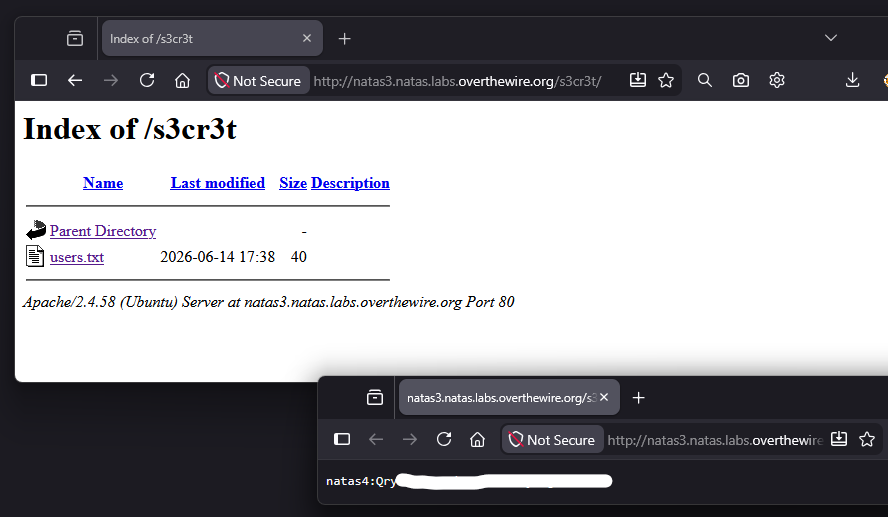

# Natas Level 3 → 4

## Obiettivo

La pagina afferma di nuovo che non c'è nulla su di essa. Stavolta non ci sono risorse nel DOM che rivelino cartelle nascoste. L'obiettivo è trovare un percorso alternativo verso la password.

---

## Informazioni di accesso

| Campo | Valore |
|-------|--------|
| URL | `http://natas3.natas.labs.overthewire.org` |
| Username | `natas3` |
| Password | *(password trovata al livello 2)* |

---

## Strumenti / concetti utili

- **Inspector / DevTools** (`F12`) — ispezione del DOM
- `robots.txt` — file standard dei server web che indica ai motori di ricerca quali percorsi non indicizzare
- **Navigazione manuale dell'URL** — esplorazione diretta di percorsi noti sul server

---

## Soluzione

### Step 1 – Analisi del DOM: un indizio nel commento

Il `div#content` non contiene immagini, link o altri riferimenti a risorse esterne come nel livello precedente. Contiene però un commento HTML:

```html
<!--No more information leaks!! Not even Google will find it this time....-->
```

Il riferimento esplicito a Google è l'indizio: indica che il percorso nascosto non è raggiungibile tramite i motori di ricerca. Il meccanismo standard con cui un sito comunica ai motori di ricerca cosa non devono indicizzare è il file `robots.txt`.



### Step 2 – Lettura di `robots.txt`

Navigando a `http://natas3.natas.labs.overthewire.org/robots.txt` il file è accessibile pubblicamente e contiene:

```
User-agent: *
Disallow: /s3cr3t/
```

La direttiva `Disallow: /s3cr3t/` indica ai crawler di non visitare quella cartella. Paradossalmente, elencare un percorso in `robots.txt` lo rende noto a chiunque legga il file.



### Step 3 – Esplorazione di `/s3cr3t/` e password trovata

Navigando a `http://natas3.natas.labs.overthewire.org/s3cr3t/` il server risponde con un directory listing. La cartella contiene un file `users.txt` che riporta la riga:

```
natas4:[REDACTED]
```



---

## Note e osservazioni

**Cos'è `robots.txt` e perché è un file comune da cercare**

`robots.txt` è un file di testo posizionato nella root di un sito web (`/robots.txt`) che segue il **Robots Exclusion Protocol**: uno standard informale con cui i siti comunicano ai crawler dei motori di ricerca (Googlebot, Bingbot, ecc.) quali URL non devono essere visitati o indicizzati. La struttura base è:

```
User-agent: *          ← si applica a tutti i crawler
Disallow: /percorso/   ← non visitare questo percorso
```

Il file è pubblicamente accessibile per definizione — i crawler devono poterlo leggere prima di navigare il sito. Questo lo rende una fonte di informazioni sulla struttura del server: qualsiasi percorso elencato in `Disallow` è un percorso che l'amministratore vuole tenere fuori dai risultati di ricerca, ma non necessariamente fuori dalla portata di un utente che conosce l'URL diretto. Per questo motivo `robots.txt` è uno dei primi file che si controlla durante l'analisi di un'applicazione web.

**Metodo alternativo: brute force dei percorsi con una wordlist**

In assenza dell'indizio nel commento HTML, il file `robots.txt` o la cartella `/s3cr3t/` sarebbero potuti essere scoperti tramite **directory/file brute forcing**: si utilizza un tool (come `gobuster` o `feroxbuster`) che prova in automatico centinaia o migliaia di nomi di cartelle e file comuni contro il server, inserendoli nell'URL uno per volta e osservando quali rispondono con un codice 200 o 301 anziché 404 (NOT FOUND). Il tool legge i nomi da una **wordlist**, cioè una lista di percorsi comuni usata come dizionario. Questa tecnica non richiede indizi nel sorgente e funziona anche qualora `robots.txt` non avesse elencato nulla di utile.
