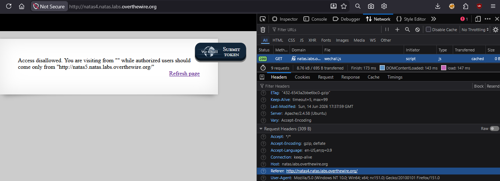
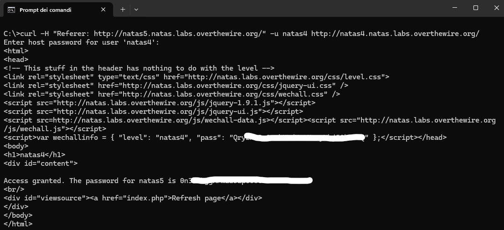

# Natas Level 4 → 5

## Obiettivo

La pagina nega l'accesso specificando che gli utenti autorizzati devono provenire da un URL preciso. L'obiettivo è capire quale meccanismo il server usa per verificare la provenienza e falsificarlo.

---

## Informazioni di accesso

| Campo | Valore |
|-------|--------|
| URL | `http://natas4.natas.labs.overthewire.org` |
| Username | `natas4` |
| Password | *(password trovata al livello 3)* |

---

## Strumenti / concetti utili

- **Network tab** (DevTools, `F12`) — mostra le richieste HTTP effettuate dal browser con tutti gli header inviati e ricevuti
- `Referer` — header HTTP che il browser invia automaticamente per indicare da quale pagina proviene la richiesta corrente
- `curl -H` — opzione di `curl` per aggiungere un header HTTP arbitrario a una richiesta
- `curl -u` — opzione di `curl` per autenticazione HTTP Basic (`username:password`)

---

## Soluzione

### Step 1 – Lettura del messaggio di errore

Aprendo la pagina il server risponde con:

> *Access disallowed. You are visiting from "" while authorized users should come only from "http://natas5.natas.labs.overthewire.org/"*

Il messaggio contiene due informazioni utili: il server sa da dove proviene la richiesta (in questo caso stringa vuota, cioè nessuna provenienza dichiarata), e conosce l'URL che considera autorizzato. Questo indica che il controllo di accesso è basato su un header HTTP che dichiara la provenienza della richiesta.

### Step 2 – Identificazione dell'header tramite Network tab

Aprendo la scheda **Network** dei DevTools (`F12` → *Network*) e ricaricando la pagina, si seleziona la richiesta principale verso `natas4.natas.labs.overthewire.org` e si aprono i **Request Headers**. Tra questi è visibile:

```
Referer: http://natas4.natas.labs.overthewire.org/
```

L'header `Referer` è quello che il browser invia automaticamente per indicare da quale pagina proviene la navigazione corrente. Il server lo legge e lo confronta con il valore atteso (`http://natas5.natas.labs.overthewire.org/`): poiché non coincidono, nega l'accesso.

Il messaggio iniziale mostrava `""` (stringa vuota) perché la prima visita non proveniva da nessuna pagina precedente — il browser non aveva un Referer da dichiarare. Dopo aver cliccato *Refresh page* il Referer è diventato l'URL della pagina stessa.



### Step 3 – Falsificazione del Referer con `curl`

Il browser imposta il Referer automaticamente e non permette di modificarlo tramite l'interfaccia standard. Si usa `curl` per costruire manualmente la richiesta HTTP con il valore di Referer corretto:

```bash
curl -H "Referer: http://natas5.natas.labs.overthewire.org/" \
     -u natas4 \
     http://natas4.natas.labs.overthewire.org/
```

- `-H "Referer: ..."` — aggiunge l'header con il valore atteso dal server
- `-u natas4` — gestisce l'autenticazione HTTP Basic; `curl` chiederà la password interattivamente

Il server accetta la richiesta e risponde con:

```
Access granted. The password for natas5 is [REDACTED]
```



### Step 4 – Password trovata

La password per accedere al livello 5 è contenuta nel corpo della risposta HTTP restituita dal server quando il Referer corrisponde al valore atteso.

---

## Note e osservazioni

**Cos'è il Referer e come funziona**

`Referer` è un header HTTP standard che il browser include automaticamente nelle richieste quando la navigazione verso una pagina è originata da un'altra pagina — ad esempio cliccando un link o inviando un form. Il suo valore è l'URL della pagina di provenienza. Quando si digita un URL direttamente nella barra degli indirizzi, o si apre un link da un'applicazione esterna, il browser non ha una pagina di provenienza da dichiarare e l'header viene omesso (risulta vuoto, come nel primo accesso di questo livello).

**Perché il Referer non è un meccanismo di sicurezza affidabile**

Il Referer è un header come tutti gli altri: viene inviato dal client, non dal server. Questo significa che chiunque abbia il controllo della richiesta HTTP — tramite `curl`, Burp Suite, o qualsiasi altro strumento che permetta di costruire richieste arbitrarie — può impostarlo al valore desiderato. Il server non ha modo di verificare se il Referer dichiarato corrisponda alla realtà.

Usare il Referer come unico controllo di accesso è quindi equivalente a non avere alcun controllo: è un dato autodescritto dal client, non una prova verificabile della provenienza della richiesta.
