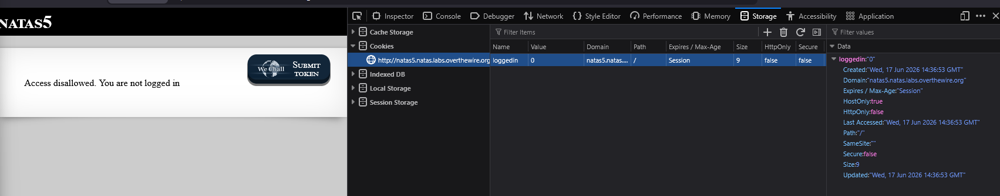
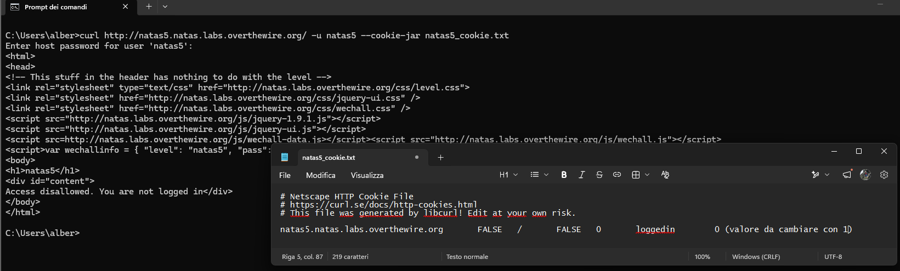
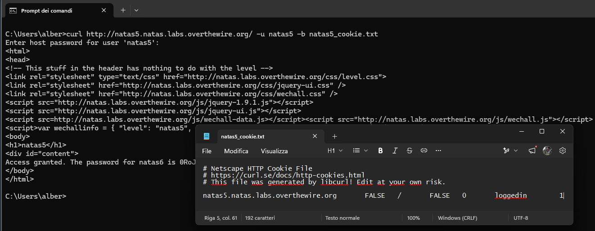

# Natas Level 5 → 6

## Obiettivo

La pagina nega l'accesso perché l'utente non risulta loggato. L'obiettivo è capire dove e come il server tiene traccia dello stato di login e modificarlo.

---

## Informazioni di accesso

| Campo | Valore |
|-------|--------|
| URL | `http://natas5.natas.labs.overthewire.org` |
| Username | `natas5` |
| Password | *(password trovata al livello 4)* |

---

## Strumenti / concetti utili

- **Storage tab → Cookies** (DevTools, `F12`) — mostra i cookie impostati dal sito corrente con nome, valore e attributi
- **Cookie HTTP** — piccola porzione di dati che il server chiede al browser di conservare e rinviare a ogni richiesta successiva
- `curl --cookie-jar` — salva su file i cookie ricevuti da una risposta HTTP
- `curl -b` — invia al server i cookie letti da un file

---

## Soluzione

### Step 1 – Il messaggio di errore indica lo stato di sessione

La pagina mostra:

> *Access disallowed. You are not logged in*

A differenza del livello precedente, qui non si parla di provenienza della richiesta ma di uno **stato**: essere o non essere "loggati". Lo stato di login di un utente, in un'applicazione web, deve essere conservato in qualche modo tra una richiesta e l'altra dato che il protocollo HTTP di per sé non mantiene memoria tra richieste diverse (è *stateless*). Il meccanismo più comune per farlo è il cookie rendendolo il primo posto dove guardare.

### Step 2 – Ispezione del cookie tramite DevTools

Aprendo la scheda **Storage → Cookies** (`F12`) per il sito, è presente un cookie:

```
Name: loggedin
Value: 0
```

Il nome del cookie è esplicito: `loggedin` con valore `0` indica, con ragionevole certezza, che il server considera l'utente non autenticato quando questo valore è `0`.



### Step 3 – Salvataggio del cookie su file con `curl`

Per modificare il valore del cookie prima di rinviarlo al server si usa `curl` per scaricarlo su un file locale:

```bash
curl http://natas5.natas.labs.overthewire.org/ -u natas5 --cookie-jar natas5_cookie.txt
```

`--cookie-jar <file>` salva tutti i cookie ricevuti nella risposta nel file specificato, nel formato *Netscape HTTP Cookie File*. Aprendo il file si trova la riga:

```
natas5.natas.labs.overthewire.org    FALSE   /   FALSE   0   loggedin   0
```

Si modifica manualmente l'ultimo valore da `0` a `1`.



### Step 4 – Invio del cookie modificato e password trovata

Si rinvia la richiesta al server specificando il file di cookie modificato come input, con l'opzione `-b`:

```bash
curl http://natas5.natas.labs.overthewire.org/ -u natas5 -b natas5_cookie.txt
```

`-b <file>` legge i cookie dal file e li include nella richiesta, al contrario di `--cookie-jar` che li salva da una risposta. Con `loggedin=1` il server risponde:

```
Access granted. The password for natas6 is [REDACTED]
```



---

## Note e osservazioni

**Perché il messaggio puntava al cookie**

La differenza tra "non sei autorizzato a visitare questa pagina da questa provenienza" (livello 4, basato sul Referer) e "non sei loggato" (questo livello) è concettualmente importante. Il primo è un controllo su un singolo dato di una singola richiesta. Il secondo descrive uno **stato persistente**: l'essere autenticato è qualcosa che, in un'applicazione web reale, deve sopravvivere a più richieste e più pagine. Poiché HTTP non conserva memoria tra una richiesta e l'altra, qualunque informazione di stato (sessione utente, carrello acquisti, preferenze) deve essere conservata da qualche parte tra client e server e il cookie è il meccanismo standard con cui ciò avviene.

**Lettura dei campi nel file di cookie generato da curl**

Il formato *Netscape HTTP Cookie File* salvato da `curl --cookie-jar` riporta i campi del cookie separati da tab, nell'ordine:

```
domain    flag    path    secure    expiration    name    value
```

Nel cookie di questo livello:

- `natas5.natas.labs.overthewire.org` — **domain**: il cookie viene inviato solo a richieste verso questo host
- `FALSE` — **flag**: indica se il domain è stato impostato esplicitamente come wildcard per i sottodomini (qui no)
- `/` — **path**: il cookie è valido per tutte le risorse sotto la root del sito
- `FALSE` — **secure**: se `TRUE`, il cookie verrebbe inviato solo su connessioni HTTPS; qui è `FALSE`, coerente con il fatto che Natas usa HTTP semplice
- `0` — **expiration**: timestamp Unix di scadenza; `0` indica un cookie di sessione, che scade alla chiusura del browser (coerente con `Session` mostrato nei DevTools)
- `loggedin` — **name**: il nome del cookie
- `0` (poi modificato in `1`) — **value**: il valore effettivo, ossia il dato che il server legge per decidere lo stato di login

L'aspetto centrale è che tutti questi campi sono dati inviati dal client. Esattamente come il Referer nel livello precedente, un cookie non firmato e non verificato lato server (ad esempio tramite firma crittografica o controllo su database) è un dato che l'utente può leggere, capire e modificare a piacimento prima di rinviarlo.
