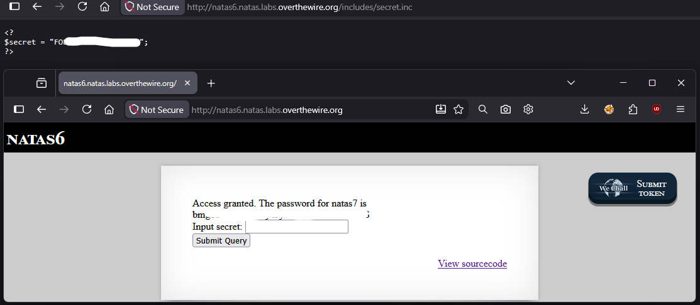

# Natas Level 6 → 7

## Obiettivo

La pagina presenta un form che richiede un "secret" da inviare. L'obiettivo è scoprire quale valore il server si aspetta, analizzando il codice sorgente fornito dalla pagina stessa.

---

## Informazioni di accesso

| Campo | Valore |
|-------|--------|
| URL | `http://natas6.natas.labs.overthewire.org` |
| Username | `natas6` |
| Password | *(password trovata al livello 5)* |

---

## Strumenti / concetti utili

- **Link "View sourcecode"** — funzionalità fornita direttamente dalla pagina per leggere il codice PHP del livello
- `include` (PHP) — istruzione che inserisce ed esegue il contenuto di un altro file all'interno dello script corrente
- **Estensione `.inc`** — convenzione di naming per file PHP destinati a essere inclusi da altri script, non eseguiti direttamente

---

## Soluzione

### Step 1 – Lettura del codice sorgente fornito dalla pagina

La pagina mostra un form con un singolo campo "Input secret" e un link "View sourcecode". Cliccandolo si accede a `index-source.html`, che mostra il codice PHP della pagina:

```php
<?

include "includes/secret.inc";

    if(array_key_exists("submit", $_POST)) {
        if($secret == $_POST['secret']) {
        print "Access granted. The password for natas7 is <censored>";
    } else {
        print "Wrong secret";
    }
    }
?>
```

La logica è chiara: il form invia il valore digitato come `$_POST['secret']`, che viene confrontato con una variabile `$secret`. Se coincidono, l'accesso è garantito: dove e come trovare il valore di `$secret`?

![Sourcecode della pagina con logica di confronto $secret == $_POST['secret']](./screenshots/06-sourcecode.png)

### Step 2 – Individuare dove è definita `$secret`

La riga `include "includes/secret.inc";` mostra che la variabile `$secret` non è definita in questo file, ma viene caricata da un file separato: `includes/secret.inc`. Per `include` di PHP, il contenuto di quel file viene eseguito esattamente come se fosse scritto all'interno dello script principale e questo significa che `secret.inc` contiene quasi certamente la riga `$secret = "...";`.

Il ragionamento successivo è: se quel file viene richiesto come script PHP attraverso `include`, cosa succede se si naviga direttamente al suo percorso nel browser? Un file `.inc` non è l'estensione standard riconosciuta da Apache per l'esecuzione PHP (che normalmente è `.php`). Se il server non è configurato per interpretare `.inc` come PHP, la richiesta diretta a quel file restituirebbe il suo contenuto come testo grezzo, codice non eseguito, invece di eseguirlo e mostrarne solo l'output.

### Step 3 – Richiesta diretta di `includes/secret.inc`

Navigando a `http://natas6.natas.labs.overthewire.org/includes/secret.inc` il server restituisce il contenuto del file non elaborato:

```php
<?
$secret = "[REDACTED]";
?>
```

L'ipotesi del passaggio precedente è confermata: il server ha servito il file come testo statico, esponendo il valore di `$secret` in chiaro. Non resta che inserire il valore trovato nel campo "Input secret" della pagina principale e si clicca "Submit Query". Il server confronta il valore inviato con quello letto da `secret.inc` e risponde con:

```
Access granted. The password for natas7 is [REDACTED]
```



---

## Note e osservazioni

**Perché la richiesta diretta di un file `.inc` ha funzionato**

Quando Apache riceve una richiesta per un file `.php`, sa (tramite la sua configurazione, in genere il modulo `mod_php` o `php-fpm`) di dover passare quel file all'interprete PHP prima di restituire una risposta: l'utente riceve solo l'output dello script, mai il codice sorgente. L'estensione `.inc` non è tra quelle che Apache associa di default all'interprete PHP, convenzione informale usata dagli sviluppatori per indicare "questo file è pensato per essere incluso da un altro script, non visitato direttamente". Tale convenzione però, da sola, non impedisce nulla: se il file si trova in una cartella accessibile via web e il server non è configurato per trattarlo come PHP, una richiesta diretta lo restituisce come testo semplice.

**La lezione di sicurezza di questo livello**

Il problema non è l'uso di `include`, che è normale e necessario per organizzare codice PHP in più file. Il problema è che il file incluso si trova in una posizione raggiungibile direttamente da una richiesta HTTP, combinato con una configurazione del server che non blocca l'esecuzione o l'accesso ai file `.inc`. Le soluzioni corrette sarebbero ad esempio posizionare i file da includere fuori dalla document root del server (così non sono raggiungibili da nessuna URL) o configurare il server affinché tratti anche i file `.inc` come PHP da eseguire, oppure ancora bloccare esplicitamente l'accesso diretto a quei file tramite la configurazione del server.
