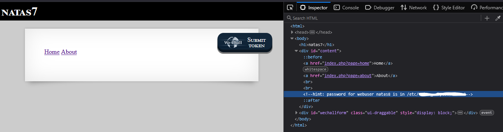
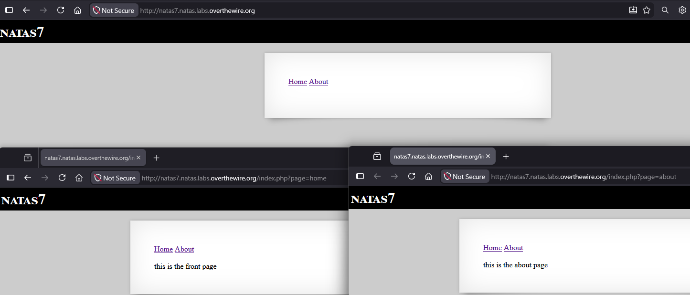
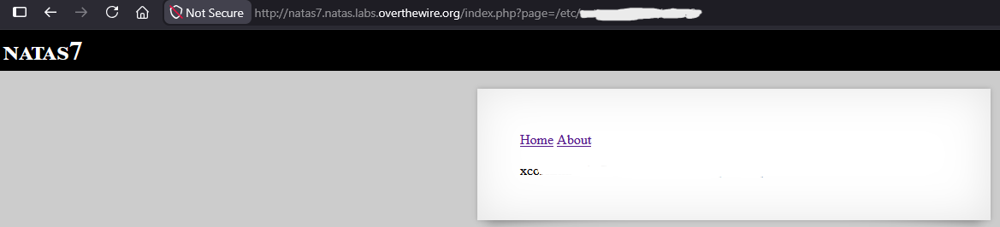
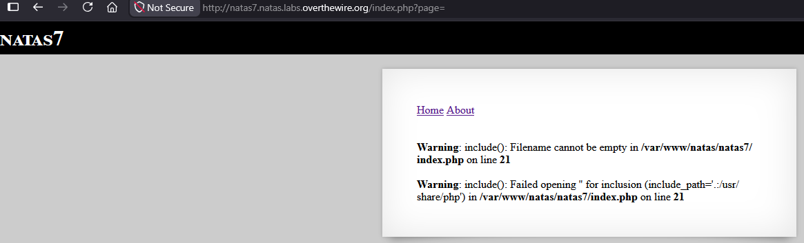

# Natas Level 7 → 8

## Obiettivo

La pagina ha due link, "Home" e "About", e un commento HTML indica dove si trova la password per il livello successivo sul filesystem del server. L'obiettivo è capire come i link caricano il contenuto delle pagine e usare lo stesso meccanismo per leggere il file indicato.

---

## Informazioni di accesso

| Campo | Valore |
|-------|--------|
| URL | `http://natas7.natas.labs.overthewire.org` |
| Username | `natas7` |
| Password | *(password trovata al livello 6)* |

---

## Strumenti / concetti utili

- **Inspector** (`F12`) — ispezione del DOM e dei link presenti nella pagina
- **Parametro GET nell'URL** (`?page=...`) — valore passato al server tramite query string
- `include()` (PHP) — funzione che inserisce ed esegue il contenuto di un file; se il percorso è costruito da input controllato dall'utente, può essere sfruttata per leggere file arbitrari (**Local File Inclusion**)
- **PHP warning / display_errors** — messaggi diagnostici che PHP mostra a schermo quando una funzione fallisce, se la visualizzazione degli errori è abilitata

---

## Soluzione

### Step 1 – Individuare l'indizio sulla posizione della password

Ispezionando il DOM con `F12` si trova all'interno di `div#content` un commento HTML:

```html
<!--hint: password for webuser natas8 is in /etc/[REDACTED]-->
```

L'indizio specifica un percorso sul filesystem del server (`/etc/...`), non una pagina web. Questo significa che per ottenere la password serve un modo per far leggere al server il contenuto di quel file e mostrarlo nella pagina.



### Step 2 – Analizzare come funzionano i link Home e About

Osservando i link nel DOM si nota che puntano a:

```html
<a href="index.php?page=home">Home</a>
<a href="index.php?page=about">About</a>
```

Cliccando ciascun link, l'URL cambia in `index.php?page=home` o `index.php?page=about` e il contenuto della pagina cambia di conseguenza, mostrando rispettivamente "this is the front page" e "this is the about page". Il meccanismo è chiaro: il parametro `page` nella query string indica al server quale contenuto caricare all'interno della pagina, e il valore passato corrisponde quasi certamente al nome di un file che lo script PHP include nella pagina principale.



Questo conferma il ragionamento del livello precedente: il parametro `page` viene probabilmente passato direttamente a una chiamata `include()` lato server, qualcosa nello stile di `include($_GET['page'])`. Se è così, e se il valore del parametro non viene filtrato o limitato a una lista di pagine consentite, si può tentare di sostituirlo con un percorso arbitrario sul filesystem, incluso quello indicato nell'hint.

### Step 3 – Sostituire il parametro con il percorso del file e password trovata

Si modifica l'URL inserendo direttamente il percorso completo trovato nell'hint:

```
http://natas7.natas.labs.overthewire.org/index.php?page=/etc/path_to_file
```

Il server include il contenuto del file richiesto e lo mostra nella pagina, restituendo la password per `natas8`.



---

## Bonus – Analisi del comportamento con parametro vuoto

Navigando a `http://natas7.natas.labs.overthewire.org/index.php?page=` (parametro presente ma vuoto) il server restituisce due warning PHP invece del contenuto normale:

```
Warning: include(): Filename cannot be empty in /var/www/natas/natas7/index.php on line 21

Warning: include(): Failed opening '' for inclusion (include_path='.:/usr/share/php') in /var/www/natas/natas7/index.php on line 21
```



**Cosa significano questi due warning**

Sono due avvisi distinti generati dalla stessa chiamata a `include()`, ciascuno relativo a un controllo diverso che PHP effettua internamente:

Il primo, *"Filename cannot be empty"*, è un controllo preliminare: prima ancora di tentare di aprire un file, PHP verifica che la stringa passata a `include()` non sia vuota. Ricevendo una stringa vuota (il parametro `page` non conteneva nulla), PHP genera questo avviso immediatamente.

Il secondo, *"Failed opening '' for inclusion"*, documenta il tentativo effettivo (fallito) di apertura del file. Tra parentesi viene mostrato anche `include_path='.:/usr/share/php'`, cioè l'elenco delle cartelle in cui PHP cerca i file quando viene fornito un percorso relativo: la cartella corrente (`.`) e `/usr/share/php`.

**Perché questi messaggi sono visibili e cosa rivelano**

Questi warning sono normalmente destinati ai log del server, non alla pagina mostrata all'utente. Il fatto che siano visibili indica che sull'applicazione è attiva l'opzione PHP `display_errors`, pensata per il debug in sviluppo ma da disabilitare in produzione. Il problema di sicurezza non è il warning in sé, ma l'informazione che espone: il percorso completo dello script sul filesystem (`/var/www/natas/natas7/index.php`) e il suo `include_path`. Questo tipo di informazione aiuta chi sta analizzando l'applicazione a confermare ipotesi sulla struttura del server e, in questo caso, conferma in modo inequivocabile che il parametro `page` viene passato direttamente a una chiamata `include()`, esattamente come ipotizzato nello Step 2.
