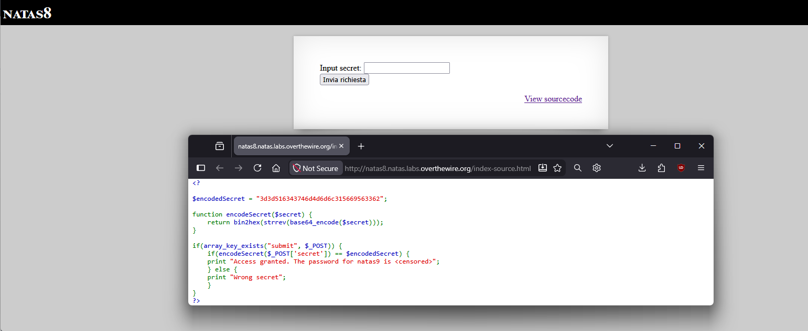
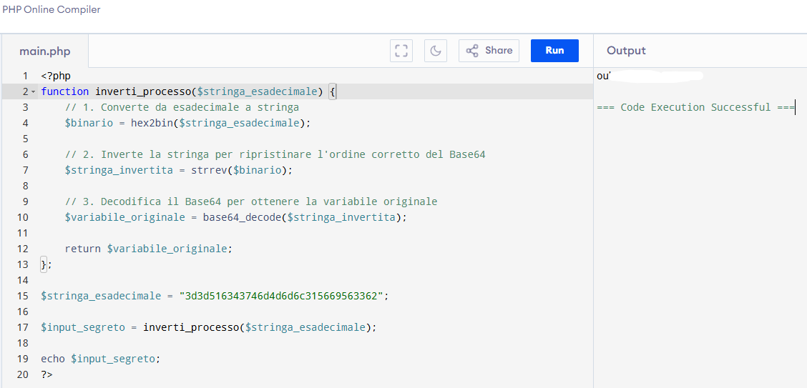
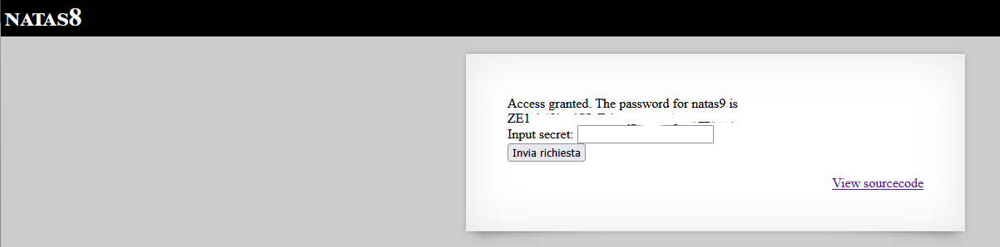

# Natas Level 8 → 9

## Obiettivo

La pagina presenta lo stesso form del livello 6: un campo "Input secret" da inviare. Questa volta però il secret non è leggibile in chiaro da nessun file incluso: è codificato attraverso una sequenza di trasformazioni.

---

## Informazioni di accesso

| Campo | Valore |
|-------|--------|
| URL | `http://natas8.natas.labs.overthewire.org` |
| Username | `natas8` |
| Password | *(password trovata al livello 7)* |

---

## Strumenti / concetti utili

- **Link "View sourcecode"** — espone il codice PHP della pagina
- `base64_encode` / `base64_decode` — funzioni PHP per codificare/decodificare in Base64
- `strrev` — funzione PHP che inverte una stringa carattere per carattere
- `bin2hex` / `hex2bin` — funzioni PHP per convertire tra stringa binaria e rappresentazione esadecimale
- **PHP online compiler** — ambiente per eseguire rapidamente script PHP senza installazione locale

---

## Soluzione

### Step 1 – Lettura e analisi del sourcecode

Cliccando "View sourcecode" si accede a `index-source.html`, che mostra il codice PHP:

```php
$encodedSecret = "3d3d516343746d4d6d6c315669563362";

function encodeSecret($secret) {
    return bin2hex(strrev(base64_encode($secret)));
}

if(array_key_exists("submit", $_POST)) {
    if(encodeSecret($_POST['secret']) == $encodedSecret) {
        print "Access granted. The password for natas9 is <censored>";
    } else {
        print "Wrong secret";
    }
}
```

A differenza del livello 6, qui `$encodedSecret` è definita direttamente nello script e il suo valore è visibile. Il problema non è trovare dove si trova il secret, ma ricavarlo a partire dal valore già noto invertendo il processo di codifica.



### Step 2 – Decostruire la catena di codifica

La funzione `encodeSecret` applica tre trasformazioni in sequenza, dall'interno verso l'esterno:

```
bin2hex( strrev( base64_encode( $secret ) ) )
```

Letta nell'ordine in cui viene applicata al secret originale:

1. `base64_encode($secret)` — codifica il secret in Base64
2. `strrev(...)` — inverte la stringa risultante carattere per carattere
3. `bin2hex(...)` — converte la stringa in rappresentazione esadecimale

Il valore che abbiamo (`$encodedSecret`) è l'output finale di questo processo. Per ottenere il secret originale si deve percorrere la catena al contrario, applicando l'operazione inversa di ciascun passo nell'ordine opposto:

1. `hex2bin(...)` — da esadecimale a stringa binaria (inverso di `bin2hex`)
2. `strrev(...)` — inverte di nuovo la stringa (inverso di `strrev`, che è idempotente: applicato due volte restituisce la stringa originale)
3. `base64_decode(...)` — decodifica il Base64 (inverso di `base64_encode`)

### Step 3 – Eseguire il processo inverso in un compilatore PHP online

Si scrive uno script PHP che applica le tre operazioni inverse nell'ordine corretto e si esegue su un compilatore online per semplicità e velocità (ad esempio `onlinephp.io` o equivalente):

```php
<?php
function inverti_processo($stringa_esadecimale) {
    // 1. Da esadecimale a stringa
    $binario = hex2bin($stringa_esadecimale);

    // 2. Inverti la stringa per ripristinare l'ordine pre-strrev
    $stringa_invertita = strrev($binario);

    // 3. Decodifica Base64 per ottenere il secret originale
    $variabile_originale = base64_decode($stringa_invertita);

    return $variabile_originale;
}

$stringa_esadecimale = "3d3d516343746d4d6d6c315669563362";
$input_segreto = inverti_processo($stringa_esadecimale);
echo $input_segreto;
?>
```

Lo script restituisce il secret originale in chiaro.



### Step 4 – Invio del secret e password trovata

Si inserisce il valore ottenuto nel campo "Input secret" e si clicca "Invia richiesta". Il server applica `encodeSecret()` all'input, ottiene di nuovo `3d3d516343746d4d6d6c315669563362`, il confronto con `$encodedSecret` è positivo e risponde con la password:

```
Access granted. The password for natas9 is [REDACTED]
```



---

## Note e osservazioni

**I tre tipi di trasformazione usati nel livello**

Questo livello combina tre operazioni di natura diversa, spesso confuse tra loro:

**Base64** è una codifica binaria-testuale: trasforma dati arbitrari (anche non stampabili) in una stringa composta solo da caratteri ASCII sicuri (lettere, cifre, `+`, `/`, `=` come padding). È reversibile senza chiave, è usato comunemente per trasportare dati binari in contesti che accettano solo testo (email, URL, HTML). Non è crittografia: chiunque può decodificarlo.

**`strrev`** è una semplice inversione di stringa: il carattere in posizione 0 va in ultima posizione e viceversa. Non è una codifica standard e non ha un'operazione "inversa" diversa da sé stessa. Nel contesto di questo livello serve a rendere il risultato del Base64 meno immediatamente riconoscibile: le stringhe Base64 terminano spesso con `==` di padding, ma dopo `strrev` quel padding finisce all'inizio, alterando l'aspetto visivo.

**`bin2hex`** converte ogni byte della stringa nella sua rappresentazione esadecimale a due cifre (es. il carattere `A`, codice ASCII 65, diventa `41`). Il risultato è una stringa di soli caratteri `0-9a-f`, il doppio più lunga dell'input ed è anch'essa completamente reversibile con `hex2bin`. Viene usata spesso per stampare o trasmettere dati binari in forma leggibile o per rendere opaco il formato di un valore a colpo d'occhio.

**Perché questa catena non è sicurezza**

Nessuna delle tre operazioni usa una chiave segreta: dato l'output e la conoscenza dell'algoritmo (qui esposta nel sourcecode), il processo è invertibile da chiunque in modo deterministico. Codifica non è cifratura: proteggere un secret con sole trasformazioni reversibili e note non equivale a proteggerlo! Un confronto corretto richiederebbe o di non esporre mai il secret (nemmeno codificato) lato client o di usare una funzione di hashing non reversibile con salt (come `password_hash` in PHP).
