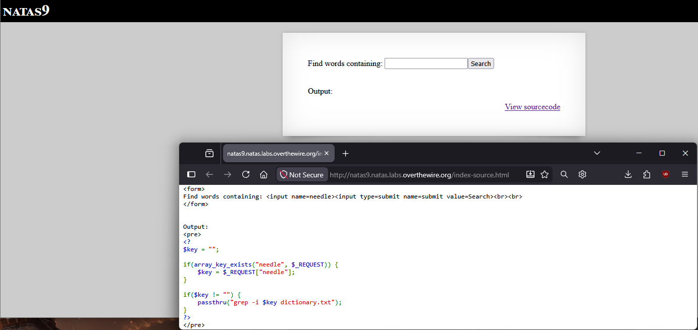
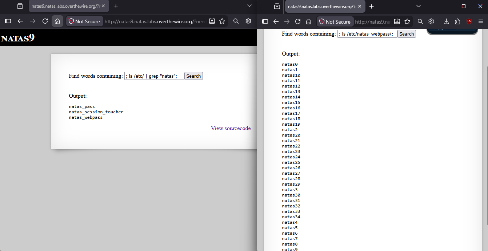
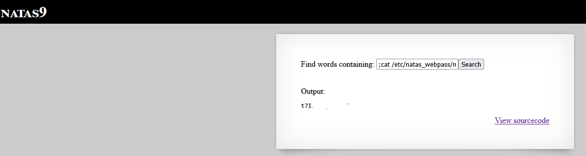

# Natas Level 9 → 10

## Obiettivo

La pagina espone un form di ricerca che cerca parole all'interno di un file dizionario. L'obiettivo è capire come il server elabora l'input, identificare eventuali vulnerabilità nel codice PHP e sfruttarle per leggere la password del livello successivo.

---

## Informazioni di accesso

| Campo | Valore |
|-------|--------|
| URL | `http://natas9.natas.labs.overthewire.org` |
| Username | `natas9` |
| Password | *(password trovata al livello 8)* |

---

## Strumenti / concetti utili

- **Link "View sourcecode"** — espone il codice PHP della pagina
- `passthru()` — funzione PHP che esegue un comando di sistema e stampa l'output direttamente nella risposta HTTP
- **Command injection** — vulnerabilità che si verifica quando input controllato dall'utente viene inserito senza sanitizzazione in un comando di sistema
- `;` — separatore di comandi in shell, permette di eseguire più comandi in sequenza sulla stessa riga
- `ls`, `cat` — comandi Linux per listare directory e leggere file

---

## Soluzione

### Step 1 – Lettura e analisi del sourcecode

Cliccando "View sourcecode" si legge il codice PHP della pagina:

```php
$key = "";

if(array_key_exists("needle", $_REQUEST)) {
    $key = $_REQUEST["needle"];
}

if($key != "") {
    passthru("grep -i $key dictionary.txt");
}
```

Il codice prende il valore inviato dal form (`needle`), lo assegna a `$key` e lo inserisce direttamente dentro una stringa di comando che viene poi passata a `passthru()`. Non c'è nessuna operazione di sanitizzazione o validazione sull'input prima che venga usato.

La riga critica è:

```php
passthru("grep -i $key dictionary.txt");
```

Se `$key` fosse ad esempio `hello`, il comando eseguito sarebbe `grep -i hello dictionary.txt`. Ma dal momento che `$key` è inserita così com'è nella stringa del comando, qualsiasi carattere speciale della shell presente nell'input viene interpretato dalla shell stessa, incluso il punto e virgola (`;`) che in shell separa comandi distinti.



### Step 2 – Esplorazione del filesystem con comandi iniettati

Per verificare la vulnerabilità e orientarsi sul filesystem, si invia nel campo di ricerca un input che inietta comandi dopo il `;`. Il primo test esplora le cartelle rilevanti in `/etc/`:

```
; ls /etc/ | grep "natas";
```

Il comando effettivamente eseguito dal server diventa:

```bash
grep -i  dictionary.txt ; ls /etc/ | grep "natas" ; dictionary.txt
```

Il primo `grep` cerca una stringa vuota in `dictionary.txt` (non produce output utile), poi il `;` avvia `ls /etc/ | grep "natas"`, che filtra le voci di `/etc/` contenenti "natas". L'output mostra le directory rilevanti: `natas_pass`, `natas_session_toucher`, `natas_webpass`. La cartella più interessante è `/etc/natas_webpass/`.

Confermata la cartella, si lista il suo contenuto:

```
; ls /etc/natas_webpass/;
```

L'output elenca dei file nominati con gli utenti di tutti i livelli (`natas0`, `natas1`, `natas2`, ... `natas34`), suggerendo che ogni livello ha il proprio file contenente la password. Il target è il file `natas10` che è tra l'altro, per ragioni ovvie, l'unico che si può aprire da questo livello.



### Step 3 – Lettura della password e password trovata

Si inietta quindi `cat` sul file:

```
;cat /etc/natas_webpass/natas10
```

Il server esegue `cat /etc/natas_webpass/natas10` e stampa il contenuto del file direttamente nell'output della pagina, fornendo la password per il livello successivo.



---

## Note e osservazioni

**`passthru()` e le altre funzioni di esecuzione comandi in PHP**

PHP espone diverse funzioni per eseguire comandi di sistema, con differenze nel modo in cui gestiscono l'output:

- `passthru($cmd)` — esegue il comando e stampa l'output direttamente nel flusso di risposta HTTP, byte per byte. È la più diretta: nessun valore di ritorno da gestire, l'output arriva al browser esattamente come prodotto dal comando.
- `exec($cmd)` — esegue il comando ma restituisce solo l'ultima riga dell'output come stringa PHP; il resto va perso a meno di usare il parametro opzionale `$output`.
- `shell_exec($cmd)` — esegue il comando e restituisce l'intero output come stringa PHP, che lo script può poi manipolare o stampare.
- `system($cmd)` — simile a `passthru()` ma restituisce anche l'ultima riga come valore di ritorno.

Dal punto di vista della vulnerabilità, la funzione usata non cambia la sostanza: in tutti e quattro i casi il problema è che l'input utente viene concatenato nella stringa del comando senza sanitizzazione. Cambia solo come l'attaccante riceve il risultato del comando iniettato.

**Command injection e il ruolo del `;`**

La shell (in questo caso `/bin/sh` su Linux, richiamata implicitamente da `passthru()`) interpreta il `;` come separatore tra comandi indipendenti: tutto ciò che viene prima è un comando, tutto ciò che viene dopo è un altro. Questo permette di "appendere" comandi arbitrari a quello originale. Il comando originale (`grep`) viene eseguito regolarmente ma il suo output è irrilevante perchè ciò che interessa è l'output del comando iniettato dopo il `;`.

Altre varianti di questo attacco usano `&&` (il secondo comando viene eseguito solo se il primo ha successo) o `||` (il secondo viene eseguito solo se il primo fallisce), o la subshell con `$(comando)` inserita direttamente nel parametro. Il principio è sempre lo stesso: caratteri speciali della shell nell'input vengono interpretati dal sistema operativo, non trattati come testo letterale.

**La prevenzione corretta**

Il problema fondamentale è costruire un comando di sistema per concatenazione di stringhe includendo input non validato. La soluzione non è filtrare manualmente i caratteri speciali (operazione error-prone), ma usare funzioni che separano nettamente il comando dai suoi argomenti, come `escapeshellarg()` in PHP, che racchiude l'argomento in virgolette singole e fa l'escape dei caratteri speciali al suo interno. L'alternativa più robusta è non usare comandi di sistema dove esistono API native del linguaggio per la stessa operazione (in questo caso, cercare una parola in un file si può fare interamente in PHP senza chiamare `grep`).
