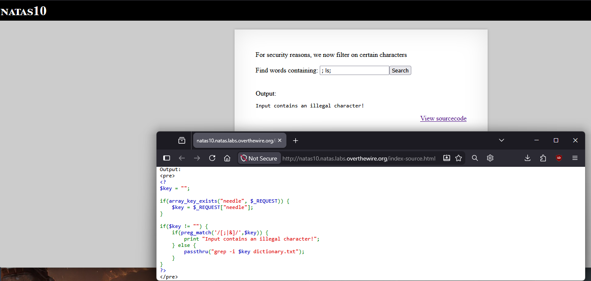
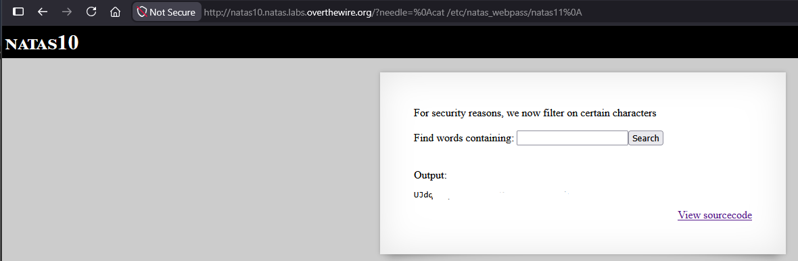

# Natas Level 10 → 11

## Obiettivo

La pagina è identica al livello precedente ma aggiunge un filtro sui caratteri usati per iniettare comandi. L'obiettivo è analizzare il filtro e trovare un modo per aggirarlo.

---

## Informazioni di accesso

| Campo | Valore |
|-------|--------|
| URL | `http://natas10.natas.labs.overthewire.org` |
| Username | `natas10` |
| Password | *(password trovata al livello 9)* |

---

## Strumenti / concetti utili

- `preg_match()` — funzione PHP per cercare un pattern regex in una stringa
- **URL encoding** — rappresentazione di caratteri speciali nell'URL tramite la notazione `%XX`, dove `XX` è il codice esadecimale del carattere
- `%0A` — URL encoding del carattere newline (`\n`, LF, ASCII 10)
- **Newline come separatore di comandi** — in shell, un carattere di a capo separa i comandi esattamente come il punto e virgola

---

## Soluzione

### Step 1 – Lettura del sourcecode e analisi del filtro

Il codice PHP è quasi identico al livello 9, con l'aggiunta di un controllo sull'input prima di passarlo a `passthru()`:

```php
$key = "";

if(array_key_exists("needle", $_REQUEST)) {
    $key = $_REQUEST["needle"];
}

if($key != "") {
    if(preg_match('/[;|&]/',$key)) {
        print "Input contains an illegal character!";
    } else {
        passthru("grep -i $key dictionary.txt");
    }
}
```

Il filtro usa `preg_match('/[;|&]/',$key)`: blocca qualsiasi input che contenga almeno uno dei caratteri `;`, `|`, `&`. Questi sono i tre separatori/concatenatori di comandi usati nel livello precedente. Inviare `; ls;` produce il messaggio "Input contains an illegal character!", confermando che il filtro funziona per questi caratteri.



Il problema del filtro è che è una lista chiusa: blocca esattamente e solo i caratteri elencati nella regex. In shell esistono altri modi per separare comandi che questa regex non contempla.

### Step 2 – Identificare il carattere non filtrato: il newline

In shell, il carattere di a capo (newline, `\n`) è un separatore di comandi al pari del `;`: ogni riga di uno script shell è un comando separato. Il filtro di questo livello controlla solo `[;|&]` dunque il newline non è nella lista e non viene bloccato.

Il problema pratico è che digitare un newline nel campo di un form non è diretto. Nell'URL però qualsiasi carattere può essere rappresentato in forma codificata con la notazione `%XX`, dove `XX` è il valore esadecimale del carattere in ASCII. Il newline ha valore decimale 10, che in esadecimale è `0A`: la sua rappresentazione URL-encoded è perciò `%0A`.

Modificando direttamente l'URL con il parametro `needle` contenente `%0A`, il browser invia il carattere newline al server, che lo riceve come parte di `$key` senza che venga intercettato dal filtro.

### Step 3 – Iniezione tramite newline e password trovata

Si costruisce l'URL inserendo `%0A` come separatore al posto di `;`:

```
http://natas10.natas.labs.overthewire.org/?needle=%0Acat%/etc/natas_webpass/natas11%0A
```

Il comando effettivamente eseguito dal server diventa:

```bash
grep -i 
cat /etc/natas_webpass/natas11
 dictionary.txt
```

Il primo newline termina il comando `grep` con un argomento vuoto che fallisce silenziosamente. Il secondo newline isola `dictionary.txt` come token separato che non causa errori visibili. Nel mezzo, `cat /etc/natas_webpass/natas11` viene eseguito come comando autonomo e il suo output (la password) viene stampato nella pagina.



---

## Note e osservazioni

**Perché `%0A` ha bypassato il filtro**

`preg_match('/[;|&]/',$key)` confronta il valore della variabile PHP `$key` contro la regex. A questo punto `$key` contiene già il valore decodificato: PHP e il server web decodificano automaticamente i parametri URL prima che lo script li legga. Il server riceve `%0A` nell'URL, lo decodifica nel carattere newline (`\n`) e lo assegna a `$key`. La regex `[;|&]` non include `\n`, quindi `preg_match` restituisce 0 (nessuna corrispondenza) e l'input passa al `passthru()`.

Questo illustra un problema generale dei filtri basati su liste nere di caratteri: basta che esista un carattere funzionalmente equivalente non incluso nella lista per aggirare il controllo. In questo caso il newline è un sinonimo del `;` dal punto di vista della shell, ma non è stato considerato nel filtro.

**Metodo alternativo: aggiungere il file password come argomento di `grep`**

Un approccio diverso, che non richiede separatori di comandi di nessun tipo, sfrutta il fatto che `grep` accetta più file come argomenti. Il comando originale è:

```bash
grep -i $key dictionary.txt
```

Se `$key` contiene sia un pattern sia un percorso di file aggiuntivo, `grep` cercherà il pattern su entrambi i file. Inviando come input:

```
. /etc/natas_webpass/natas11 #
```

Il comando diventa:

```bash
grep -i . /etc/natas_webpass/natas11 # dictionary.txt
```

`.` è una regex che in `grep` corrisponde a qualsiasi carattere, quindi trova tutte le righe non vuote e `/etc/natas_webpass/natas11` viene passato come file aggiuntivo su cui cercare. `#` avvia un commento in shell: tutto ciò che segue sulla stessa riga viene ignorato, eliminando `dictionary.txt` dall'esecuzione. Il risultato è che `grep` stampa il contenuto del file della password senza che nessun `;`, `|` o `&` sia coinvolto, non facendo intervenire il filtro.
